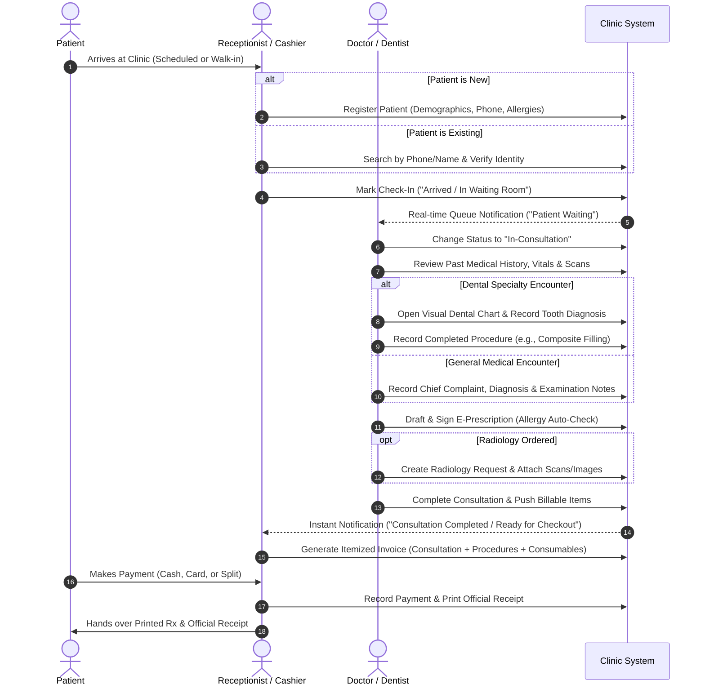

# Customer Requirements Document (CRD)
## Enterprise Smart Clinic Management System (Clinic App)

| **Document Version** | 2.0.0 (Enterprise Comprehensive Edition) |
| :--- | :--- |
| **Status** | Approved Baseline for Development & Customer Sign-Off |
| **Date** | 2026-09-25 |
| **Document Classification** | Customer Requirements Document (CRD) / User Requirements Specification (URS) |
| **Target Practice** | Outpatient Medical Clinics, Poly-Clinics, Specialized Dental & Radiology Practices |
| **Primary Stakeholders** | Clinic Owners, Medical Practitioners, Dentists, Front-Desk Staff, Practice Managers |

---

## 1. Document Control & Revision History

| Version | Date | Author / Role | Summary of Changes |
| :---: | :---: | :--- | :--- |
| **1.0.0** | 2026-09-25 | Healthcare Systems Analyst | Initial functional scope baseline across 12 core modules. |
| **2.0.0** | 2026-09-25 | Lead Clinical Product Architect | Upgraded with Clinical Safety Business Rules, Output Specifications (Prescription/Receipt/Dental), Hardware/Thermal Printer Specifications, Regulatory Retention Rules, and Formal Scope Boundaries. |

---

## 2. Executive Summary & Business Case

### 2.1 Clinical & Business Problem Statement
Private outpatient clinics and multi-specialty practices routinely suffer from operational inefficiencies caused by paper-based charting, disjointed scheduling books, uncoordinated cashiering, and scattered diagnostic files:
- **Lost & Inaccessible History:** Finding past visits, diagnostic scans, and drug reactions during a 10-minute consultation is time-consuming and error-prone.
- **Revenue Leakage:** Unbilled procedures, forgotten consumable fees, untracked patient debts, and manual discounts lead to unaccounted financial losses.
- **Waiting Room Friction:** Lack of real-time visibility between the receptionist's desk and the consultation room causes patient crowding, long wait times, and scheduling conflicts.
- **Specialty Charting Deficits:** General clinic software lacks specialized, visual dental tooth-by-tooth charting and integrated radiology viewing, forcing clinics to purchase disconnected software.

### 2.2 System Purpose & Strategic Goals
The **Enterprise Smart Clinic Management System** is a unified, cloud-ready clinic automation solution designed from the doctor's perspective to achieve:
1. **Paperless Clinic Operations:** 100% digital transition for patient intake, clinical charting, e-prescribing, diagnostic imaging, and invoicing.
2. **Clinical Safety & Zero Diagnostic Regret:** Prominent allergy warnings, permanent audit-locked medical histories, and instant diagnostic scan retrieval.
3. **Optimized Chair-Side Ergonomics:** Rapid documentation workflows requiring $\le 3$ clicks for routine actions, allowing doctors to focus on patients rather than computer screens.
4. **Specialized Dental & Radiology Integration:** Native support for both adult and pediatric FDI/Universal dental charting and high-resolution radiograph archiving.
5. **Fiscal & Material Accountability:** Tight coupling between clinical procedures, consumed materials, itemized billing, and multi-method payments.

---

## 3. Scope Boundaries (In-Scope vs. Explicitly Out-of-Scope)

Setting strict boundaries prevents project scope creep and sets clear contractual expectations.

```
┌────────────────────────────────────────────────────────────────────────────────────────┐
│                                IN-SCOPE (Core System)                                  │
├──────────────────────────┬─────────────────────────────┬───────────────────────────────┤
│ • Outpatient EMR         │ • Interactive Dental Chart  │ • Consumables Inventory       │
│ • Scheduling & Queue     │ • Radiology Archiving       │ • Invoicing & Receipts        │
│ • E-Prescriptions        │ • Multi-Branch Doctors      │ • Clinical & Financial Dash   │
└──────────────────────────┴─────────────────────────────┴───────────────────────────────┘
                                           ▲
                                           │ Explicit Boundary
                                           ▼
┌────────────────────────────────────────────────────────────────────────────────────────┐
│                              OUT-OF-SCOPE (Phase 1 Baseline)                           │
├──────────────────────────┬─────────────────────────────┬───────────────────────────────┤
│ • Inpatient / Ward Beds  │ • Automated Direct Insurance│ • Retail Pharmacy POS         │
│   (No admission, vitals  │   Clearinghouse Submission  │   (No external OTC sales, no  │
│    nursing sheets, OR)   │   (Manual claims/bills only)│    pharmaceutical supplier EDI│
├──────────────────────────┼─────────────────────────────┼───────────────────────────────┤
│ • Hardware Driver Level  │ • Telehealth Video Streaming│ • Laboratory LIMS Machine     │
│   Direct COM/Serial port │   (In-clinic physical visit │   Serial Port Automation      │
│   interfacing            │    focus for Phase 1)       │   (Manual report upload only) │
└──────────────────────────┴─────────────────────────────┴───────────────────────────────┘
```

---

## 4. User Personas & Role Responsibilities (RACI Matrix)

| User Persona | Context of Use | Primary Objectives |
| :--- | :--- | :--- |
| **Dr. Clinic Owner (Admin Doctor)** | Office / Consultation Room / Remote | Full clinical oversight, staff permission management, financial auditing, branch management, subscription and practice analytics. |
| **Associate Doctor / Dentist** | Consultation Room / Dental Chair-Side | Rapid review of patient files, visual tooth charting, clinical diagnosis, electronic prescribing, and ordering imaging. |
| **Clinic Receptionist / Cashier** | Front-Desk Reception Station | Patient intake and registration, appointment scheduling, patient check-in/queue sorting, invoicing, and collecting payments. |
| **Clinic Assistant / Nurse** | Exam Room / Sterilization Area | Recording basic vitals, managing clinical consumables/materials, and preparing patient files for the doctor. |
| **Patient (Recipient)** | Waiting Room / Home | Receiver of printed/digital prescriptions, clear diagnostic reports, payment receipts, and appointment reminder alerts. |

### RACI Governance Matrix
*(**R**esponsible, **A**ccountable, **C**onsulted, **I**nformed)*

| Functional Domain | Clinic Owner | Doctor / Dentist | Receptionist | Clinic Assistant | Patient |
| :--- | :---: | :---: | :---: | :---: | :---: |
| Patient Registration & Demographics | A | I | R | C | C |
| Clinical Notes & Diagnoses | A | R | I | I | I |
| Dental Charting & Procedures | A | R | I | C | I |
| E-Prescriptions Issuance | A | R | I | I | R (Receipt) |
| Radiology Exam Requests & Uploads | A | R | C | R | I |
| Consumables Stock Tracking | A | C | I | R | I |
| Invoicing & Payment Collection | A | I | R | I | R (Receipt) |
| Staff Permissions & System Config | R / A | I | I | I | I |

---

## 5. Clinical Business Rules & Safety Guardrails

The following business rules are mandatory constraints that govern the application logic.

### 5.1 Clinical & Prescription Safety Rules (BR-MED / BR-RX)
- **`BR-RX-01: Allergy Conflict Interceptor`**  
  Whenever a doctor adds a medication to an e-prescription, the system must cross-check the active ingredients against the patient's recorded drug allergies. If a conflict exists, the system must trigger a high-visibility amber/red alert modal requiring explicit clinical override justification before the prescription can be finalized.
- **`BR-RX-02: Prescription Immutability & Audit Lock`**  
  Once a doctor finalizes and digitally signs a prescription, it becomes legally locked and read-only. No user (including the clinic owner) can edit or delete a finalized prescription. If a medication change is needed, the doctor must issue a *Superseding Prescription* or an *Addendum*, preserving the complete historical audit trail.
- **`BR-RX-03: Pediatric Safety Dosing Prerequisite`**  
  For patients under 14 years of age, the system must require the doctor/nurse to record current **Body Weight (kg)** before generating a prescription, ensuring proper dosage calculations can be verified.
- **`BR-MED-01: Consultation Note Non-Deletion`**  
  Clinical encounter notes entered by a doctor cannot be deleted from the database. Modifications are appended as timestamped amendments with the author's identity preserved.

### 5.2 Financial & Invoicing Rules (BR-FIN)
- **`BR-FIN-01: Discount Authorization Matrix`**  
  Receptionists may apply courtesy discounts only up to a system-defined cap (e.g., maximum 10% or a maximum fixed amount). Any discount exceeding this threshold requires administrative approval or a Doctor PIN override.
- **`BR-FIN-02: Outstanding Debt Warning`**  
  When an existing patient with an unpaid balance is selected for an appointment or check-in, the receptionist must receive an immediate visual alert showing the outstanding debt and historical unpaid invoices.
- **`BR-FIN-03: Invoice Numbering Continuity`**  
  All issued invoices must follow a sequential, gapless numbering scheme per clinic (e.g., `INV-2026-00001`). Invoices cannot be permanently deleted; if an error occurs, the invoice must be marked as *Voided* with a mandatory recorded reason.

### 5.3 Specialized Dental Rules (BR-DEN)
- **`BR-DEN-01: Dual Dental Notation Standard Support`**  
  The interactive dental chart must support instant toggling between **FDI Two-Digit Notation** (ISO 3950: 11–48 for permanent dentition, 51–85 for deciduous) and the **Universal Numbering System** (1–32 for permanent, A–T for deciduous) to suit individual dentist preference without altering the underlying clinical data.
- **`BR-DEN-02: Procedure Lifecycle State Machine`**  
  Dental procedures must follow a strict sequential state progression:  
  $$\text{Proposed / Treatment Plan} \longrightarrow \text{Patient Accepted} \longrightarrow \text{In Progress} \longrightarrow \text{Completed} \longrightarrow \text{Invoiced}$$  
  Only procedures in the *Completed* status can be pushed into the billing module for cashier settlement.

### 5.4 Inventory & Stock Rules (BR-INV)
- **`BR-INV-01: Expiration Date Quarantine`**  
  Any consumable material whose batch expiration date has passed must be flagged with a red *Expired* status and automatically locked from selection during clinical procedures.
- **`BR-INV-02: Low-Stock Threshold Trigger`**  
  When an item’s on-hand quantity equals or falls below its configured minimum stock reorder level, the system must immediately trigger an in-app alert on the assistant and clinic owner dashboards.

---

## 6. End-to-End Clinical Workflows

### 6.1 Standard Patient Journey (Walk-in & Scheduled)



---

## 7. Functional Customer Requirements (Enriched Specification)

Requirements are organized by domain, tagged with traceable IDs, prioritized using MoSCoW, and detailed with **User Stories** and **Given-When-Then Acceptance Criteria**.

---

### Module 1: Clinic Identity & Multi-Branch Architecture (REQ-CLI)

#### REQ-CLI-01: Clinic Profile & Formal Branding [Must Have]
- **User Story:** *As a Clinic Owner, I want to configure the clinic’s official details, logo, license numbers, and letterhead headers, so that all printed prescriptions, diagnostic orders, and invoices project an authentic, branded image.*
- **Acceptance Criteria:**
  - **Given** the clinic owner is in the Clinic Settings screen,
  - **When** they upload a high-resolution clinic logo and update tax registration, medical syndicate numbers, and phone numbers,
  - **Then** the updated branding and credentials must immediately reflect on all newly generated PDF prescriptions, receipts, and invoices without visual distortion.

#### REQ-CLI-02: Operating Hours & Appointment Slots Configuration [Must Have]
- **User Story:** *As a Practice Manager, I want to define working shifts, consultation duration slots (e.g., 15, 30, 45 minutes), and holiday closures, so that receptionists cannot book patients outside operating windows.*
- **Acceptance Criteria:**
  - **Given** clinic working hours are set to 09:00 AM – 09:00 PM, Saturday through Thursday,
  - **When** a receptionist attempts to book an appointment on Friday or at 10:00 PM,
  - **Then** the system must block the booking and present a descriptive error message indicating clinic closed hours.

#### REQ-CLI-03: Multi-Branch & Multi-Room Management [Should Have]
- **User Story:** *As a Doctor who operates across two branches, I want to switch between clinic branches from a single login, so that I can view each branch's patient queue and schedule independently.*

---

### Module 2: User Access & Role-Based Security (REQ-SEC)

#### REQ-SEC-01: Role-Segregated Portals [Must Have]
- **User Story:** *As a Clinic Administrator, I want users to be assigned explicit roles (Doctor, Receptionist, Nurse, Admin), so that staff members only access tools necessary for their daily responsibilities.*
- **Acceptance Criteria:**
  - **Given** a user logs in with the `Receptionist` role,
  - **When** they attempt to access doctor consultation diagnostic notes or clinical dental charts directly,
  - **Then** the system must deny access and redirect to the front-desk operational view.

#### REQ-SEC-02: Confidential Medical Masking [Must Have]
- **User Story:** *As a Patient and Doctor, I want confidential clinical diagnoses and sensitive notes to remain hidden from front-desk staff, so that patient privacy is strictly upheld.*

---

### Module 3: Patient Records & EMR (REQ-PAT)

#### REQ-PAT-01: Rapid Patient Intake & Registration [Must Have]
- **User Story:** *As a Receptionist, I want to register a new patient in under 45 seconds using minimal mandatory fields (Name, Phone Number, Gender, Age/Birthdate), so that arriving patients do not face registration queues.*
- **Acceptance Criteria:**
  - **Given** a new walk-in patient arrives,
  - **When** the receptionist enters Full Name, Primary Phone, Gender, and Birth Date and clicks "Register",
  - **Then** a unique Patient File Number is generated instantly, and the patient is immediately eligible for appointment booking and check-in.

#### REQ-PAT-02: Duplicate Prevention Guardrail [Must Have]
- **User Story:** *As a Clinic Manager, I want the system to flag identical phone numbers or national identification IDs, so that duplicate patient charts are not created accidentally.*
- **Acceptance Criteria:**
  - **Given** an existing patient with phone number `+201012345678`,
  - **When** a receptionist attempts to register a new file with the identical phone number,
  - **Then** the system must display an alert listing the existing matched patient and offer a one-click option to open the existing file.

#### REQ-PAT-03: Prominent Allergy & Chronic Disease Warning Banner [Must Have]
- **User Story:** *As an Attending Physician, I want a persistent red alert banner displaying drug allergies and chronic conditions whenever I open a patient file, so that I never prescribe harmful drugs.*
- **Acceptance Criteria:**
  - **Given** a patient has recorded allergies to `Penicillin`,
  - **When** the doctor opens the patient consultation view,
  - **Then** a high-contrast red badge stating **"ALLERGIES: PENICILLIN"** must be prominently anchored at the top of the screen.

#### REQ-PAT-04: Chronological Patient Encounter Timeline [Must Have]
- **User Story:** *As a Doctor, I want to see a unified historical timeline of all past visits, diagnoses, prescriptions, radiographs, and paid invoices, so that I have complete clinical context.*

---

### Module 4: Appointment & Live Queue Management (REQ-APT)

#### REQ-APT-01: Multi-View Calendar (Day / Week / Month / Doctor View) [Must Have]
- **User Story:** *As a Receptionist, I want an interactive calendar color-coded by doctor and status, so that I can see available slots at a glance.*

#### REQ-APT-02: Live Waiting Room Queue Management [Must Have]
- **User Story:** *As a Receptionist, I want to mark a patient as "Arrived / Waiting", so that the doctor's screen updates in real time without refreshing.*
- **Acceptance Criteria:**
  - **Given** a patient has a scheduled booking for 04:00 PM,
  - **When** the receptionist clicks "Check In",
  - **Then** the patient's queue card moves to the "Waiting" section, displays their arrival timestamp and waiting duration, and automatically appears in the doctor's queue.

#### REQ-APT-03: Double-Booking Conflict Prevention [Must Have]
- **User Story:** *As a Receptionist, I want the system to prevent overlapping appointments for the same doctor unless an emergency override is confirmed, so that the clinic schedule remains orderly.*

---

### Module 5: Clinical Encounters & E-Prescriptions (REQ-RX)

#### REQ-RX-01: Structured Clinical Encounter Recording [Must Have]
- **User Story:** *As a Doctor, I want to record chief complaints, vital signs, physical exam findings, and provisional/final diagnoses, so that the patient's visit is thoroughly documented.*

#### REQ-RX-02: Rapid Drug Prescription with Dosage Presets [Must Have]
- **User Story:** *As a Doctor, I want auto-complete suggestions for drug names, standard forms, strengths, and frequencies, so that I can draft prescriptions in under 30 seconds.*
- **Acceptance Criteria:**
  - **Given** the doctor is in the e-prescription editor,
  - **When** they type `Amox`,
  - **Then** the system suggests `Amoxicillin 500mg (Capsule)` with default frequency `Every 8 hours for 7 days` with instructions `After meals`.

#### REQ-RX-03: Print-Ready Formatted Prescription PDF [Must Have]
- **User Story:** *As a Doctor, I want to generate a crisp, standardized prescription PDF formatted with official clinic headers, doctor credentials, patient details, and a legal signature section, ready for direct A4/A5 printing.*

---

### Module 6: Specialized Interactive Dental Charting (REQ-DEN)

#### REQ-DEN-01: Adult & Pediatric Interactive Odontogram [Must Have]
- **User Story:** *As a Dentist, I want an interactive visual graphic of the human dentition (permanent 32 teeth and primary 20 teeth), so that I can select individual teeth and surfaces (Mesial, Distal, Occlusal, Lingual, Buccal).*
- **Acceptance Criteria:**
  - **Given** the dentist opens a dental patient encounter,
  - **When** they toggle between "Adult" and "Pediatric",
  - **Then** the odontogram switches between permanent teeth (11–48) and primary deciduous teeth (51–85) instantly.

#### REQ-DEN-02: Tooth-Specific Condition Mapping & Visual Coding [Must Have]
- **User Story:** *As a Dentist, I want to assign clinical conditions to teeth (Sound, Caries, Missing, Root Remnant, Existing Restoration, Crown, Impacted), so that the chart renders clear color-coded indicators.*
- **Acceptance Criteria:**
  - **Given** Tooth #16 is selected,
  - **When** the dentist assigns condition "Caries - Occlusal",
  - **Then** the occlusal surface of Tooth #16 turns red on the visual chart and adds "Caries (Occlusal)" to the patient's clinical problem list.

#### REQ-DEN-03: Dental Procedure Planning & Multi-Session Tracking [Must Have]
- **User Story:** *As a Dentist, I want to plan multi-visit procedures (e.g., Root Canal Session 1: Pulpectomy, Session 2: Canal Prep, Session 3: Obturation), so that I can track progress across appointments.*

#### REQ-DEN-04: One-Click Dental Procedure to Billing Sync [Must Have]
- **User Story:** *As a Dentist, I want completed dental procedures to be sent directly to the billing cart with their standard fee tariffs, so that I do not need to inform the cashier manually.*

---

### Module 7: Radiology, Imaging & File Management (REQ-RAD)

#### REQ-RAD-01: Radiology Order Generation [Must Have]
- **User Story:** *As a Doctor/Dentist, I want to create radiology orders (Panoramic X-Ray, Periapical, Cone Beam CT, Ultrasound, MRI) with clinical indications, so that the patient or imaging technician receives precise instructions.*

#### REQ-RAD-02: High-Resolution Scan Upload & Viewer [Must Have]
- **User Story:** *As a Doctor, I want to upload and view medical images (JPEG, PNG, DICOM snapshots, PDF reports) directly in the patient file with zoom, pan, and rotate tools, so that I can inspect details chair-side.*
- **Acceptance Criteria:**
  - **Given** a doctor is reviewing an uploaded digital periapical radiograph,
  - **When** they use the viewer controls,
  - **Then** they can zoom up to $400\%$, rotate $90^\circ$, and view in full-screen mode without loss of visual sharpness.

---

### Module 8: Clinic Consumables & Materials Inventory (REQ-MAT)

#### REQ-MAT-01: Medical Consumables Catalog & Batch Tracking [Must Have]
- **User Story:** *As a Clinic Assistant, I want to maintain a list of clinic materials (e.g., local anesthetic cartridges, composite tubes, surgical sutures, gloves, disposable syringes) with current quantity, unit, batch, and expiry date.*

#### REQ-MAT-02: Automated Low-Stock Alerting [Must Have]
- **User Story:** *As a Clinic Assistant, I want immediate warnings when any material drops below its minimum safety stock, so that the clinic never runs out of vital supplies during procedures.*

---

### Module 9: Invoicing, Receipts & Financial Cashiering (REQ-BIL)

#### REQ-BIL-01: Itemized Clinical Invoice Generation [Must Have]
- **User Story:** *As a Cashier, I want to generate an itemized invoice that automatically aggregates consultation fees, completed dental procedures, radiology fees, and billed materials into a single bill.*

#### REQ-BIL-02: Multi-Method & Split Payments [Must Have]
- **User Story:** *As a Cashier, I want to record payments made partly in Cash and partly via Credit Card or Mobile Wallet, so that all payment scenarios are accurately reconciled.*
- **Acceptance Criteria:**
  - **Given** an invoice total of $100,
  - **When** the patient pays $60 in Cash and $40 via Visa,
  - **Then** the system registers both transactions under the same invoice and marks the remaining invoice balance as $0.00 (Fully Paid).

#### REQ-BIL-03: Dual Format Printing (A4 Invoice & 80mm Thermal Receipt) [Must Have]
- **User Story:** *As a Cashier, I want to print either a formal A4 invoice or an instant 80mm thermal paper receipt, so that the clinic can provide quick receipts from POS thermal printers.*

---

### Module 10: Operational Dashboard & Financial Analytics (REQ-DSH)

#### REQ-DSH-01: Real-Time Clinic Daily Snapshot [Must Have]
- **User Story:** *As a Doctor/Clinic Owner, I want to view today's total appointments, patients in waiting room, completed visits, total revenue collected, and pending debts on one dashboard.*

#### REQ-DSH-02: Financial Revenue & Debt Aging Reports [Should Have]
- **User Story:** *As a Clinic Owner, I want reports showing gross revenue, net collections, discounts given, and outstanding patient debts categorized by date range.*

---

### Module 11: Internal Staff Alerts & Scheduled Reminders (REQ-NOTIF)

#### REQ-NOTIF-01: In-App Operational Notifications [Must Have]
- **User Story:** *As a Doctor, I want an instant unobtrusive chime or visual notification when the receptionist checks in a patient or cancels a visit.*

#### REQ-NOTIF-02: Patient Appointment SMS / WhatsApp Reminders [Should Have]
- **User Story:** *As a Receptionist, I want the system to send automated appointment confirmation and reminder messages to patients 24 hours prior to their visit, so that no-show rates are minimized.*

---

### Module 12: Subscriptions & Licensing (REQ-SUB)

#### REQ-SUB-01: Clinic Subscription Tier Visibility [Must Have]
- **User Story:** *As a Clinic Owner, I want transparent visibility into our subscription plan (Active tier, maximum doctor seats, file storage capacity, expiration date, and billing cycle).*

---

## 8. Document Output & Field Specifications

This section specifies the exact layout, fields, and compliance markers required for physical and digital printouts.

### 8.1 Official Medical Prescription (Rx) Specification
- **Paper Formats:** A4 (210 × 297 mm) and A5 (148 × 210 mm) Portrait.
- **Mandatory Header Fields:**
  - Clinic Name, Logo, Physical Address, Telephone, and Emergency Contact.
  - Doctor Name, Medical Title, Specialization, and Professional Syndicate/License Registration Number.
- **Mandatory Patient Identification Fields:**
  - Patient Full Name, Patient File Number, Gender, Age, and Date of Prescription.
  - *Pediatric Mandatory Field:* Body Weight (kg) if age < 14.
- **Rx Body (Medication Table):**
  - Standard Rx symbol ($\mathbf{R_x}$).
  - Numbered list of prescribed items:
    - Drug Trade Name & Scientific Generic Name.
    - Dosage Form & Strength (e.g., `Tablet 500mg`, `Syrup 250mg/5ml`).
    - Quantity prescribed (e.g., `Dispense 1 Box (20 Tablets)`).
    - Detailed Instructions for the Patient: Frequency, Timing relative to meals, and Duration (e.g., `Take 1 tablet every 8 hours after meals for 7 days`).
- **Footer Fields:**
  - Doctor's Signature space and Clinic Official Stamp area.
  - QR Code containing cryptographic verification URL (allows scanning to verify prescription authenticity).
  - Standard Medical Disclaimer: *"Do not repeat this prescription without consulting your physician."*

---

### 8.2 Official Financial Receipts & Invoices Specification

#### A4 Full Invoice Format (For corporate, insurance reimbursement, or detailed records)
- **Header:** Clinic Fiscal Name, Tax Identification Number, Commercial Registry Number, Address.
- **Invoice Metadata:** Invoice Number (Sequential: `INV-YYYY-XXXXX`), Date & Time of Issue, Cashier User Name.
- **Patient Information:** Patient Name, File Number, Phone Number.
- **Line Items Table:**
  - Item Description (Consultation / Procedure / Material / Radiology).
  - Unit Price, Quantity, Line Subtotal.
- **Totals Calculation Section:**
  - Gross Total.
  - Authorized Discount (with discount percentage and reason).
  - Net Payable Total.
  - Total Amount Paid (Categorized: Cash, Card, Bank Transfer).
  - Remaining Balance Due (if partially paid).
- **Footer:** Formal thank-you note and legal tax disclaimer.

#### 80mm Thermal POS Receipt Format (Fast cashier handover)
- **Width:** Fixed 80 mm (72 mm printable area).
- **Layout:** Compact, high-contrast monochrome thermal typography.
- **Contents:**
  ```
  ========================================
             DR. SMILE DENTAL CLINIC
           123 Healthcare Ave, Cairo
               Tel: +20 2 12345678
  ========================================
  Date: 25/09/2026 04:32 PM
  Receipt #: REC-2026-00421
  Cashier: Sarah (Front Desk)
  Patient: John Doe (ID: PT-10084)
  ----------------------------------------
  ITEM                         QTY   PRICE
  Consultation & Examination     1  200.00
  Composite Filling (Tooth 16)   1  550.00
  Periapical X-Ray               1  100.00
  ----------------------------------------
  Subtotal:                         850.00
  Discount:                           0.00
  ----------------------------------------
  TOTAL AMOUNT:                   $850.00
  Paid (Cash):                    $500.00
  Paid (Visa):                    $350.00
  BALANCE DUE:                      $0.00
  ========================================
           Thank you for your visit!
      Prescriptions verified digitally.
  ========================================
  ```

---

### 8.3 Dental Treatment Plan & Progress Report Specification
- **Visual Chart Snapshot:** Embedded graphic of current dentition showing color-coded treated and pending teeth.
- **Procedure Summary Table:**
  - Tooth Number (FDI and Universal).
  - Surface(s) involved (MODBL).
  - Planned Procedure Name.
  - Estimated Number of Visits.
  - Estimated Procedure Cost.
- **Patient Consent Clause:** Space for patient signature agreeing to the proposed dental treatment plan and financial estimate.

---

## 9. Hardware, Peripherals & Environment Specifications

The system must run reliably in outpatient environments with diverse hardware setups:

```
┌────────────────────────────────────────────────────────────────────────┐
│                        CLINIC HARDWARE TOPOLOGY                        │
├────────────────────────────────────────────────────────────────────────┤
│                                                                        │
│   [Front-Desk Reception Station]       [Doctor Consultation Room]      │
│   ├── Desktop PC (Windows / Mac)       ├── Desktop / Laptop PC         │
│   ├── Barcode / Document Scanner       ├── Touchscreen Tablet (iPad    │
│   ├── 80mm Thermal Receipt Printer         or Surface for chair-side   │
│   └── A4 Laser Document Printer            dental charting)            │
│                                        └── Digital Signature Pad / Pen │
│                                                                        │
│   [Local Network & Connectivity]                                       │
│   ├── High-Speed Clinic Wi-Fi / LAN                                    │
│   └── Network Fallback: Cellular Hotspot / Local Offline Caching       │
└────────────────────────────────────────────────────────────────────────┘
```

### 9.1 Hardware Support Requirements
- **Standard Printing:** Native browser print support for standard **A4 and A5** laser and inkjet printers via standard operating system print dialogs.
- **Thermal Receipt Printing:** Support for standard **80mm ESC/POS** thermal paper receipt printers (USB, Ethernet, and Bluetooth). Output must be optimized for 203 DPI thermal paper width without truncation.
- **Chair-Side Touch Tablets:** The user interface for the **Interactive Dental Chart** and **Clinical Consultation Encounter** must support touch gestures (tap to select tooth, pinch to zoom radiology images, smooth stylus/pen scrolling) on tablet displays ($\ge 10$ inches).
- **Scanner Integration:** Compatible with standard flatbed and feeder document scanners via standard PDF/JPEG file imports.

### 9.2 Network Fault Tolerance & Offline Interruption Policy
- In outpatient environments, internet connectivity can fluctuate. If connection drops during an active consultation:
  1. The application must not crash or wipe unsaved form inputs.
  2. The system must display a discreet amber status indicator: *"Working in Offline Cache Mode"*.
  3. When connection restores, pending updates must synchronize gracefully with the central server with conflict detection.

---

## 10. Regulatory, Privacy & Record Retention Requirements

### 10.1 Medical Record Retention
- **Retention Period:** In accordance with medical record retention regulations, all patient demographic profiles, clinical encounter notes, electronic prescriptions, dental charts, and diagnostic imaging scans must be securely preserved for a minimum of **ten (10) years** from the date of the last recorded encounter.
- **Protection Against Accidental Erasure:** The system must not provide any "Delete Patient Record" function to general staff. Soft-archiving is permissible only under master clinic owner credentials with a mandatory recorded legal justification.

### 10.2 Audit Trails & Access Logging (Compliance Standard)
Every interaction with clinical data must generate an immutable, tamper-evident audit record containing:
- Exact UTC and local timestamp.
- User ID and Staff Name.
- Patient ID accessed.
- Action type: `VIEW`, `CREATE`, `AMEND`, `PRINT`, `EXPORT`.
- Prior state vs. New state for all clinical and financial modifications.

---

## 11. Non-Functional Quality Requirements

| Quality Attribute | Metric / Requirement | Acceptance Benchmark |
| :--- | :--- | :--- |
| **Performance: Patient Search** | Query by phone, name, or ID | Results rendered in **< 400 ms** across 50,000 patient records. |
| **Performance: Chart Loading** | Open comprehensive patient timeline | Loads in **< 1.0 second**. |
| **Performance: Document Rendering** | Generate prescription or invoice PDF | Downloads/opens preview in **< 1.5 seconds**. |
| **Usability & Ergonomics** | Maximum clicks for frequent tasks | $\le 3$ clicks to: check in patient, write prescription, issue invoice. |
| **Visual Ergonomics** | Consultation room lighting conditions | High contrast, clear font sizes ($\ge 14\text{px}$ body), distinct status colors. |
| **Data Security** | Data Encryption Standards | **TLS 1.3** in transit; **AES-256** encryption for stored medical records and files. |
| **System Availability** | Operating uptime | **99.9%** availability during clinic operating hours (08:00 AM – 11:00 PM). |
| **Backup & Recovery** | RPO & RTO | Daily automated snapshots; **RPO < 24 hours**, **RTO < 2 hours**. |

---

## 12. Complete Customer Acceptance Verification Scenarios

The customer (Clinic Owner and Head Doctor) will conduct formal verification testing using the following 7 end-to-end acceptance scenarios before project sign-off:

```
┌────────────────────────────────────────────────────────────────────────────────────────┐
│                              ACCEPTANCE SCENARIO MATRIX                                │
├────────────┬────────────────────────────┬──────────────────────────────────────────────┤
│ Scenario 1 │ New Patient Walk-in Intake │ Receptionist registers & checks in in < 1 min│
│ Scenario 2 │ Clinical Rx & Allergy Alert│ Penicillin allergy triggers safety warning   │
│ Scenario 3 │ Dental Charting & Billing  │ Tooth caries charted -> auto-synced to bill  │
│ Scenario 4 │ Radiology Scan & Zoom      │ High-res X-Ray uploaded and zoomed chair-side│
│ Scenario 5 │ Split Cash/Card Payment    │ 80mm thermal receipt printed with zero debt  │
│ Scenario 6 │ Consumables Low-Stock Alert│ Stock reaches minimum -> Assistant alerted   │
│ Scenario 7 │ Receptionist Access Denial │ Front desk cannot view private doctor notes  │
└────────────┴────────────────────────────┴──────────────────────────────────────────────┘
```

### Detailed Test Scripts:

#### Scenario 1: New Patient Walk-In Intake & Queue Check-in
1. Receptionist clicks "New Patient".
2. Enters: Name: *"Ahmed Hassan"*, Phone: *"+201001122334"*, Gender: *Male*, Age: *34*, Allergies: *"Aspirin"*.
3. Clicks "Save & Check-In".
4. **Verification:** Patient appears immediately in Doctor's waiting room queue marked as "Waiting" with elapsed timer. Registration time: $\le 45$ seconds.

#### Scenario 2: Consultation, Allergy Warning & E-Prescription
1. Doctor clicks "Call Patient" on Ahmed Hassan.
2. Status updates to "In-Consultation".
3. Red allergy banner *"ALLERGIES: ASPIRIN"* is visibly anchored at top of screen.
4. Doctor attempts to prescribe an Aspirin-containing medication.
5. **Verification:** System triggers safety dialog: *"Allergy Conflict Detected"*. Doctor selects alternative medication. Prescription PDF is generated with clinic header and QR code.

#### Scenario 3: Specialized Dental Charting & Auto-Billing
1. Dentist opens dental chart for patient.
2. Selects Tooth #24, marks condition as *"Caries (Mesial-Occlusal)"*.
3. Adds procedure: *"Composite Restoration"*, marks as *"Completed"*.
4. Navigates to Billing.
5. **Verification:** Composite restoration fee is automatically loaded into the invoice without manual data entry.

#### Scenario 4: Radiology Order & Image Inspection
1. Doctor orders *"Panoramic Dental X-Ray"*.
2. Clinic uploads a 10 MB digital radiograph file.
3. Doctor opens radiograph in viewer, applies $300\%$ zoom, and rotates image.
4. **Verification:** Image renders smoothly without blur or UI stuttering.

#### Scenario 5: Financial Cashiering & Dual Receipt Printing
1. Receptionist opens invoice for total amount $750.00.
2. Enters payment: $400.00 Cash, $350.00 Credit Card.
3. Clicks "Print 80mm Thermal Receipt".
4. **Verification:** Receipt prints on 80mm printer with split-payment breakdown and zero remaining balance.

#### Scenario 6: Inventory Consumption & Low-Stock Trigger
1. Clinic sets minimum threshold for *"Dental Composite Syringes"* to 5 units. Current stock: 6.
2. Staff logs usage of 2 units. Current stock becomes 4.
3. **Verification:** System badge notification fires immediately on the assistant dashboard warning of low stock.

#### Scenario 7: Security & Medical Record Privacy Isolation
1. Staff member logs in with `Receptionist` credentials.
2. Navigates to patient file and attempts to open Doctor's private clinical diagnosis encounter.
3. **Verification:** Access is strictly denied. Receptionist can only access demographic data, appointment booking, and cashier billing.

---

## 13. Glossary of Terms

| Term | Definition |
| :--- | :--- |
| **EMR** | Electronic Medical Record — digital health record containing clinical history, medications, and visits. |
| **FDI Notation** | Two-digit dental numbering system endorsed by the World Health Organization (ISO 3950). |
| **Universal System** | 1–32 dental notation commonly used in North American dental practices. |
| **Odontogram** | Graphical representation of the human dentition used for clinical dental charting. |
| **ESC/POS** | Standardized command system used by point-of-sale thermal receipt printers. |
| **RPO / RTO** | Recovery Point Objective (maximum data loss acceptable) and Recovery Time Objective (maximum downtime). |
| **MoSCoW** | Requirements prioritization framework: Must Have, Should Have, Could Have, Won't Have. |
| **Addendum** | An official supplementary clinical note attached to an existing finalized medical record without modifying the original entry. |
