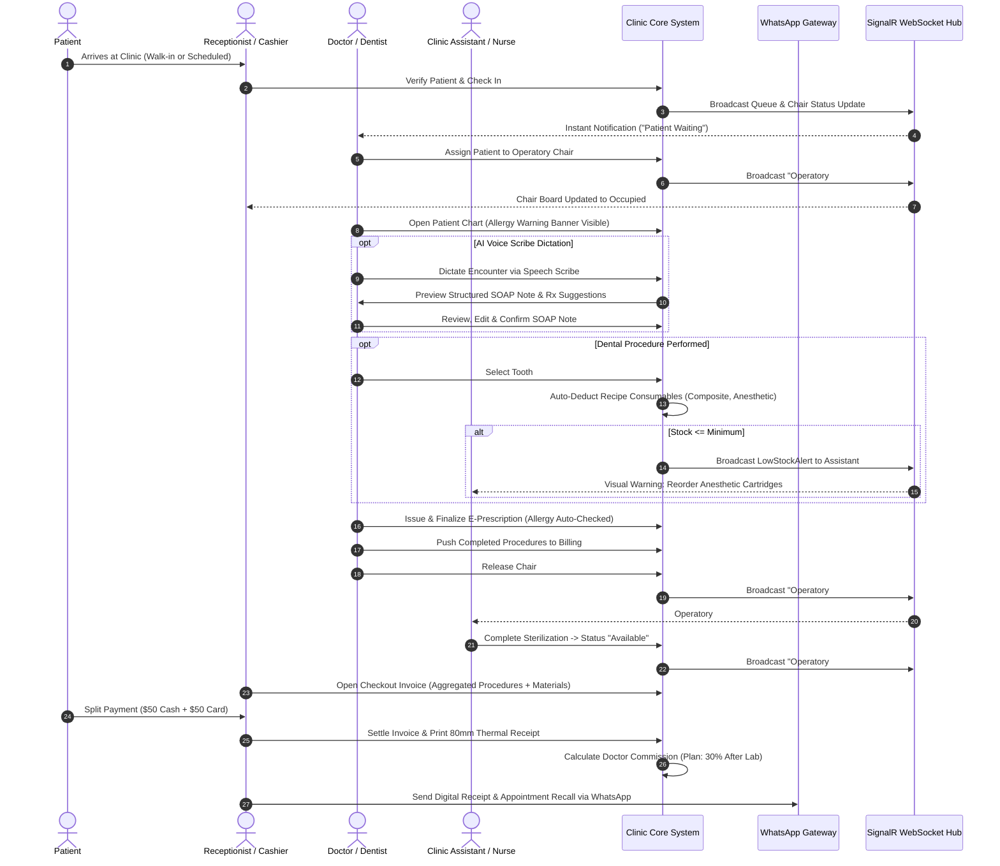

# Customer Requirements Document (CRD)
## Enterprise Smart Clinic Management System (Clinic App)

| **Document Version** | 4.0.0 (AI Diagnostic Vision Edition) |
| :--- | :--- |
| **Status** | Approved Baseline for Enterprise Clinical Operations & Customer Sign-Off |
| **Date** | 2026-10-06 |
| **Document Classification** | Customer Requirements Document (CRD) / User Requirements Specification (URS) |
| **Target Practice** | Outpatient Medical Clinics, Multi-Specialty Poly-Clinics, Advanced Dental & Radiology Centers |
| **Primary Stakeholders** | Clinic Owners, Medical Specialists, Dental Surgeons, Practice Managers, Front-Desk Operations |

---

## 1. Document Control & Revision History

| Version | Date | Author / Role | Summary of Changes |
| :---: | :---: | :--- | :--- |
| **1.0.0** | 2026-09-25 | Healthcare Systems Analyst | Initial functional scope baseline across 12 core modules. |
| **2.0.0** | 2026-09-25 | Lead Clinical Product Architect | Upgraded with Clinical Safety Business Rules, Output Specifications (Prescription/Receipt/Dental), Hardware/Thermal Printer Specifications, Regulatory Retention Rules, and Formal Scope Boundaries. |
| **3.0.0** | 2026-10-06 | Principal Healthcare Enterprise Architect | Comprehensive production upgrade incorporating 12 Master Clinical & Operational Enhancements: Automated WhatsApp Hub & Batch Dispatch, Multi-Stage Treatment Planning with Patient Consent, Procedure-Linked Auto-Inventory Deduction Recipes, Live Operatory & Chair Status Board with Turnaround Timers, Global Spotlight Command Palette (`Ctrl+K`), Radiology Digital Caliper (mm) & Split-Screen Comparison Tools, AI Chair-Side Voice Scribe (SOAP Notes), Tiered Doctor Commission & Profit-Sharing Analytics, Offline PWA Resilience & Local Caching, 100% Arabic RTL Visual Parity, Route Lazy Loading & Bundle Budgets (<200 kB), and Angular 19 Signal Primitives Modernization. |
| **3.1.0** | 2026-10-06 | Lead Healthcare Solutions Architect | Release v3.1.0: Patient Self-Service Portal (`/portal/login`), Passwordless OTP Authentication, Real-Time Waiting Queue Radar Tracker, 1-Click Printable Medical Prescriptions and Tax Invoice Receipts with Tamper-Proof QR Code Verification, and Automated 24/7 Cloud Health Telemetry. |
| **4.0.0** | 2026-10-06 | Principal AI Healthcare Solutions Architect | Release v4.0.0: AI-Powered Computer Vision Radiograph Diagnostics Suite (DentalVision YOLOv11 Ensemble), Multi-Head Pathology Detection (Caries, Periapical Radiolucency, Alveolar Bone Loss Caliper, 3rd Molar Impaction), Clinical Safety Governance Rule BR-AI-RAD-01 (Physician-in-the-Loop Verification), and 1-Click Odontogram Synchronization directly into Patient Dental Chart. |

---

## 2. Executive Summary & Business Case

### 2.1 Clinical & Business Problem Statement
Modern multi-specialty healthcare and dental outpatient clinics operate in high-tempo, data-intensive environments where clinical accuracy, operational velocity, and financial integrity directly dictate practice viability:
- **Clinical Time Fragmentation:** Attending physicians and dental surgeons spend up to $40\%$ of consultation time navigating cumbersome software menus, typing notes, or re-entering data, leading to cognitive fatigue and reduced patient engagement.
- **Revenue Leakage & Consumables Waste:** Procedures are frequently performed without accounting for high-cost materials (e.g., bone grafts, restorative composites, membranes, anesthetic cartridges). Unbilled items and forgotten lab deductions erode operating margins by $8\text{--}15\%$.
- **Disjointed Multi-Session Treatment Plans:** Patients requiring extensive multi-stage restorative, endodontic, or orthodontic treatment often drop out between sessions due to lack of transparent cost estimators, phased treatment clarity, and signed financial consent.
- **Operatory Bottlenecks & Chair Downtime:** Receptionists lack real-time visibility into operatory chair status (in-chair treatment vs. room sterilization), causing schedule slippages, extended waiting room delays, and underutilized operatories.
- **Communication Inefficiency & Patient No-Shows:** Appointment confirmations via manual phone calls are labour-intensive, leading to $15\text{--}25\%$ patient no-show rates without proactive, automated messaging.
- **Doctor Remuneration Disputes:** Complex commission structures (variable tier percentages, material/lab fee deductions before vs. after doctor splits) managed via ad-hoc spreadsheets cause administrative disputes, delayed payouts, and clinic accounting friction.

### 2.2 System Purpose & Strategic Goals
The **Enterprise Smart Clinic Management System** delivers a unified, high-performance, cloud-native clinical automation platform engineered to achieve:
1. **Frictionless Chair-Side Experience:** Sub-second response times, keyboard-first navigation via Global Spotlight Command Palette (`Ctrl+K`), AI-assisted voice documentation, and interactive tooth-by-tooth odontograms.
2. **Clinical Safety & Zero Diagnostic Regret:** Hard-locked allergy interceptors, permanent tamper-evident medical histories, digital radiograph caliper measurements calibrated to millimeter accuracy, and dual-scan before/after comparison.
3. **End-to-End Material Accountability:** Automatic recipe-based deduction of consumable inventories upon procedure completion, lot/batch tracking, expiration date quarantines, and real-time low-stock alerts.
4. **Transparent Treatment & Financial Phasing:** Multi-stage treatment planning that breaks complex clinical plans into sequential phases with itemized cost estimates, digital patient consent signatures, and direct billing integration.
5. **Real-Time Practice Flow Optimization:** Real-time operatory chair status monitoring with turnover and sterilization timers synchronized across all devices via WebSockets.
6. **Automated Remuneration & Doctor Retention:** Automated calculation of tiered doctor commissions with configurable laboratory deduction rules and audit-locked payout settlements.
7. **Omnichannel Patient Engagement:** Two-way WhatsApp messaging hub with 24-hour pre-appointment batch dispatch and one-click direct communication.
8. **Offline Resilience & Bilingual Parity:** Flawless operation in offline environments with local IndexedDB/Service Worker caching, instant background synchronization, and native 100% Arabic (RTL) and English (LTR) visual parity.

---

## 3. Scope Boundaries (In-Scope vs. Explicitly Out-of-Scope)

```
┌──────────────────────────────────────────────────────────────────────────────────────────────────┐
│                                       IN-SCOPE (Enterprise System)                               │
├──────────────────────────────────┬─────────────────────────────────┬─────────────────────────────┤
│ • Outpatient EMR & Clinical Chart│ • Multi-Stage Treatment Plans   │ • Consumables & Recipe Inv. │
│ • Scheduling & Live Chair Board  │ • Odontogram (FDI & Universal)  │ • Auto-Stock Deduction      │
│ • E-Prescriptions & Allergy Check│ • Radiology Caliper & Compare   │ • Multi-Method Split Cashier│
│ • WhatsApp Hub & Batch Dispatch  │ • AI Chair-Side Voice Scribe    │ • Doctor Commission Ledger  │
│ • Global Command Palette (Ctrl+K)│ • Offline PWA & Background Sync │ • Full Bilingual Arabic RTL │
└──────────────────────────────────┴─────────────────────────────────┴─────────────────────────────┘
                                                 ▲
                                                 │ Explicit Boundary
                                                 ▼
┌──────────────────────────────────────────────────────────────────────────────────────────────────┐
│                                   OUT-OF-SCOPE (Enterprise Baseline)                            │
├──────────────────────────────────┬─────────────────────────────────┬─────────────────────────────┤
│ • Inpatient Beds / Ward Admission│ • Automated Insurance Clearing  │ • Retail Pharmacy Over-The- │
│   (No nursing ward rounds, OR    │   Direct EDI Claims Switch      │   Counter POS (No external  │
│    anesthesia charting, bed mgmt)│   (Manual claims & bills only)  │   wholesaler EDI sync)      │
├──────────────────────────────────┼─────────────────────────────────┼─────────────────────────────┤
│ • Hardware COM Port Serial Drivers│ • Direct PACS DICOM Hardware    │ • Direct In-App Video Call  │
│   (Standard ESC/POS thermal &     │   Modality C-STORE Integration  │   Telehealth Streaming      │
│    system print spoolers only)   │   (Direct image upload/view)    │   (Physical visit focus)    │
└──────────────────────────────────┴─────────────────────────────────┴─────────────────────────────┘
```

---

## 4. User Personas & Role Responsibilities (RACI Matrix)

| User Persona | Operational Context | Core Responsibilities & System Interactions |
| :--- | :--- | :--- |
| **Dr. Subscriber / Clinic Owner (Admin Doctor)** | SaaS Tenant / Executive Office / Operatory | Primary SaaS license holder. Manages one or more clinics, configures clinic profiles, invites associate doctors, hires and delegates assistants, defines doctor commission plans, audits financial reports, and configures public booking rules. |
| **Associate / Visiting Doctor** | Multi-Clinic Practitioner / Consultation Suite | Practices at one or multiple clinics. Configures clinic-specific working days and shift hours, reviews patient EMR, charts odontograms, builds treatment plans, issues e-prescriptions, performs clinical procedures, and generates diagnostic referral orders. |
| **Clinic Assistant / Reception Nurse** | Front-Desk / Operatory / Sterilization / Stock Room | **Delegated Practice Operator:** Empowered by clinic doctors to: (1) Register and manage patient demographic profiles; (2) Reserve and manage appointment schedules for all clinic doctors; (3) Set treatment charges, collect payments (cash/card/split), and issue receipts; (4) Add, update, and track clinic equipment, tools, maintenance, and sterilization cycles; (5) Upload and attach external lab results and radiology scans directly to patient profiles. *Guardrail: Restricted from editing finalized clinical SOAP notes or viewing doctor net commission payout ledgers.* |
| **Patient (Public / Self-Service)** | Mobile / Web / Waiting Room | Books appointments via the Clinic Public QR Code or direct link, selects preferred doctor and time slot, receives WhatsApp booking confirmation and 24h reminders, reviews prescriptions, and monitors live queue status. |
| **External Diagnostic Partner (Lab & Radiology Center)** | External Dental Lab / Imaging Center | Receives diagnostic referral orders via secure digital tokens/QR codes. Drops off finalized prosthetic lab items, CAD/CAM models, biopsy reports, or high-resolution radiographs (PNG/JPEG/DICOM) into the clinic portal, triggering automatic linking to the patient EMR. |

### Enriched RACI Governance Matrix
*(**R**esponsible, **A**ccountable, **C**onsulted, **I**nformed)*

| Functional Domain | Clinic Owner Doctor | Associate Doctor | Clinic Assistant | Patient | External Diagnostic Partner |
| :--- | :---: | :---: | :---: | :---: | :---: |
| **SaaS Clinic Setup & Multi-Doctor Roster** | R / A | C | I | I | I |
| **Patient Registration & Intake** | A | I | R | C | I |
| **Appointment Scheduling & Slot Allocation** | A | C | R | R (Self-Booking) | I |
| **Public Clinic QR Code Booking Portal** | A | C | I | R | I |
| **Clinical Encounters, SOAP Notes & AI Scribe** | A | R | I | I | I |
| **Interactive Dental Charting & Odontogram** | A | R | C | I | I |
| **Multi-Stage Treatment Plans & Informed Consent** | A | R | I | R (Consent) | I |
| **E-Prescriptions & Allergy Interceptor** | A | R | I | R (Receipt) | I |
| **Diagnostic Referral Order Generation** | A | R | C | I | R (Fulfillment) |
| **Lab & Radiology Ingestion & Auto-Linking** | A | I | R (Manual Backup) | I | R (Direct Drop-off) |
| **Equipment, Tools & Sterilization Cycles** | A | C | R | I | I |
| **Consumables Inventory & Auto-Deductions** | A | C | R | I | I |
| **Cashiering, Payments & Receipt Issuance** | A | I | R | R (Payer) | I |
| **Doctor Commission & Profit-Sharing Settlements** | R / A | C (Review) | I (Restricted) | I | I |
| **WhatsApp Communication & Batch Reminders** | A | I | R | R (Recipient) | I |

---

## 5. Clinical Business Rules & Safety Guardrails

The following business rules represent strict operational invariants enforced across application controllers, domain validators, database constraints, and user interface workflows.

### 5.1 Clinical & Prescription Safety Rules (BR-MED / BR-RX)

#### `BR-RX-01: Allergy Conflict Interceptor`
- Whenever a practitioner selects or inputs a medication in an electronic prescription or clinical note, the system must perform an instantaneous, case-insensitive cross-check against the patient’s documented active drug allergies.
- If a conflict or known cross-reactivity is identified, the system must trigger a high-visibility amber/red blocking alert modal displaying the matched allergen and active pharmaceutical ingredient.
- The practitioner cannot finalize the prescription without either:
  1. Selecting an alternative non-conflicting medication, or
  2. Providing a mandatory written clinical justification for override, which is permanently logged in the audit ledger.

#### `BR-RX-02: Prescription Immutability & Audit Lock`
- Once an electronic prescription is finalized and signed, its status transitions to `Finalized` and it becomes legally immutable. No user, regardless of administrative privileges, may edit or delete a finalized prescription.
- If clinical therapy requires modification, the practitioner must issue a *Superseding Prescription* referencing the original prescription ID, or attach a formal timestamped *Addendum*.
- The complete chain of prescription revisions must remain visible in the patient’s encounter timeline.

#### `BR-RX-03: Pediatric Safety Dosing Prerequisite`
- For any patient under 14 years of age (calculated automatically from Date of Birth), the system must require current **Body Weight (kg)** to be recorded within the active encounter before permitting prescription generation.
- The system must display recommended mg/kg dosage verification aids to prevent accidental pediatric overdosing.

#### `BR-MED-01: Consultation Note Non-Deletion & Amendment Trail`
- Clinical consultation notes entered by a practitioner cannot be deleted or purged from the database (`IsDeleted = true` is rejected on clinical encounter records).
- Additions or clarifications must be appended as child `ClinicalNoteAmendment` records capturing the amendment timestamp, practitioner ID, and delta content.

### 5.2 Multi-Stage Treatment Plan & Dental Rules (BR-PLAN / BR-DEN)

#### `BR-PLAN-01: Treatment Plan Lifecycle State Machine & Consent Locking`
- Every multi-stage dental and clinical treatment plan must follow a strict, unidirectional state transition model:
  $$\text{Proposed (Draft)} \longrightarrow \text{Patient Accepted} \longrightarrow \text{In Progress} \longrightarrow \text{Completed} \longrightarrow \text{Invoiced}$$
- State transition rules:
  1. **Proposed $\rightarrow$ Accepted:** Requires formal acceptance, which unlocks procedure scheduling and activates the digital patient consent signature pad.
  2. **Accepted $\rightarrow$ In Progress:** Initiated when the first procedure in the plan is commenced chair-side.
  3. **In Progress $\rightarrow$ Completed:** Automatically occurs when all sequential procedures across all stages are marked `Completed`.
  4. **Completed $\rightarrow$ Invoiced:** Procedures marked `Completed` are transmitted to the billing module (`POST /api/dental/{id}/push-to-billing`).
- Once a treatment plan is signed via digital signature and marked `Accepted`, the agreed procedures and estimated tariffs are locked against unauthorized alteration. Any scope addition requires a *Treatment Plan Addendum* or *Supplemental Phase*.

#### `BR-DEN-01: Dual Dental Notation Standard Support`
- The odontogram must provide real-time seamless switching between **FDI Two-Digit Notation** (ISO 3950: 11–48 permanent, 51–85 deciduous) and the **Universal Numbering System** (1–32 permanent, A–T deciduous).
- Switching notation standards is purely presentational and must never modify the canonical tooth entity representation in the database.

#### `BR-DEN-02: Procedure State Locking Against Invoicing`
- Dental procedures cannot be directly marked as `Invoiced` by manual entry. Only completed procedures transferred through the formal billing push workflow (`/push-to-billing`) can transition to `Invoiced`.
- Once in `Invoiced` status, a procedure is permanently locked from clinical editing or deletion.

### 5.3 Inventory & Recipe Auto-Deduction Rules (BR-INV)

#### `BR-INV-01: Expiration Date Quarantine`
- Any consumable material whose batch expiration date has passed (`ExpirationDate < UtcNow.Date`) must automatically transition to quarantined status (`IsExpired = true`).
- The system must immediately disable the expired item from clinical selection menus, procedure completion recipes, and dispensing carts with a high-contrast warning: *"Material Expired & Quarantined"*.

#### `BR-INV-02: Real-Time Low-Stock Reorder Threshold Trigger`
- When the on-hand quantity of an inventory item reaches or falls below its configured minimum safety stock (`Quantity <= MinimumThreshold`), the system must immediately trigger an in-app alert banner and emit a real-time SignalR event (`LowStockAlert`) to all connected clinic assistant and administrator sessions.

#### `BR-INV-03: Procedure-Linked Recipe Auto-Deduction Invariant`
- Each clinical and dental procedure type may have an associated standard material recipe (e.g., *Composite Restoration* deducts 1 composite compule, 1 bonding agent dose, 1 micro-brush, and 1 local anesthetic cartridge).
- When a procedure transitions to `Completed`:
  1. The system must automatically deduct the exact recipe quantities from active, unexpired inventory stock.
  2. If on-hand stock is insufficient, the system must log a partial depletion warning, deduct available stock down to 0, and record a stock variance discrepancy note for administrative review.
  3. Stock deductions must record the associated Procedure ID, Patient ID, and timestamp in the inventory audit ledger.

### 5.4 Operatory & Chair Management Rules (BR-OPS)

#### `BR-OPS-01: Operatory Room & Dental Chair State Lifecycle`
- Operatory dental chairs must operate according to a 4-state finite state machine:
  $$\text{Available (Ready)} \underset{\text{Release}}{\overset{\text{Assign}}{\rightleftharpoons}} \text{Occupied (In Chair)} \longrightarrow \text{Cleaning (Sterilization)} \longrightarrow \text{Available (Ready)}$$
  *(With an administrative override state: $\text{Maintenance}$)*
- State transition rules:
  1. **Assign (`available` $\rightarrow$ `occupied`):** Requires valid Patient ID, Patient Name, Attending Doctor, and Procedure Name. Starts the *Occupancy Elapsed Timer*.
  2. **Release (`occupied` $\rightarrow$ `cleaning`):** Clears patient details, resets occupancy timer, and immediately initiates the *Cleaning / Sterilization Timer*.
  3. **Complete Cleaning (`cleaning` $\rightarrow$ `available`):** Triggered by clinic assistant or nurse confirming operatory disinfection and readiness.
  4. **Live Broadcast Invariant:** Every chair status mutation must immediately broadcast a `ReceiveChairStatusUpdate` SignalR message to all connected clients within the clinic branch group (`clinic_{clinicId}`), synchronizing reception, doctor, and nursing displays in $<100\text{ ms}$.

### 5.5 Financial, Invoicing & Doctor Commission Rules (BR-FIN / BR-COMM)

#### `BR-FIN-01: Discount Authorization Matrix`
- Front-desk cashiers may apply courtesy discounts up to a hard system ceiling (maximum $10\%$ of invoice gross total).
- Any discount exceeding $10\%$ requires explicit administrative credential authorization or Doctor PIN validation before the invoice can be finalized.

#### `BR-FIN-02: Outstanding Debt Warning & Patient Ledger Isolation`
- When an existing patient with an unsettled balance is selected for appointment check-in or chair assignment, the system must present a high-contrast amber debt alert badge detailing the unpaid amount and delinquent invoice dates.
- Payments must be applied to specific invoices in strict FIFO (First-In, First-Out) chronological order unless explicitly directed by the cashier.

#### `BR-FIN-03: Invoice Numbering Continuity & Voiding Invariant`
- Invoices must follow a gapless sequential numbering format per clinic branch (e.g., `INV-2026-00001`). Invoices cannot be physically deleted; erroneous invoices must be marked as `Voided` with a mandatory recorded justification and timestamp.

#### `BR-COMM-01: Tiered Doctor Commission Calculation Rules`
- Doctor commissions are computed from eligible billed procedures based on the doctor's active `DoctorCommissionPlan`:
  1. **Default Base Rate:** Configurable flat percentage (e.g., $30.0\%$).
  2. **Specialty / Category Overrides:** Specific procedure categories (e.g., *Endodontics: 40%*, *Implantology: 35%*, *General: 30%*) take precedence over the default base rate.
  3. **Laboratory & Consumable Fee Deduction Modes:**
     - **`BeforeCommission` (Standard):** Doctor commission is calculated on the net procedural revenue after deducting external dental lab fees:
       $$\text{Commission} = (\text{Procedure Gross Fee} - \text{Lab Fee}) \times \text{Commission Rate}$$
     - **`AfterCommission`:** Commission is calculated on gross fee, and lab fee is deducted directly from doctor payout:
       $$\text{Commission} = (\text{Procedure Gross Fee} \times \text{Commission Rate}) - \text{Lab Fee}$$
     - **`None`:** Clinic absorbs all lab and material costs; doctor receives commission on full gross fee:
       $$\text{Commission} = \text{Procedure Gross Fee} \times \text{Commission Rate}$$

#### `BR-COMM-02: Commission Payout Ledger Immutability & Audit Locking`
- Commission payout statements follow a 3-step approval lifecycle:
  $$\text{Draft} \longrightarrow \text{Approved} \longrightarrow \text{Paid}$$
- Once marked `Approved`, commission line items are locked against recalculation.
- When settled to `Paid`, a mandatory `PaymentReference` (e.g., bank transfer voucher, check number) and settlement timestamp are permanently recorded. Settled payout statements cannot be modified or deleted.

### 5.6 Omnichannel Communication & Patient Engagement Rules (BR-NOTIF)

#### `BR-NOTIF-01: Automated WhatsApp Messaging & Dispatch Fallback`
- The system must provide direct patient messaging via official WhatsApp Cloud API with transparent fallback to deep-linked Web WhatsApp (`https://wa.me/{phone}?text={encoded_message}`).
- Phone numbers must be automatically validated and normalized to international E.164 format (e.g., `+20 100 123 4567` $\rightarrow$ `201001234567`) before dispatch.
- Automated appointment reminder batches must be scheduled for dispatch **24 hours prior** to appointment scheduled start time.
- The system must record message delivery status, timestamp, and retry counts in the patient communication log.

### 5.7 AI Chair-Side Voice Scribe & Medical Safety Rules (BR-AI)

#### `BR-AI-01: AI Chair-Side Voice Scribe Non-Destructive Review Guardrail`
- Chair-side voice transcription powered by the Web Speech API / continuous audio streaming must process speech locally or via secure encrypted endpoints with strict zero-retention policies for raw audio.
- The system must automatically structure dictated notes into the standardized clinical **SOAP** format:
  - **S (Subjective):** Patient's chief complaint, history of present illness, and symptoms.
  - **O (Objective):** Clinical observations, physical examination findings, vital signs.
  - **A (Assessment):** Provisional or definitive clinical diagnosis.
  - **P (Plan):** Therapeutic recommendations, procedures, and follow-up.
- **Safety Invariant:** Under NO circumstances may the AI transcription automatically commit or finalize a clinical note or prescription into the official medical record. The attending physician must visually review, edit, and click an explicit "Apply to Encounter" button, ensuring full clinician accountability.
- Entity extraction for suggested medications must undergo standard `BR-RX-01` allergy conflict interceptor checking before being accepted into the prescription builder.

### 5.8 Offline Resilience & Progressive Web App Rules (BR-PWA)

#### `BR-PWA-01: Offline Caching & Optimistic UI Synchronization Policy`
- When internet connectivity is lost, the PWA Service Worker must maintain operational continuity for active patient queues, clinical forms, dental charting, and viewing cached patient records.
- Form submissions created offline must be stored in browser `IndexedDB` with unique temporary UUIDs and an amber *"Pending Sync"* visual indicator.
- Upon network restoration, the system must execute background synchronization in chronological order, detecting potential conflicts and alerting the practitioner if a record was modified concurrently on another station.

### 5.9 Global Command Palette & Navigation Rules (BR-UX)

#### `BR-UX-01: Keyboard-First Command Palette Hotkey & Scope Filtering`
- The system must provide instant activation of the Global Command Palette via `Ctrl + K` (Windows/Linux) or `Cmd + K` (macOS) from any screen or modal state.
- Search queries must return categorized results in $<150\text{ ms}$ across Patients, Doctors, Operatory Chairs, Inventory Consumables, and System Navigation routes.
- The command palette must enforce strict Role-Based Access Control (RBAC): receptionist sessions cannot navigate to doctor-restricted diagnostic screens or commission analytics.

### 5.10 Doctor-Centric SaaS & Multi-Clinic Architecture Rules (BR-SAAS)

#### `BR-SAAS-01: Multi-Clinic Ownership & Polyclinic Doctor Hosting`
- A Doctor is the core SaaS tenant account. A Doctor can create and own one or multiple distinct clinic entities (e.g., "Downtown Clinic" and "Northside Clinic").
- An individual clinic entity can host multiple doctors (Polyclinic / Shared Practice model). Doctors can be assigned as Clinic Owners, Partners, or Associate Practitioners.
- Tenancy Scoping: Patient encounters, appointments, invoices, and physical inventory are strictly scoped by `ClinicId`. Doctor identities, specializations, master medical credentials, and subscription accounts remain global.

#### `BR-SAAS-02: Doctor Subscription Tiers & Feature Entitlement`
- Doctors purchase SaaS subscriptions (e.g., *Solo Doctor*, *Multi-Clinic Practitioner*, *Polyclinic Enterprise*) defining quotas for managed clinics, active assistant accounts, and monthly appointment volume.
- If a subscription expires or enters grace period, administrative and consultation access is preserved in read-only mode, with automated prompts for renewal.

### 5.11 Assistant Delegation & Operational Scope Rules (BR-ASST)

#### `BR-ASST-01: Assistant Delegated Operational Authority`
- A Doctor or Clinic Administrator can invite and bind Assistants (`UserRole.Assistant`) to one or more specific clinics via `UserClinic`.
- Clinic Assistants possess verified operational authority to perform the following core clinic workflows:
  1. **Patient Intake & EMR Management:** Register new patients, edit demographic information, record vital signs, and manage non-clinical contact details.
  2. **Appointment Scheduling:** Book, reschedule, and cancel appointments for *any* authorized doctor in that clinic, with full visibility into doctor working shifts.
  3. **Cashiering & Payment Collection:** Generate invoices, record payments (Cash, Credit Card, Mobile Wallet, or Split Payments), apply authorized clinic discounts, and print 80mm thermal receipts or A4 tax invoices.
  4. **Equipment & Tool Management:** Register clinic equipment and tools, log calibration schedules, track repair maintenance, and record autoclave sterilization batches.
  5. **Diagnostic File Attachment:** Upload and associate lab test results, biopsy documents, clinical photos, and radiology scans directly into patient records.

#### `BR-ASST-02: Assistant Privacy & Clinical Governance Guardrail`
- Assistants are strictly prohibited from:
  1. Editing, amending, or deleting finalized clinical consultation notes (`SOAP`).
  2. Prescribing medications, modifying drug dosages, or overriding allergy interceptors.
  3. Viewing Doctor commission plans, doctor percentage splits, or net doctor financial payout ledgers.

### 5.12 Public Clinic QR Code & Multi-Doctor Scheduling Rules (BR-QR)

#### `BR-QR-01: Permanent Public Clinic Slug & QR Poster Link`
- Every clinic is provisioned with a permanent, human-readable public slug (e.g., `https://[app-domain]/book/al-amal-dental-cairo`) and a unique cryptographic GUID.
- The system provides an automated **Printable Clinic QR Kit** (PDF and high-resolution PNG) directly in the Clinic Settings. Clinics can print this poster for front-desk check-in, street banners, or digital distribution on WhatsApp, Instagram, and Google Maps.

#### `BR-QR-02: Dynamic Multi-Doctor Availability & Slot Resolution`
- Scanning the Clinic QR Code loads the public booking interface tailored to that clinic's branding and location.
- The patient selects from the list of doctors practicing at that clinic.
- Time slot generation dynamically evaluates:
  1. The doctor's clinic-specific availability days and hours (`DoctorClinic.AvailabilityDays` & `AvailabilityHours`).
  2. Exclusion of slots where the doctor already has a booked appointment at *this clinic or any other clinic* (cross-clinic double-booking prevention).
  3. Real-time patient phone number verification via WhatsApp/SMS OTP before slot reservation confirmation.

### 5.13 External Diagnostic Partner Drop-off & Auto-Linking Rules (BR-LAB)

#### `BR-LAB-01: Cryptographic Diagnostic Referral Token (Requisition Order)`
- When a doctor refers a patient for external diagnostic services (e.g., Crown/Bridge fabrication at a dental lab, biopsy at a pathology lab, or CBCT/panoramic scan at a radiology center), the system generates a `DiagnosticRequisitionOrder`.
- Each order is assigned a tamper-evident cryptographic token and scannable QR code embedded on the printed or digital referral slip: `https://[app-domain]/partner-dropzone?order=[TOKEN]`.

#### `BR-LAB-02: Tri-Factor Automated Ingestion & Patient Profile Attachment`
- When an external lab or radiology center drops off results through the secure upload portal, the system guarantees automated association to the patient record via the **Tri-Factor Ingestion Pipeline**:
  - **Factor 1 (Token Match - Deterministic):** Uploads via the referral QR code/link automatically bind the uploaded files directly to the patient's EMR, specific encounter, and target tooth/procedure without any manual lookup.
  - **Factor 2 (Patient Identifier Match - Assisted):** If accessed via the general clinic drop-off link, the partner enters the Patient Phone Number or File Number; the system matches the patient, requests confirmation of initials, and attaches the file.
  - **Factor 3 (DICOM Metadata Match - Automated):** For raw radiology scans (`.dcm`), the server-side parser extracts DICOM tags `(0010,0020) PatientID` and `(0010,0010) PatientName`, automatically indexing the scan into the patient's Radiology Viewer.

#### `BR-LAB-03: Real-Time Attending Doctor Alert & Clinical Chart Notification`
- Once diagnostic files are uploaded by an external partner, the system transitions the order status to `Results Received`.
- The system dispatches an instantaneous SignalR WebSocket push notification and WhatsApp alert to the attending doctor: *"Diagnostic results for Patient [Name] ([Order Type]) have been received and attached to their clinical chart."*
- The patient's EMR timeline highlights the new diagnostic artifact with a "New External Result" badge for immediate physician review.

### 5.14 Inter-Branch Stock Transfers & Centralized Supply Chain Logistics Rules (BR-LOG)

#### `BR-LOG-01: Transfer Custody & Source Stock Deduction`
- Inventory stock is deducted from the source facility ONLY upon explicit transition to `Dispatched`.
- Prior to dispatch, stock can be reserved in status `Approved`, but physical inventory remains recorded at the source facility.

#### `BR-LOG-02: Receiving Physical Verification & Destination Inward Credit`
- Inventory stock is credited to the destination clinic ONLY when the receiving custodian performs physical inspection and marks `Receive Shipment`.
- In-transit stock cannot be consumed for medical procedures until receiving confirmation is completed.

#### `BR-LOG-03: FEFO (First-Expired, First-Out) & Expiry Protection Guardrail`
- Consumables with less than 30 days remaining shelf life cannot be approved for inter-branch transfer unless accompanied by an explicit clinical supervisor override string `"OVERRIDE"`.

#### `BR-LOG-04: Discrepancy, Leakage & Damage Quarantine Logging`
- If received units are less than dispatched units, or if packages arrive damaged, the receiving custodian records the damaged count and reason (`BrokenSeal`, `TemperatureExcursion`, `MissingInTransit`). Damaged units are isolated to quarantine and not added to active inventory.

#### `BR-LOG-05: Immutable Transport Audit Trail`
- Requisitions in `Received` or `Cancelled` status are permanently audit-locked and cannot be modified or deleted.

### 5.15 Dental & Medical Insurance Claims & EDI Pre-Authorization Rules (BR-INS)

#### `BR-INS-01: Automated Copay & Claim Split Calculation`
- For patients with verified insurance coverage, invoices and treatment plans dynamically calculate:
  - Patient Copay Amount = Total Gross Amount * (Copay Percentage / 100)
  - Claimed Amount = Total Gross Amount - Patient Copay Amount
- Official patient receipts print the patient copay only, referencing the pending insurance claim number.

#### `BR-INS-02: High-Value Pre-Authorization Requirement`
- Procedures exceeding the insurance payer's `PreAuthThreshold` require status `PreAuthorized` or `Approved` before treatment can be marked completed under insurance.

#### `BR-INS-03: Claim Adjudication & Settlement Immutability`
- Only claims in `Approved` or `PartiallyApproved` status can transition to `Settled` upon entry of the TPA remittance voucher reference.
- Settled claims are permanently locked from modification.

#### `BR-INS-04: Diagnostic Evidence Traceability`
- Dental claims must link target FDI tooth numbers (11–48) and attach diagnostic radiograph scan URLs to prevent administrative payer rejections.

---

## 6. End-to-End Clinical Workflows

### 6.1 Unified Outpatient Clinical & Operational Flow


```mermaid
sequenceDiagram
    autonumber
    actor P as Patient
    actor R as Receptionist / Cashier
    actor D as Doctor / Dentist
    actor A as Clinic Assistant / Nurse
    participant S as Clinic Core System
    participant W as WhatsApp Gateway
    participant H as SignalR WebSocket Hub

    P->>R: Arrives at Clinic (Walk-in or Scheduled)
    R->>S: Verify Patient & Check In
    S->>H: Broadcast Queue & Chair Status Update
    H-->>D: Instant Notification ("Patient Waiting")
    D->>S: Assign Patient to Operatory Chair #1
    S->>H: Broadcast "Operatory #1: In Chair"
    H-->>R: Chair Board Updated to Occupied
    
    D->>S: Open Patient Chart (Allergy Warning Banner Visible)
    opt AI Voice Scribe Dictation
        D->>S: Dictate Encounter via Speech Scribe
        S->>D: Preview Structured SOAP Note & Rx Suggestions
        D->>S: Review, Edit & Confirm SOAP Note
    end
    
    opt Dental Procedure Performed
        D->>S: Select Tooth #16 -> Mark "Composite Restoration" Completed
        S->>S: Auto-Deduct Recipe Consumables (Composite, Anesthetic)
        alt Stock <= Minimum
            S->>H: Broadcast LowStockAlert to Assistant
            H-->>A: Visual Warning: Reorder Anesthetic Cartridges
        end
    end

    D->>S: Issue & Finalize E-Prescription (Allergy Auto-Checked)
    D->>S: Push Completed Procedures to Billing
    D->>S: Release Chair #1 -> Status "Cleaning"
    S->>H: Broadcast "Operatory #1: Cleaning"
    H-->>A: Operatory #1 Disinfection Alert Triggered
    
    A->>S: Complete Sterilization -> Status "Available"
    S->>H: Broadcast "Operatory #1: Ready"
    
    R->>S: Open Checkout Invoice (Aggregated Procedures + Materials)
    P->>R: Split Payment ($50 Cash + $50 Card)
    R->>S: Settle Invoice & Print 80mm Thermal Receipt
    S->>S: Calculate Doctor Commission (Plan: 30% After Lab)
    R->>W: Send Digital Receipt & Appointment Recall via WhatsApp
```

---

## 7. Functional Customer Requirements (Enriched Specification)

Requirements are tagged with unique traceable IDs, prioritized using MoSCoW (**Must Have**, **Should Have**, **Could Have**, **Won't Have**), and detailed with **User Stories** and **Given-When-Then Acceptance Criteria**.

---

### Module 1: Clinic Identity, Branch Management & Multi-Room Operatories (REQ-CLI)

#### `REQ-CLI-01: Clinic Profile & Formal Letterhead Configuration` [Must Have]
- **User Story:** *As a Clinic Owner, I want to configure the clinic’s official details, logo, syndicate license numbers, and letterhead headers, so that all printed prescriptions, diagnostic orders, and invoices project an authentic, branded image.*
- **Acceptance Criteria:**
  - **Given** the clinic owner accesses the Clinic Settings panel,
  - **When** they update clinic branding, tax registration number, and syndicate license,
  - **Then** all newly generated PDF prescriptions, receipts, and invoices must immediately display the updated letterhead with proper alignment and zero graphic distortion.

#### `REQ-CLI-02: Operating Shifts & Appointment Time-Slot Configuration` [Must Have]
- **User Story:** *As a Practice Manager, I want to define working shifts, consultation duration slots (e.g., 15, 30, 45, 60 minutes), and holiday closures, so that receptionists cannot book patients outside operating windows.*
- **Acceptance Criteria:**
  - **Given** clinic working hours are set to 09:00 AM – 09:00 PM, Saturday through Thursday,
  - **When** a receptionist attempts to schedule an appointment on Friday or outside shift boundaries,
  - **Then** the system must block the booking and present a descriptive error message indicating clinic closed hours.

#### `REQ-CLI-03: Multi-Branch & Multi-Operatory Room Setup` [Must Have]
- **User Story:** *As a Doctor practicing across multiple clinic branches, I want to switch between clinic branches from a single session, so that I can manage each branch's patient queue, operatory chairs, and inventories independently.*
- **Acceptance Criteria:**
  - **Given** a doctor is associated with "Main Branch - Downtown" and "Zayed Branch",
  - **When** they switch the active clinic selector in the navigation bar,
  - **Then** the dashboard, appointment calendar, patient queue, and operatory chair board must immediately reload data scoped strictly to the selected clinic branch.

---

### Module 2: User Access, Role-Based Security & Permissions (REQ-SEC)

#### `REQ-SEC-01: Role-Segregated Portals & Least Privilege Principle` [Must Have]
- **User Story:** *As a Clinic Administrator, I want users to be assigned explicit roles (`Admin`, `Doctor`, `Assistant`, `Receptionist`), so that staff members only access tools necessary for their daily responsibilities.*
- **Acceptance Criteria:**
  - **Given** a user logs in with the `Receptionist` role,
  - **When** they attempt to access doctor consultation diagnostic notes, clinical dental charts, or commission reports directly via URL navigation,
  - **Then** the system must deny access with HTTP `403 Forbidden` and redirect to the front-desk operational view.

#### `REQ-SEC-02: Confidential Medical Masking & Patient Privacy` [Must Have]
- **User Story:** *As a Patient and Attending Physician, I want confidential clinical diagnoses, psychiatric notes, and sensitive lab results to remain masked from front-desk staff, so that patient privacy is strictly upheld.*
- **Acceptance Criteria:**
  - **Given** a patient file contains private doctor notes,
  - **When** a receptionist views the patient record,
  - **Then** the clinical note content must be completely masked or omitted from the front-desk user interface and API response payload.

---

### Module 3: Patient Records, Intake & Clinical Safety EMR (REQ-PAT)

#### `REQ-PAT-01: Rapid Patient Intake & File Number Assignment` [Must Have]
- **User Story:** *As a Receptionist, I want to register a new patient in under 45 seconds using minimal mandatory fields (Name, Phone Number, Gender, Age/Birthdate), so that arriving patients do not face registration bottlenecks.*
- **Acceptance Criteria:**
  - **Given** a new walk-in patient arrives,
  - **When** the receptionist enters Full Name, Primary Phone, Gender, and Birth Date and clicks "Register & Check-In",
  - **Then** a unique Patient File Number is generated instantly, and the patient is immediately eligible for appointment booking and chair assignment in $<45\text{ seconds}$.

#### `REQ-PAT-02: Duplicate Prevention & Phone Number Normalization` [Must Have]
- **User Story:** *As a Clinic Manager, I want the system to flag identical phone numbers or national identification IDs, so that duplicate patient charts are not created accidentally.*
- **Acceptance Criteria:**
  - **Given** an existing patient with phone number `+201012345678`,
  - **When** a receptionist attempts to register a new file with the identical normalized phone number,
  - **Then** the system must display an alert listing the existing matched patient and offer a one-click option to open the existing file.

#### `REQ-PAT-03: Prominent Allergy & Chronic Disease Warning Banner` [Must Have]
- **User Story:** *As an Attending Physician, I want a persistent high-contrast red alert banner displaying drug allergies and chronic conditions whenever I open a patient file, so that I never prescribe harmful drugs.*
- **Acceptance Criteria:**
  - **Given** a patient has recorded allergies to `Penicillin`,
  - **When** the doctor opens the patient consultation view,
  - **Then** a high-contrast red badge stating **"ALLERGIES: PENICILLIN"** must be prominently anchored at the top of the screen throughout the consultation.

#### `REQ-PAT-04: Digital Patient Consent Signature Pad` [Must Have]
- **User Story:** *As a Doctor and Practice Manager, I want patients to digitally sign treatment plans, surgical informed consent, and GDPR privacy forms on a tablet/screen, so that legal consent is securely captured without paper.*
- **Acceptance Criteria:**
  - **Given** a patient accepts a proposed treatment plan,
  - **When** the doctor opens the digital signature modal,
  - **Then** the patient can sign using a touchscreen stylus or finger, clear if needed, and save the signature as a base64 PNG linked permanently to the patient record with timestamp and IP/device metadata.

---

### Module 4: Appointment Scheduling & Real-Time Queue Management (REQ-APT)

#### `REQ-APT-01: Multi-View Calendar (Day / Week / Month / Doctor View)` [Must Have]
- **User Story:** *As a Receptionist, I want an interactive calendar color-coded by doctor and status, so that I can see available slots at a glance.*
- **Acceptance Criteria:**
  - **Given** the receptionist is viewing the calendar,
  - **When** they toggle between Day, Week, and Month views,
  - **Then** appointments render color-coded by attending practitioner, showing patient name, procedure type, and status badges.

#### `REQ-APT-02: Live Waiting Room Queue & Ticket Dispatch` [Must Have]
- **User Story:** *As a Receptionist, I want to mark a patient as "Arrived / Waiting", so that the doctor's queue screen updates in real time without refreshing.*
- **Acceptance Criteria:**
  - **Given** a patient has a scheduled booking for 04:00 PM,
  - **When** the receptionist clicks "Check In",
  - **Then** the patient's queue card moves to the "Waiting" section, displays their arrival timestamp and waiting duration timer, and automatically appears in the doctor's queue via SignalR.

#### `REQ-APT-03: Double-Booking Conflict Prevention` [Must Have]
- **User Story:** *As a Receptionist, I want the system to prevent overlapping appointments for the same doctor unless an emergency override is confirmed, so that the clinic schedule remains orderly.*
- **Acceptance Criteria:**
  - **Given** Doctor A already has an appointment booked for 10:00 AM – 10:30 AM,
  - **When** a receptionist attempts to book another patient for Doctor A at 10:15 AM,
  - **Then** the system must block the booking and highlight the overlapping schedule conflict.

---

### Module 5: Clinical Encounters, AI Voice Scribe & E-Prescriptions (REQ-RX / REQ-AI)

#### `REQ-RX-01: Structured Clinical Encounter Recording (SOAP Standard)` [Must Have]
- **User Story:** *As a Doctor, I want to record chief complaints, vital signs, physical exam findings, and provisional/final diagnoses according to the standard SOAP format, so that the patient's visit is thoroughly documented.*
- **Acceptance Criteria:**
  - **Given** a doctor is conducting an active consultation,
  - **When** they fill out Subjective, Objective, Assessment, and Plan fields,
  - **Then** the encounter note is validated and saved with author attribution and UTC timestamp.

#### `REQ-RX-02: Rapid Drug Prescription with Dosage Presets & Allergy Check` [Must Have]
- **User Story:** *As a Doctor, I want auto-complete suggestions for drug names, standard forms, strengths, and frequencies, with automated allergy conflict interceptors, so that I can draft prescriptions safely in under 30 seconds.*
- **Acceptance Criteria:**
  - **Given** the doctor is in the e-prescription editor,
  - **When** they type `Amox` for a patient with recorded penicillin allergy,
  - **Then** the system suggests `Amoxicillin 500mg` but immediately raises the high-contrast `BR-RX-01` Allergy Interceptor warning dialog before the item can be added.

#### `REQ-RX-03: Print-Ready Formatted Prescription PDF with Verification QR Code` [Must Have]
- **User Story:** *As a Doctor, I want to generate a crisp, standardized prescription PDF formatted with official clinic headers, doctor credentials, patient details, and a verification QR code, ready for direct A4/A5 printing.*
- **Acceptance Criteria:**
  - **Given** an e-prescription is finalized,
  - **When** the doctor clicks "Print Prescription",
  - **Then** a print preview opens displaying clinic logo, syndicate number, patient age/weight, numbered medication table, doctor signature line, and a cryptographic verification QR code.

#### `REQ-AI-01: AI Chair-Side Voice Scribe Continuous Dictation` [Should Have]
- **User Story:** *As a Doctor, I want to dictate consultation notes hands-free chair-side using speech-to-text, so that I can maintain eye contact with the patient while recording clinical observations.*
- **Acceptance Criteria:**
  - **Given** the doctor opens the Voice Scribe modal during an encounter,
  - **When** they click "Start Dictation" and speak into the microphone,
  - **Then** the system streams continuous real-time speech recognition, transcribing English and medical terms with visual audio wave animation.

#### `REQ-AI-02: Automated SOAP Note Structuring & Medication Entity Extraction` [Should Have]
- **User Story:** *As a Doctor, I want the AI Voice Scribe to automatically parse my unstructured speech into structured SOAP sections and extract suggested medications, so that I do not need to manually categorize dictation.*
- **Acceptance Criteria:**
  - **Given** a completed dictation audio stream,
  - **When** the doctor clicks "Process Dictation",
  - **Then** the system populates Subjective, Objective, Assessment, and Plan sections, displays detected medication suggestions for one-click prescription inclusion, and waits for explicit doctor review and approval before committing.

---

### Module 6: Specialized Dental Charting & Multi-Stage Treatment Plans (REQ-DEN / REQ-PLAN)

#### `REQ-DEN-01: Adult & Pediatric Interactive Odontogram` [Must Have]
- **User Story:** *As a Dentist, I want an interactive visual graphic of the human dentition (permanent 32 teeth and primary 20 teeth), so that I can select individual teeth and surfaces (Mesial, Distal, Occlusal, Lingual, Buccal).*
- **Acceptance Criteria:**
  - **Given** the dentist opens a dental patient encounter,
  - **When** they toggle between "Adult" and "Pediatric",
  - **Then** the odontogram switches between permanent teeth (11–48) and primary deciduous teeth (51–85) instantly.

#### `REQ-DEN-02: Tooth Condition Mapping & Surface Color Coding` [Must Have]
- **User Story:** *As a Dentist, I want to assign clinical conditions to teeth (Sound, Caries, Missing, Root Remnant, Existing Restoration, Crown, Impacted, Fracture, Implant), so that the chart renders clear color-coded indicators.*
- **Acceptance Criteria:**
  - **Given** Tooth #16 is selected,
  - **When** the dentist assigns condition "Caries - Occlusal",
  - **Then** the occlusal surface of Tooth #16 turns red on the visual chart and adds "Caries (Occlusal)" to the patient's clinical problem list.

#### `REQ-PLAN-01: Multi-Stage Treatment Plan Builder with Phasing & Sequencing` [Must Have]
- **User Story:** *As a Dentist, I want to group planned procedures into structured chronological stages (e.g., Stage 1: Urgent Pain Relief & Hygiene, Stage 2: Endodontic Therapy, Stage 3: Crown & Prosthetics), so that complex multi-visit treatment is organized clearly.*
- **Acceptance Criteria:**
  - **Given** a patient requiring comprehensive oral rehabilitation,
  - **When** the dentist creates a treatment plan,
  - **Then** they can define multiple stages, reorder procedures with sequence numbers, specify target teeth and surfaces, and view calculated subtotals per stage.

#### `REQ-PLAN-02: Treatment Plan Cost Estimator & Patient Financial Summary` [Must Have]
- **User Story:** *As a Dentist and Patient, I want a transparent cost estimator showing gross fees, courtesy discounts, and net payable amounts per stage, so that the patient understands the financial commitment before starting.*
- **Acceptance Criteria:**
  - **Given** a multi-stage treatment plan with 5 procedures totaling $1,200,
  - **When** a 10% stage discount is applied,
  - **Then** the estimator displays gross total $1,200, discount -$120, and net payable total $1,080 with payment milestones per visit.

#### `REQ-PLAN-03: Treatment Plan Acceptance & Digital Informed Consent Lock` [Must Have]
- **User Story:** *As a Clinic Owner, I want patients to digitally sign the treatment plan cost estimate and clinical consent clause, so that the agreed plan is legally locked against arbitrary scope changes.*
- **Acceptance Criteria:**
  - **Given** a patient reviews the treatment plan,
  - **When** the patient signs via the embedded signature pad and clicks "Accept Plan",
  - **Then** the plan status transitions to `Accepted`, the signature is timestamped, and the procedures become active for scheduling.

---

### Module 7: Radiology, Imaging, Digital Caliper & Comparative Viewer (REQ-RAD)

#### `REQ-RAD-01: Radiology Order Generation & Diagnostic Indications` [Must Have]
- **User Story:** *As a Doctor/Dentist, I want to create radiology orders (Panoramic X-Ray, Periapical, Cone Beam CT, Ultrasound, MRI) with clinical indications, so that the imaging center or clinic radiology technician receives precise instructions.*
- **Acceptance Criteria:**
  - **Given** a doctor needs diagnostic imaging,
  - **When** they submit a radiology request specifying modality and target anatomical region,
  - **Then** an official radiology order order ticket is generated and added to the patient's imaging log.

#### `REQ-RAD-02: High-Resolution Scan Viewer with Pan, Zoom & Invert` [Must Have]
- **User Story:** *As a Doctor, I want to view uploaded radiographs (JPEG, PNG, DICOM snapshots) with smooth pan, zoom (up to 400%), rotation (90° increments), brightness/contrast adjustment, and color inversion (negative mode), so that I can inspect subtle bone lesions and root canals.*
- **Acceptance Criteria:**
  - **Given** a periapical radiograph is open in the viewer,
  - **When** the doctor adjusts the contrast slider and toggles "Invert Colors",
  - **Then** the radiograph renders in negative view with enhanced cortical bone definition without image artifacts or lag.

#### `REQ-RAD-03: Digital Measurement Caliper Tool (Millimeter Calibration)` [Must Have]
- **User Story:** *As a Dentist or Surgeon, I want a digital caliper/ruler tool to measure anatomical distances (e.g., endodontic working length, bone crest to mandibular canal distance) in millimeters, so that I can plan surgical interventions accurately.*
- **Acceptance Criteria:**
  - **Given** a radiograph is displayed in the viewer,
  - **When** the doctor clicks "Ruler", sets reference point A and point B,
  - **Then** the viewer draws a high-contrast measurement line displaying the calculated distance in millimeters (mm) based on the image's DPI calibration factor.

#### `REQ-RAD-04: Split-Screen Before & After Comparative Scan Viewer` [Must Have]
- **User Story:** *As a Doctor, I want a side-by-side split comparison mode displaying pre-treatment and post-treatment radiographs with synchronized zoom, so that I can evaluate clinical outcome and demonstrate healing to the patient.*
- **Acceptance Criteria:**
  - **Given** a patient has baseline and follow-up radiographs,
  - **When** the doctor activates "Compare Mode",
  - **Then** both images render in a dual-pane layout allowing simultaneous inspection and side-by-side evaluation.

---

### Module 8: Clinic Consumables & Recipe-Linked Auto-Inventory Deduction (REQ-MAT / REQ-INV)

#### `REQ-MAT-01: Medical Consumables Catalog & Lot/Batch Tracking` [Must Have]
- **User Story:** *As a Clinic Assistant, I want to maintain a list of clinic materials (e.g., local anesthetic cartridges, composite tubes, surgical sutures, gloves, disposable syringes) with current quantity, unit, batch/lot number, and expiry date.*
- **Acceptance Criteria:**
  - **Given** an inventory intake shipment arrives,
  - **When** the assistant records item name, lot number, expiration date, and unit cost,
  - **Then** the inventory ledger updates and tracks the batch under the appropriate category.

#### `REQ-INV-03: Procedure-Linked Recipe Auto-Deduction on Procedure Completion` [Must Have]
- **User Story:** *As a Clinic Owner and Dentist, I want materials used during a procedure (e.g., 1 composite tube dose, 1 anesthetic cartridge) to be automatically deducted from inventory when the procedure is marked "Completed", so that physical stock remains synchronized without manual logging.*
- **Acceptance Criteria:**
  - **Given** Tooth #16 procedure "Composite Restoration" is marked "Completed",
  - **When** the completion event is saved,
  - **Then** the system automatically deducts the predefined recipe materials from active stock and records the deduction in the inventory audit log.

#### `REQ-INV-04: Inward Shipment Intake & Purchase Order Receipts` [Must Have]
- **User Story:** *As a Clinic Assistant, I want to log inward shipments from medical suppliers with supplier name, invoice reference, and batch numbers, so that replenishment stock is correctly accounted for.*
- **Acceptance Criteria:**
  - **Given** a new shipment arrives from a dental distributor,
  - **When** the assistant logs 50 units of Anesthetic Cartridges with Lot #AB-2026,
  - **Then** on-hand stock increases by 50 units and the shipment transaction is logged in the history ledger.

---

### Module 9: Invoicing, Receipts & Financial Cashiering (REQ-BIL)

#### `REQ-BIL-01: Itemized Clinical Invoice Generation` [Must Have]
- **User Story:** *As a Cashier, I want to generate an itemized invoice that automatically aggregates consultation fees, completed dental procedures, radiology fees, and billed materials into a single bill.*
- **Acceptance Criteria:**
  - **Given** a patient has completed a consultation and dental filling,
  - **When** the cashier generates the invoice,
  - **Then** the invoice aggregates all completed line items with tariff codes, quantities, and line subtotals.

#### `REQ-BIL-02: Multi-Method Split Payments & Partial Balances` [Must Have]
- **User Story:** *As a Cashier, I want to record payments made partly in Cash and partly via Credit Card or Mobile Wallet, so that all payment scenarios are accurately reconciled.*
- **Acceptance Criteria:**
  - **Given** an invoice total of $100.00,
  - **When** the patient pays $60.00 Cash and $40.00 Visa card,
  - **Then** the system registers both transactions under the same invoice and marks the remaining invoice balance as $0.00 (`paid`).

#### `REQ-BIL-03: Dual Format Printing (A4 Invoice & 80mm ESC/POS Thermal Receipt)` [Must Have]
- **User Story:** *As a Cashier, I want to print either a formal A4 invoice or an instant 80mm thermal receipt, so that the clinic can provide quick receipts from POS thermal printers.*
- **Acceptance Criteria:**
  - **Given** an invoice is settled,
  - **When** the cashier clicks "Print 80mm Thermal Receipt",
  - **Then** a compact monochrome thermal receipt formatted for 80mm paper is spooled with clinic details, line items, payment breakdown, and zero balance.

---

### Module 10: Live Operatory & Chair Status Board (REQ-OPS)

#### `REQ-OPS-01: Live Operatory & Chair Status Dashboard` [Must Have]
- **User Story:** *As a Receptionist and Practice Manager, I want a real-time visual board displaying all operatory rooms and dental chairs with color-coded status badges (`Available`, `Occupied`, `Cleaning`, `Maintenance`), so that I know exactly which chairs are ready for patients.*
- **Acceptance Criteria:**
  - **Given** the clinic has 4 operatory chairs,
  - **When** the user navigates to the Operatory Board,
  - **Then** all 4 chairs display room number, chair name, active status, patient name (if occupied), attending doctor, and active procedure.

#### `REQ-OPS-02: Chair Occupancy Assignment & Elapsed Duration Timer` [Must Have]
- **User Story:** *As a Doctor or Receptionist, I want to assign a waiting patient to an available chair, so that the chair transitions to "Occupied" and starts an elapsed treatment timer.*
- **Acceptance Criteria:**
  - **Given** Chair #1 is "Available",
  - **When** the user assigns Patient "Sarah Ibrahim" with Doctor "Dr. Tarek",
  - **Then** Chair #1 updates to "Occupied", starts counting elapsed minutes, and broadcasts the update via SignalR to all connected clinic screens.

#### `REQ-OPS-03: Operatory Release & Sterilization Turnaround Workflow` [Must Have]
- **User Story:** *As a Doctor and Clinic Assistant, I want to release the chair upon procedure completion to trigger "Cleaning" status, alerting nursing staff to disinfect the operatory before the next patient.*
- **Acceptance Criteria:**
  - **Given** treatment is complete in Chair #1,
  - **When** the doctor clicks "Release Chair",
  - **Then** Chair #1 status switches to "Cleaning" (amber), starts the cleaning timer, and alerts the nursing station to commence room sterilization.

---

### Module 11: Doctor Commission & Profit-Sharing Analytics (REQ-COMM)

#### `REQ-COMM-01: Configurable Doctor Commission Plans & Specialty Overrides` [Must Have]
- **User Story:** *As a Clinic Owner, I want to configure doctor commission plans with base percentage rates, lab deduction models (`BeforeCommission`, `AfterCommission`, `None`), and specialty-specific overrides, so that individual doctor contracts are automated accurately.*
- **Acceptance Criteria:**
  - **Given** Doctor A has a plan: 30% base rate, Endodontics override: 40%, Lab mode: `BeforeCommission`,
  - **When** an Endodontic procedure of $500 is billed with a $100 lab fee,
  - **Then** the commission engine computes net commission as: $(500 - 100) \times 40\% = \$160.00$.

#### `REQ-COMM-02: Real-Time Commission & Revenue Analytics Dashboard` [Must Have]
- **User Story:** *As a Clinic Owner and Doctor, I want a dashboard showing gross revenue generated, lab fees deducted, net doctor commission earned, and clinic retained revenue filtered by date range and doctor.*
- **Acceptance Criteria:**
  - **Given** the clinic owner selects date range "Current Month",
  - **When** the commission analytics page loads,
  - **Then** KPI cards display Total Gross Revenue, Total Lab Deductions, Total Net Commission, and Clinic Retained Margin with itemized breakdown per doctor.

#### `REQ-COMM-03: Monthly Commission Settlement Ledger & Payout Workflow` [Must Have]
- **User Story:** *As a Clinic Owner and Practice Accountant, I want to generate monthly commission payout statements, review line items, approve them, and record settlement payment references, so that doctor payments are audited and locked.*
- **Acceptance Criteria:**
  - **Given** monthly commission calculations for Doctor B are verified,
  - **When** the owner creates a Payout Statement and enters settlement reference "Bank Transfer #TXN-998811",
  - **Then** the payout status transitions from `Draft` $\rightarrow$ `Paid`, line items are audit-locked, and a printable settlement voucher is generated.

---

### Module 12: WhatsApp Patient Communication Hub & Scheduled Reminders (REQ-NOTIF)

#### `REQ-NOTIF-01: Omnichannel WhatsApp Hub & Quick Messaging Drawer` [Must Have]
- **User Story:** *As a Receptionist, I want to send WhatsApp messages directly to patients from their profile or appointment card with one click, using pre-configured bilingual message templates.*
- **Acceptance Criteria:**
  - **Given** a patient has a confirmed mobile number,
  - **When** the receptionist clicks the WhatsApp icon on the appointment card,
  - **Then** the system opens the WhatsApp template drawer, formats the personalized message (with patient name, appointment time, and clinic address), and dispatches via API or opens `wa.me` fallback.

#### `REQ-NOTIF-02: Automated 24-Hour Pre-Appointment Batch Reminder Dispatch` [Must Have]
- **User Story:** *As a Receptionist and Practice Manager, I want to dispatch batch appointment reminder messages to all patients scheduled for tomorrow in one click, so that no-show rates are drastically reduced.*
- **Acceptance Criteria:**
  - **Given** 15 appointments are scheduled for tomorrow,
  - **When** the receptionist clicks "Send Tomorrow's Reminders (Batch)",
  - **Then** the system iterates through all eligible appointments, dispatches personalized WhatsApp reminders, and updates the reminder count and timestamp badges.

---

### Module 13: Global Spotlight Command Palette (`Ctrl + K`) (REQ-NAV)

#### `REQ-NAV-01: Universal Keyboard Shortcut & Spotlight Modal` [Must Have]
- **User Story:** *As a Doctor or Power User, I want to press `Ctrl + K` (or `Cmd + K`) anywhere in the application to summon an instant spotlight search modal, so that I can navigate without using the mouse.*
- **Acceptance Criteria:**
  - **Given** a user is on any screen, table, or modal,
  - **When** they press `Ctrl + K` or `Cmd + K`,
  - **Then** the Spotlight Command Palette modal appears instantly with auto-focused search input.

#### `REQ-NAV-02: Universal Entity Search & Quick-Action Execution` [Must Have]
- **User Story:** *As a Staff Member, I want the command palette to search across Patients, Doctors, Operatory Chairs, Inventory Items, and Navigation Pages with keyboard arrow navigation and `Enter` execution.*
- **Acceptance Criteria:**
  - **Given** the command palette is open,
  - **When** the user types "Sara",
  - **Then** matching patients and staff members are listed with badges; pressing `Enter` immediately navigates to the selected patient's file.

---

### Module 14: Bilingual Arabic/English RTL Visual Parity & Offline PWA (REQ-I18N / REQ-PWA)

#### `REQ-I18N-01: 100% Arabic & English Visual Layout Parity (RTL / LTR)` [Must Have]
- **User Story:** *As an Arabic-speaking Doctor and Receptionist, I want the entire application interface, including tables, modals, odontograms, calipers, and printouts, to render natively in right-to-left (RTL) Arabic typography using the Cairo font.*
- **Acceptance Criteria:**
  - **Given** the user toggles language to "العربية",
  - **When** the UI updates,
  - **Then** document direction switches to `dir="rtl"`, sidebar docks to right, typography applies Google Font `Cairo`, icons mirror appropriately, and all labels render with certified Arabic medical translations.

#### `REQ-PWA-01: Progressive Web App Offline Resilience & Local Caching` [Must Have]
- **User Story:** *As a Doctor in an area with unstable internet, I want the app to function offline, allowing me to view patient records, fill out consultation forms, and chart teeth without data loss.*
- **Acceptance Criteria:**
  - **Given** network connection drops,
  - **When** the doctor operates the application,
  - **Then** an amber "Offline Mode" banner appears, cached files remain accessible, changes are queued in `IndexedDB`, and automatic synchronization triggers upon network reconnection.

---

### Module 15: Doctor-Centric Multi-Clinic SaaS, Subscriptions & Assistant Delegation (REQ-SAAS / REQ-ASST)

#### `REQ-SAAS-01: Doctor Multi-Clinic Tenancy & Polyclinic Doctor Hosting` [Must Have]
- **User Story:** *As an independent Doctor / Medical Specialist, I want to create and manage multiple clinic locations, or join existing polyclinics as an associate, so that I can practice across multiple physical facilities from a single unified professional account.*
- **Acceptance Criteria:**
  - **Given** Doctor Dr. Ahmed logs into the platform,
  - **When** they view their clinic switcher,
  - **Then** they can switch between their self-created clinics and clinics where they are registered as an associate doctor, with data scoped dynamically to the active clinic context.

#### `REQ-ASST-01: Assistant Delegated Front-Desk & Operational Authority` [Must Have]
- **User Story:** *As a Doctor and Clinic Owner, I want to assign Assistants to my clinic and delegate day-to-day administrative powers (patient intake, appointment booking, payment collection, tool tracking, and lab result attachment), so that clinic operations run smoothly while my medical records remain secure.*
- **Acceptance Criteria:**
  - **Given** an assistant is assigned to "Al-Amal Clinic",
  - **When** they access the application,
  - **Then** they can: (1) Register new patients and update demographics; (2) Book appointments for any doctor in that clinic; (3) Set procedure fees, collect cash/card payments, and issue receipts; (4) Add and update equipment, tools, and sterilization logs; (5) Upload lab reports and radiographs to patient charts.
  - **And** they are blocked from modifying finalized clinical notes or viewing doctor net commission settlement reports.

---

### Module 16: Public Clinic QR Code & Multi-Doctor Online Appointment Reservation (REQ-QR-BOOK)

#### `REQ-QR-01: Printable Clinic QR Poster & Permanent Public URL Slug` [Must Have]
- **User Story:** *As a Doctor, I want my clinic to have a unique QR code and permanent public link (e.g., `clinic.app/book/cairo-smile-clinic`), so that I can display it on the clinic reception counter, business cards, and social media for patients to self-book.*
- **Acceptance Criteria:**
  - **Given** a clinic profile is active,
  - **When** the doctor clicks "Download Clinic QR Poster" in Clinic Settings,
  - **Then** a branded, high-resolution PDF/PNG poster is generated with the clinic logo, name, scan prompt, and active booking QR code.

#### `REQ-QR-02: Public Multi-Doctor Selection & Real-Time Slot Reservation` [Must Have]
- **User Story:** *As a Patient scanning the clinic QR code, I want to view all doctors practicing at this clinic, see each doctor's specific working hours and available time slots, and reserve an appointment instantly.*
- **Acceptance Criteria:**
  - **Given** a patient scans the clinic QR code or opens the public booking link,
  - **When** they select their preferred doctor from the clinic doctor directory,
  - **Then** the calendar displays only dates and time slots when that doctor is scheduled at this clinic, excluding any slots already booked across any clinic.
  - **And** upon entering their phone number and confirming via OTP, the appointment is created and confirmed with an instant WhatsApp message.

---

### Module 17: External Diagnostic Partner Drop-off Portal & Automated Patient Profile Ingestion (REQ-PARTNER-LAB)

#### `REQ-PARTNER-01: Secure Diagnostic Requisition Order Token & QR Referral` [Must Have]
- **User Story:** *As a Doctor referring a patient to an external dental lab or radiology imaging center, I want the system to generate a referral order with a unique scannable QR code and web link, so that the external partner can easily upload the completed results.*
- **Acceptance Criteria:**
  - **Given** a doctor creates an external diagnostic referral for Patient X (e.g., Zirconia Crown or CBCT scan),
  - **When** the referral slip is printed or shared via WhatsApp,
  - **Then** it includes a unique cryptographic token link: `https://[app-url]/partner-dropzone?order=[TOKEN]`.

#### `REQ-PARTNER-02: Tri-Factor Automated Ingestion & Patient Profile Attachment` [Must Have]
- **User Story:** *As a Doctor and Clinic Assistant, I want uploaded lab reports, photos, and radiology scans from external diagnostic centers to link automatically to the patient's electronic medical file, so that no manual file downloading or re-uploading is required.*
- **Acceptance Criteria:**
  - **Given** an external lab or radiology technician opens the referral link and uploads result files (PDF, JPEG, PNG, or DICOM),
  - **When** the upload completes,
  - **Then** the system automatically associates the files with the patient's record, encounter, and target tooth/procedure without manual intervention.
  - **And** an instantaneous SignalR push notification and WhatsApp alert are dispatched to the attending doctor notifying them that results have arrived.

---

### Module 18: Inter-Branch Stock Transfers & Centralized Supply Chain Logistics (REQ-LOG)

#### `REQ-LOG-01: Inter-Branch Stock Requisition Workflow` [Must Have]
- **User Story:** *As an Inventory Custodian at Branch A, I want to submit a formal stock transfer requisition to the Central Warehouse or another branch, specifying material, quantity, and clinical urgency, so that stockouts are prevented.*
- **Acceptance Criteria:**
  - **Given** Branch A has low stock of Composite Shade A2,
  - **When** the custodian selects Source Branch B, quantity 10, and priority "Urgent",
  - **Then** the system creates requisition `TRF-YYYYMM-XXXX` in `Requested` status and alerts the source branch custodian.

#### `REQ-LOG-02: Two-Phase Commit Transfer State Machine & Real-Time Logistics Tracking` [Must Have]
- **User Story:** *As a Clinic Network Administrator, I want stock movements to follow a strict two-phase commit state machine (Requested -> Approved -> InTransit -> Received), so that zero phantom inventory or double consumption occurs.*
- **Acceptance Criteria:**
  - **Given** a requisition is in `Requested` status,
  - **When** the source custodian clicks "Dispatch",
  - **Then** source inventory quantity is deducted, status transitions to `InTransit`, and an automated courier dispatch alert is sent.
  - **When** the destination branch inspects and clicks "Receive",
  - **Then** destination inventory is credited with usable quantity, damages are logged to quarantine, and the requisition is locked.

---

### Module 20: Dental & Medical Insurance Claims & EDI Pre-Authorization Suite (REQ-INS)

#### `REQ-INS-01: Insurance Provider & Policy Management` [Must Have]
- **User Story:** *As an Administrator, I can register insurance companies and TPAs (e.g. Bupa, AXA, MetLife, NextCare) with their pre-authorization financial ceilings and contact details.*
- **Acceptance Criteria:**
  - **Given** an administrator opens the Insurance configuration,
  - **When** they add a new payer with Payer Code and PreAuthThreshold,
  - **Then** the payer is immediately available for patient policy attachment and claim creation.

#### `REQ-INS-02: Electronic Claim Submission & Pre-Authorization Workflow` [Must Have]
- **User Story:** *As a Doctor and Billing Coordinator, I can generate insurance claims with automated copay calculations, attached tooth numbers, ICD-10 diagnosis codes, and digital X-ray evidence, and track claim adjudication through payment settlement.*
- **Acceptance Criteria:**
  - **Given** an insured patient undergoes treatment,
  - **When** the cashier or doctor submits the claim,
  - **Then** the system computes Patient Copay (20%) and Insurance Claimed Balance (80%).
  - **And** procedures exceeding the PreAuthThreshold default to `PreAuthorized` until approved by the payer.
  - **And** upon approval, the claim can be settled with recorded voucher references.

---

## 8. Document Output & Field Specifications

### 8.1 Official Medical Prescription (Rx) Output Specification
- **Paper Formats:** A4 (210 × 297 mm) and A5 (148 × 210 mm) Portrait.
- **Header:** Clinic Logo, Clinic Name, Syndicate Registration, Tax ID, Phone, Address.
- **Patient Identification:** Full Name, File ID, Gender, Age, and Date of Prescription.
  - *Pediatric Requirement:* Current Body Weight (kg) if age < 14.
- **Medication Table:**
  - $\mathbf{R_x}$ symbol.
  - Trade name & Generic active pharmaceutical name.
  - Dosage strength, form, quantity to dispense.
  - Frequency, food timing instructions, and duration.
- **Footer:** Doctor signature space, official stamp box, cryptographic verification QR code, and standard legal warning: *"Do not repeat without consulting your physician."*

### 8.2 Official Financial Receipts & Invoices Output Specification
- **A4 Full Tax Invoice:** Formal itemized invoice for insurance, corporate accounts, or patients requiring detailed procedural documentation. Includes tax registration number, commercial registry, line items, VAT (if applicable), discounts, and net payable.
- **80mm ESC/POS Thermal Receipt:** Compact thermal receipt optimized for point-of-sale thermal printers (203 DPI, 72mm printable line width). Monospaced table alignment, split-payment categorization (Cash, Card, Wallet), and remaining balance display.

### 8.3 Multi-Stage Treatment Plan & Financial Estimate Specification
- **Visual Odontogram Snapshot:** Color-coded teeth showing planned restorations, endodontic treatments, and extractions.
- **Staged Procedure Breakdown:**
  - Stage Name & Sequence (e.g., *Phase 1: Urgent Periodontal & Endodontic Care*).
  - Target Tooth Number (FDI & Universal) and affected surface(s).
  - Estimated visits, procedure unit cost, and stage subtotal.
- **Summary Totals:** Cumulative plan gross cost, agreed plan discount, and net payable balance.
- **Informed Consent Clause & Digital Signature:** Embedded patient digital signature image, signatory name, and timestamp verifying informed consent.

### 8.4 Doctor Monthly Commission Settlement Statement Specification
- **Header:** Clinic Name, Doctor Name, Specialty, Payout Period (Start Date – End Date).
- **Summary Financials:** Gross Revenue Billed, Total External Lab Deductions, Net Commissionable Revenue, Doctor Commission Earned, Clinic Retained Revenue.
- **Itemized Ledger:** Table listing Invoice Number, Date, Patient Name, Procedure Description, Gross Amount, Lab Deduction, Doctor Commission Rate, and Earned Amount.
- **Settlement Audit:** Settlement Status (`Paid`), Payment Reference Number, Settlement Date, Authorized Signatory.

---

## 9. Hardware, Peripherals & Environment Specifications

```
┌────────────────────────────────────────────────────────────────────────────────────────┐
│                              CLINIC HARDWARE TOPOLOGY                                  │
├────────────────────────────────────────────────────────────────────────────────────────┤
│                                                                                        │
│   [Front-Desk Reception Station]               [Doctor Consultation & Operatory]       │
│   ├── Desktop PC (Windows / Mac / ChromeOS)    ├── All-in-One PC / Medical Cart PC     │
│   ├── Barcode / QR Code Scanner                ├── Touchscreen Tablet (iPad / Surface) │
│   ├── 80mm ESC/POS Thermal Receipt Printer     ├── High-Res Medical Diagnostic Display │
│   └── A4 Laser Document Printer                └── Digital Stylus Signature Pad        │
│                                                                                        │
│   [Nursing & Sterilization Station]            [Radiology & Diagnostic Room]           │
│   ├── Wall-Mounted Operatory Status Display    ├── Intraoral Sensor / OPG Workstation  │
│   └── Mobile Tablet for Chair Turnover Check   └── High-Speed DICOM / Scan Uploader    │
│                                                                                        │
│   [Network Infrastructure]                                                             │
│   ├── High-Speed Clinic LAN (Gigabit Ethernet) & Low-Latency Wi-Fi 6                   │
│   └── Automated Cellular / PWA Offline Fallback with IndexedDB Local Persistence       │
└────────────────────────────────────────────────────────────────────────────────────────┘
```

- **Touch Ergonomics:** Odontogram, caliper rulers, and signature pads must provide touch targets $\ge 48 \times 48\text{ px}$ for seamless chair-side stylus and tablet operation.
- **Thermal Printing:** Native browser spooling formatted for 80mm ESC/POS thermal printers without truncation or page wrapping errors.

---

## 10. Regulatory, Privacy & Record Retention Requirements

### 10.1 Medical Record Retention & Non-Deletion Compliance
- All clinical notes, odontograms, treatment plans, prescriptions, and radiology files must be securely retained for a minimum of **ten (10) years** from the last patient encounter.
- The system strictly forbids permanent physical deletion (`DELETE` queries) of clinical encounters. Records may only be logically soft-archived with administrative legal justification.

### 10.2 Audit Trails & Access Logging Standard
- Every clinical, financial, and inventory event generates an immutable audit record capturing:
  - UTC Timestamp and Local Branch Timestamp.
  - User ID, User Role, and Staff Full Name.
  - Target Entity ID (Patient, Invoice, Treatment Plan, Material).
  - Event Action (`CREATE`, `VIEW`, `AMEND`, `SIGN`, `VOID`, `DISPENSE`).
  - Prior Value Snapshot vs. New Value Snapshot for all financial and medical modifications.

---

## 11. Non-Functional Quality Requirements & Performance Benchmarks

| Quality Attribute | Metric / Performance Standard | Verification Benchmark |
| :--- | :--- | :--- |
| **Search Response Time ($P_{95}$)** | Instant query response in **$< 400\text{ ms}$** across 50,000+ patient records | Indexed SQL queries on `PhoneNumber`, `FirstName`, `LastName` |
| **Spotlight Command Palette** | Results rendered in **$< 150\text{ ms}$** upon typing | In-memory indexing and fast API debounce |
| **Real-Time WebSocket Sync** | Chair status and queue broadcast latency in **$< 100\text{ ms}$** | SignalR WebSocket ping-pong telemetry |
| **Initial Bundle Transfer Size** | Initial production JS/CSS transfer **$< 200\text{ KB}$** (gzipped) | Route-level lazy loading and `@defer` chunking |
| **Largest Contentful Paint (LCP)** | Core screens render LCP in **$< 1.0\text{ second}$** | Google Lighthouse Performance Audit $\ge 95$ |
| **Data Security & Privacy** | End-to-end transport and persistence encryption | **TLS 1.3** in transit; **AES-256** encryption at rest |
| **System Availability** | Continuous clinical operational availability | **$99.9\%$ uptime** during clinic operating hours |
| **Disaster Recovery (RPO/RTO)** | Daily cloud automated backups | **RPO $< 24\text{ hours}$**, **RTO $< 2\text{ hours}$** |

---

## 12. Complete Customer Acceptance Verification Scenarios

The customer (Clinic Owner, Medical Director, and Practice Manager) will conduct formal verification testing against the following 15 end-to-end operational scenarios before project sign-off:

```
┌──────────────────────────────────────────────────────────────────────────────────────────────────┐
│                               ACCEPTANCE VERIFICATION SCENARIOS MATRIX                           │
├─────────────┬─────────────────────────────────┬──────────────────────────────────────────────────┤
│ Scenario 1  │ Rapid Walk-in Patient Intake    │ Register, check in, and ticket issued in < 45s   │
│ Scenario 2  │ Allergy Interceptor & E-Rx      │ Penicillin allergy triggers safety blocking modal│
│ Scenario 3  │ Odontogram Charting & Recipe Ded│ Tooth 16 filling auto-deducts composite from inv │
│ Scenario 4  │ Multi-Stage Plan & Consent Sign │ 3-stage plan created, estimated, and e-signed    │
│ Scenario 5  │ Operatory Chair Live Turnaround │ Available -> Occupied -> Cleaning -> Available   │
│ Scenario 6  │ AI Voice Scribe Transcription   │ Hands-free dictation structures SOAP note & Rx   │
│ Scenario 7  │ Radiology Caliper & Compare     │ Caliper measures 14.2 mm; dual split compare view│
│ Scenario 8  │ Split Cash/Card Payment Receipt │ $50 Cash + $50 Card settled with 80mm receipt    │
│ Scenario 9  │ Low-Stock Reorder Threshold     │ Inventory <= min threshold triggers alert        │
│ Scenario 10 │ Doctor Commission Calculation   │ 30% commission computed after lab fee deduction  │
│ Scenario 11 │ Commission Monthly Payout Settle│ Statement generated, audit-locked, marked Paid   │
│ Scenario 12 │ WhatsApp 24h Batch Reminders    │ 1-click batch dispatch sends 15 reminders        │
│ Scenario 13 │ Global Spotlight (Ctrl+K) Nav   │ Ctrl+K searches patient and navigates in < 200ms │
│ Scenario 14 │ Offline PWA Form Resilience     │ Form saved offline in IndexedDB; auto-synced     │
│ Scenario 15 │ 100% Arabic RTL Visual Parity   │ Full interface and odontogram render in RTL      │
└─────────────┴─────────────────────────────────┴──────────────────────────────────────────────────┘
```

### Detailed Acceptance Test Scripts:

#### Scenario 1: Rapid Walk-in Patient Intake & Queue Dispatch
1. Receptionist clicks "New Patient".
2. Enters: Name: *"Mahmoud Samy"*, Phone: *"+201555102395"*, Gender: *Male*, DOB: *1992-08-15*, Allergies: *"Penicillin"*.
3. Clicks "Save & Check-In".
4. **Verification:** Patient file created in $\le 45$ seconds; appears immediately on Doctor's live waiting queue with arrival timer.

#### Scenario 2: Allergy Conflict Interceptor & Finalized Prescription Lock
1. Doctor opens Mahmoud Samy's consultation.
2. High-contrast red badge *"ALLERGIES: PENICILLIN"* is prominently displayed at top of screen.
3. Doctor selects `Amoxicillin 500mg`.
4. **Verification:** System blocks prescription addition with high-contrast alert: *"Allergy Conflict Detected: Penicillin"*. Doctor selects alternative `Azithromycin 500mg`. Clicks "Finalize Rx". Prescription transitions to `Finalized` and cannot be edited or deleted.

#### Scenario 3: Specialized Dental Charting & Recipe-Linked Inventory Auto-Deduction
1. Dentist opens dental chart for patient.
2. Selects Tooth #16, assigns condition *"Caries (Occlusal)"*.
3. Adds procedure *"Composite Restoration"*, marks as *"Completed"*.
4. **Verification:** System deducts 1 composite compule and 1 anesthetic cartridge from inventory. Tooth #16 displays green restored status on visual odontogram.

#### Scenario 4: Multi-Stage Treatment Plan & Digital Patient Consent
1. Dentist creates Treatment Plan *"Comprehensive Oral Rehabilitation"*.
2. Defines Stage 1 (Endodontics) and Stage 2 (Zirconia Crown).
3. System calculates gross cost $800, applies 10% courtesy discount, displaying net $720.
4. Patient signs via digital signature pad. Clicks "Accept Plan".
5. **Verification:** Treatment plan transitions to `Accepted` with embedded signature and locked pricing.

#### Scenario 5: Live Operatory & Chair Status Board Real-Time Turnaround
1. Doctor assigns patient to "Operatory 1 - Restorative Suite".
2. Chair board updates to "Occupied" (green badge) with live occupancy timer.
3. Doctor completes procedure and clicks "Release Chair".
4. Chair status updates to "Cleaning" (amber badge), initiating sterilization timer.
5. Assistant confirms room disinfection by clicking "Complete Cleaning".
6. **Verification:** Chair status transitions to "Available" (ready) in $<100\text{ ms}$ across all connected devices via SignalR.

#### Scenario 6: AI Chair-Side Voice Scribe (SOAP Note Transcription)
1. Doctor opens Voice Scribe during consultation.
2. Clicks "Start Dictation" and dictates symptoms, clinical findings, and treatment plan.
3. Clicks "Process Dictation".
4. **Verification:** Dictation parses into Subjective, Objective, Assessment, and Plan fields with suggested medications. Doctor reviews, edits, and applies note into medical record.

#### Scenario 7: Radiology High-Resolution Caliper & Before/After Comparison
1. Doctor opens digital periapical radiograph in scan viewer.
2. Activates "Ruler Tool" and measures root apex to crest distance.
3. **Verification:** Caliper displays exact measurement in millimeters (e.g., `14.2 mm`).
4. Doctor clicks "Compare Mode" and selects baseline radiograph.
5. **Verification:** Dual split-screen viewer opens pre-treatment and post-treatment radiographs side-by-side.

#### Scenario 8: Invoicing, Split Payments & 80mm Thermal Receipt
1. Receptionist opens patient checkout invoice for $150.00.
2. Enters split payment: $100.00 Cash and $50.00 Visa.
3. Clicks "Print 80mm Thermal Receipt".
4. **Verification:** Receipt prints on 80mm thermal paper with split-payment breakdown, zero balance due, and gapless invoice number.

#### Scenario 9: Inventory Auto-Deduction & Minimum Threshold Alert
1. Current stock of *"Mepivacaine Anesthetic Cartridges"* is 5 units. Minimum threshold is 5 units.
2. Procedure completion deducts 1 unit, reducing stock to 4 units.
3. **Verification:** System triggers `LowStockAlert` SignalR notification and displays persistent low-stock badge on assistant dashboard.

#### Scenario 10: Configurable Doctor Commission Calculation
1. Doctor has 30% base commission plan with lab fee deduction type `BeforeCommission`.
2. Doctor completes $600 procedure involving $100 external dental lab fee.
3. **Verification:** Commission engine computes net commission as $(600 - 100) \times 30\% = \$150.00$. Retained clinic revenue is recorded as $\$350.00$.

#### Scenario 11: Commission Monthly Settlement & Audit Lock
1. Clinic Owner reviews monthly commission report for Doctor A.
2. Clicks "Generate Payout Statement", verifies line items, enters bank transfer voucher number `#TXN-554422`.
3. Clicks "Settle Payout".
4. **Verification:** Statement status updates to `Paid`, line items are audit-locked against recalculation, and printable settlement voucher is generated.

#### Scenario 12: Automated WhatsApp Batch Reminder Dispatch
1. Receptionist views Tomorrow's Appointment Roster (15 scheduled visits).
2. Clicks "Send 24h WhatsApp Reminders (Batch)".
3. **Verification:** System processes batch, sending personalized WhatsApp reminders with patient name, appointment time, and doctor name. Reminder counts update to 1.

#### Scenario 13: Global Spotlight Command Palette (`Ctrl + K`)
1. User presses `Ctrl + K` while viewing inventory.
2. Types "Ahmed".
3. **Verification:** Spotlight lists matching patient "Ahmed Hassan" in $<150\text{ ms}$. Pressing `Enter` navigates directly to patient chart.

#### Scenario 14: Progressive Web App Offline Caching & Sync
1. Clinic workstation loses internet connectivity.
2. Amber banner *"Working in Offline Cache Mode"* appears.
3. Doctor opens cached patient file and completes consultation form.
4. Internet connectivity is restored.
5. **Verification:** Queued changes in `IndexedDB` automatically synchronize with central server without data loss or duplicate files.

#### Scenario 15: 100% Arabic RTL Visual Parity
1. User toggles language to Arabic ("العربية").
2. **Verification:** Layout mirrors completely to RTL, sidebar docks to right, typography renders in Google Font `Cairo`, odontogram numbers and labels render in Arabic, and all navigation menus reflect certified terminology.

---

## 13. Glossary of Terms & Standards Reference

| Term | Full Designation & Technical Definition |
| :--- | :--- |
| **CRD** | Customer Requirements Document — formal contractual specification of customer-facing requirements. |
| **EMR** | Electronic Medical Record — digital repository of medical encounters, diagnoses, medications, and imaging. |
| **FDI Notation** | Two-digit dental numbering standard defined by the World Health Organization and ISO 3950. |
| **Universal System** | 1–32 dental notation standard predominantly used in American dental practice. |
| **Odontogram** | Graphical interactive schematic of adult and pediatric dentition for recording tooth pathology and restorations. |
| **SOAP Notes** | Standardized clinical documentation format: Subjective, Objective, Assessment, Plan. |
| **Caliper Tool** | Digital measurement tool that calculates spatial anatomical distances on radiographs calibrated in millimeters. |
| **ESC/POS** | Standardized command protocol for point-of-sale thermal receipt printers. |
| **SignalR** | Real-time WebSocket framework providing bi-directional server-to-client event streaming. |
| **PWA** | Progressive Web App — browser-delivered application with service worker caching and offline capabilities. |
| **RPO / RTO** | Recovery Point Objective (allowable data loss window) and Recovery Time Objective (allowable recovery downtime). |
| **MoSCoW** | Requirements prioritization hierarchy: Must Have, Should Have, Could Have, Won't Have. |
