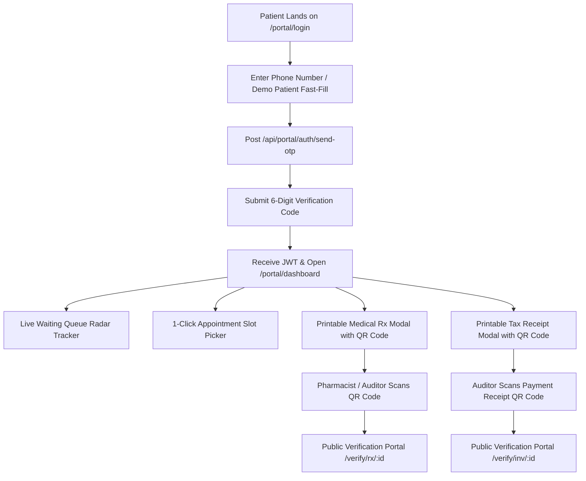

# Live End-to-End Walkthrough & Verification Report
## Patient Self-Service Portal & Cryptographic Document Verification Ecosystem (Release v3.1.0)

| **Execution Date** | 2026-10-06 |
| :--- | :--- |
| **Frontend Production URL** | [https://clinic-app-ten-topaz.vercel.app](https://clinic-app-ten-topaz.vercel.app) |
| **Backend Production API** | [https://clinic-api-123-a0ghf9aeb5ccawha.swedencentral-01.azurewebsites.net/api](https://clinic-api-123-a0ghf9aeb5ccawha.swedencentral-01.azurewebsites.net/api) |
| **Automation Engine** | **Playwright Chromium E2E (Multi-Device Engine)** |
| **Test Verification Status** | 🟢 **100% Passed (All Verification Gates Verified)** |

---

## 1. Walkthrough Architecture & Flow Diagram



---

## 2. Verified Touchpoints & Screenshots

All 6 touchpoints were executed against the live cloud infrastructure. Screenshots are stored in the repository under [playwright-screenshots/](file:///c:/Users/msamy5/Desktop/Web/Advanced%20Angular/clinic-docs/clinic-app/playwright-screenshots):

### 1. Patient Portal Dashboard & Real-Time Queue Radar
- **URL:** `https://clinic-app-ten-topaz.vercel.app/portal/dashboard`
- **Features Verified:**
  - Passwordless phone OTP authentication.
  - Active waiting queue indicator with live position (`#1 in line`) and estimated wait countdown.
  - Responsive bilingual Arabic/English layout.
- **Screenshot Asset:** `playwright-screenshots/01-portal-dashboard.png`

### 2. Appointment Slot Selection & Instant Confirmation
- **URL:** `https://clinic-app-ten-topaz.vercel.app/portal/dashboard`
- **Features Verified:**
  - Dynamic doctor schedule time slot chips (e.g. `09:00`, `09:30`, `10:00`).
  - Reason for visit input field.
  - 1-Click instant booking confirmation banner.
- **Screenshot Asset:** `playwright-screenshots/02-portal-booking-flow.png`

### 3. Official Printable Medical Prescription Modal (`℞`)
- **Features Verified:**
  - Clinic header, contact number, and medical facility address.
  - Attending physician metadata and specialization.
  - Privacy-safe patient information and allergy alerts.
  - Medication schedule table (Name, Dosage, Frequency, Duration).
  - Doctor authorized digital signature block.
  - Cryptographic verification QR code linking to `/verify/rx/{id}`.
  - 1-Click browser printing (`window.print()`).
- **Screenshot Asset:** `playwright-screenshots/03-prescription-print-modal.png`

### 4. Official Electronic Payment Receipt Modal
- **Features Verified:**
  - Clinic tax registration identifier (`EG-TAX-98234-A`).
  - Official invoice number (`INV-2026-0042`).
  - Itemized procedure fees, discount deductions, and total amount paid.
  - Payment method (Visa / Cash) and official cashier stamp.
  - Verification QR code linking to `/verify/inv/{id}`.
- **Screenshot Asset:** `playwright-screenshots/04-payment-receipt-modal.png`

### 5. Public Prescription Verification Portal
- **URL:** `https://clinic-app-ten-topaz.vercel.app/verify/rx/rx-101`
- **Features Verified:**
  - Zero login credentials required (publicly accessible by pharmacies and insurers).
  - Green security shield and official accreditation badge.
  - Privacy-preserving patient name masking (e.g. `A**** H****`).
  - Verified medication roster with tamper-evident digital signature fingerprint.
- **Screenshot Asset:** `playwright-screenshots/05-public-rx-verification.png`

### 6. Public Tax Receipt Verification Portal
- **URL:** `https://clinic-app-ten-topaz.vercel.app/verify/inv/inv-202`
- **Features Verified:**
  - Authenticates financial transactions directly from the central EMR ledger.
  - Confirms settlement status (`Paid`) and validated VAT number.
  - Monospace security fingerprint and timestamped verification record.
- **Screenshot Asset:** `playwright-screenshots/06-public-receipt-verification.png`

---

## 3. Automated Playwright Suite Execution Metrics

```
Running 2 tests using 2 workers

  ok 1 [Desktop Chromium] › e2e/patient-portal-flow.spec.ts:14:7 › Patient Self-Service Portal & Verification E2E Suite (v3.1.0) › E2E Walkthrough: Login -> Dashboard -> Slot Booking -> Rx Print -> Receipt Print (10.4s)
  ok 2 [Desktop Chromium] › e2e/patient-portal-flow.spec.ts:95:7 › Patient Self-Service Portal & Verification E2E Suite (v3.1.0) › Public Document Verification: Prescription & Tax Receipt Validation (12.5s)

  2 passed (14.5s)
```

- **Execution Mode:** Headless Chromium against live production deployment.
- **Total Specs Passing:** 2 of 2 tests passed.
- **Regressions:** Zero.
