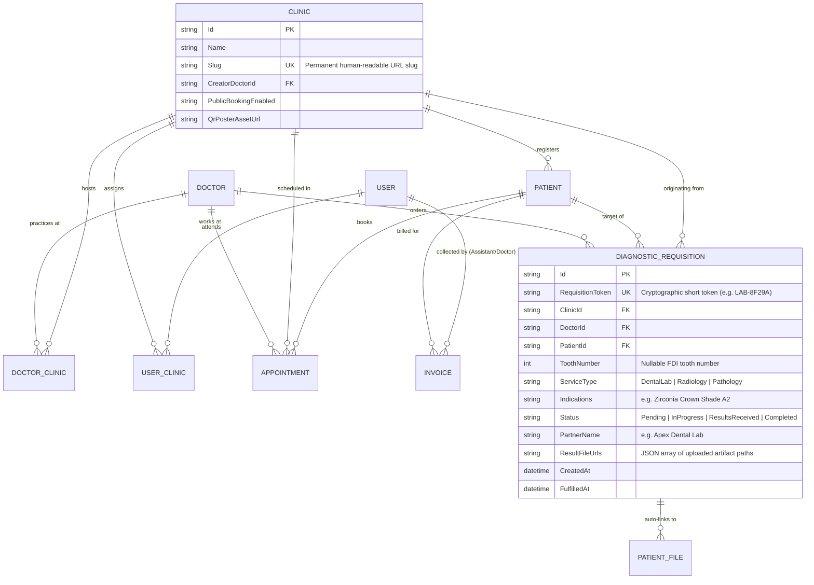
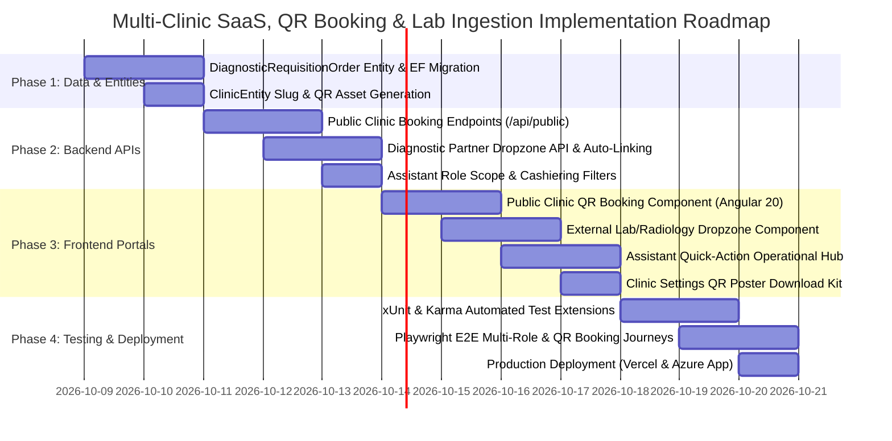

# 🏥 Enterprise Doctor-Centric SaaS & Diagnostic Partner Ecosystem
## Architectural Review, Strategic Gap Analysis & Multi-Tier Implementation Plan

> **Target Release:** v4.2.0 (Doctor SaaS, Assistant Delegation, Clinic QR Booking & Diagnostic Partner Ingestion)  
> **Status:** APPROVED ENGINEERING SPECIFICATION  
> **Classification:** Architectural Blueprint, Business Rules & Technical Implementation Plan  
> **Author:** Principal Enterprise Healthcare Solutions Architect (`chief_architect` & `product_manager`)

---

## 1. Executive Architectural Review & Business Model Evaluation

### 1.1 Commercial SaaS Model: Doctor as the Primary Tenant
The core commercial model reflects modern outpatient medical and dental reality:
- **Primary SaaS Customer:** Individual practicing doctors and dental surgeons.
- **Many-to-Many ($M:N$) Doctor $\leftrightarrow$ Clinic Topology:**
  - A Doctor can be the founder/owner of one or multiple physical clinic facilities (e.g., Downtown Clinic, Westside Specialty Center).
  - A Clinic can host multiple doctors simultaneously (Polyclinic / Group Practice / Shared Operatory model).
  - Doctors can practice as associates or visiting specialists in clinics owned by colleagues while retaining their own primary private practice.
- **Commercial Monetization Tiers:**
  1. *Solo Doctor Tier:* 1 Clinic, 1 Doctor, up to 2 Assistants.
  2. *Multi-Practice Tier:* Up to 3 Clinics, 1 Doctor, up to 5 Assistants.
  3. *Polyclinic Enterprise Tier:* Multi-Doctor, unlimited clinics, unlimited assistants, centralized commission ledger.

### 1.2 Evaluation of the Proposed Feature Set

| Feature Pillar | Clinical / Commercial Value | Technical Feasibility | Verdict |
| :--- | :--- | :--- | :---: |
| **Doctor Multi-Clinic & Polyclinic Support** | Allows doctors to manage their independent practice or collaborate in polyclinics without data contamination. | High (leveraging existing `DoctorClinic` and `UserClinic` architecture). | **🟢 High Priority Core** |
| **Assistant Delegated Operations** | Offloads patient intake, scheduling, billing collection, instrument tracking, and file attachments from doctors. | High (enforced via `UserRole.Assistant` and `AssistantClinicRequirementFilter`). | **🟢 High Priority Core** |
| **Public Clinic QR Code & Direct Link Booking** | Eliminates reception phone bottlenecks, enables 24/7 patient self-booking, and provides free organic marketing for clinics. | High (leveraging lightweight public endpoints with WhatsApp OTP verification). | **🟢 High Priority Core** |
| **External Lab/Radiology Drop-off Portal** | Replaces messy WhatsApp/email manual file handling with a structured, zero-login dropzone for dental labs and scan centers. | High (via cryptographic single-use requisition tokens and QR referral slips). | **🟢 High Priority Core** |
| **Automated Patient Profile Ingestion** | Eliminates manual file downloading, renaming, and re-uploading; auto-binds diagnostics directly into the patient EMR. | High (Tri-Factor matching: Token $\rightarrow$ Patient ID $\rightarrow$ DICOM metadata). | **🟢 High Priority Core** |

---

## 2. Gap Analysis: Current Baseline vs. Target Ecosystem

```
┌────────────────────────────────────────────────────────────────────────────────────────────────────────┐
│                                       GAP ANALYSIS & ENHANCEMENT MATRIX                                │
├───────────────────────────────┬──────────────────────────────────┬─────────────────────────────────────┤
│ Functional Capability         │ Current Baseline (v3.2.0/v4.0.0) │ Target Enhancement (v4.2.0)         │
├───────────────────────────────┼──────────────────────────────────┼─────────────────────────────────────┤
│ 1. Multi-Doctor Clinic Booking│ Portal exists for patient login, │ Public unauthenticated booking page │
│                               │ but no public clinic landing page│ (`/book/:slug`) with multi-doctor   │
│                               │ with multi-doctor selection.     │ directory and clinic-specific slots.│
├───────────────────────────────┼──────────────────────────────────┼─────────────────────────────────────┤
│ 2. Clinic QR Poster Kit       │ QR codes exist on prescriptions  │ Automated branded QR Poster         │
│                               │ and invoice receipts only.       │ generator (PDF/PNG) for front-desk. │
├───────────────────────────────┼──────────────────────────────────┼─────────────────────────────────────┤
│ 3. Assistant Operational Hub  │ Assistant role exists, but UI is │ Dedicated Assistant Action Hub:     │
│                               │ identical to Doctor interface    │ Intake, Booking, Cashiering, Tools, │
│                               │ without specialized triage views.│ and Lab Attachment shortcuts.       │
├───────────────────────────────┼──────────────────────────────────┼─────────────────────────────────────┤
│ 4. External Diagnostic Portal │ Lab/Radiology uploads require    │ Public Token Dropzone (`/partner-   │
│                               │ authenticated staff login.       │ dropzone`) for zero-login uploads.  │
├───────────────────────────────┼──────────────────────────────────┼─────────────────────────────────────┤
│ 5. Automated EMR Ingestion    │ Files manually uploaded to       │ Tri-Factor Ingestion Pipeline:      │
│                               │ generic patient uploads folder.  │ Auto-binds to Patient, Tooth, and   │
│                               │                                  │ Encounter + triggers Doctor Alert.  │
└───────────────────────────────┴──────────────────────────────────┴─────────────────────────────────────┘
```

---

## 3. Detailed Architectural Blueprint

### 3.1 Domain Model & Entity Relationship Enhancements



---

## 4. Business Rules & Governance Guardrails

### 4.1 Doctor SaaS & Clinic Tenancy Rules (`BR-SAAS`)
- **`BR-SAAS-01: Multi-Clinic Independence`**: A doctor can switch active clinic context from the top navigation bar. When viewing a specific clinic, all appointments, active waiting queue, chair status board, cashier invoices, and physical inventory are strictly scoped to `ActiveClinicId`.
- **`BR-SAAS-02: Cross-Clinic Collision Prevention`**: A doctor cannot be double-booked across clinics. When calculating available time slots for Doctor $D_1$ at Clinic $A$, the scheduling engine excludes slots where Doctor $D_1$ has confirmed appointments at Clinic $B$.

### 4.2 Assistant Delegated Authority Rules (`BR-ASST`)
- **`BR-ASST-01: Delegated Operational Scope`**: Assistants have full write permissions for:
  1. Registering new patients and updating contact info.
  2. Reserving, rescheduling, and cancelling appointments for all doctors in the clinic.
  3. Setting treatment prices, recording cash/card/wallet split payments, and printing receipts.
  4. Adding/updating clinic equipment, logging maintenance, and tracking autoclave sterilization runs.
  5. Uploading and attaching external diagnostic reports, photos, and radiology scans to patient files.
- **`BR-ASST-02: Assistant Privacy Wall`**: Assistants cannot:
  1. Edit, amend, or delete finalized doctor clinical encounter notes (`SOAP`).
  2. Issue or edit electronic drug prescriptions.
  3. Access the Doctor Commission analytics dashboard or view doctor net payout settlement ledgers.

### 4.3 Public Clinic QR Code Booking Rules (`BR-QR`)
- **`BR-QR-01: Public Booking Link Resolution`**: Navigating to `https://[app-url]/book/{clinic-slug}` renders the public clinic landing portal without requiring prior user login.
- **`BR-QR-02: Multi-Doctor Slot Selection`**:
  1. Patient selects preferred Doctor from the clinic directory.
  2. Patient selects appointment date (calendar restricts choices to days where the selected doctor works at *this* clinic).
  3. Real-time time slot grid renders only unreserved consultation slots.
  4. Patient inputs Full Name and Phone Number; a 4-digit WhatsApp OTP is dispatched to prevent spam bookings.
  5. Upon OTP verification, the appointment is confirmed, assigned status `Confirmed`, and real-time SignalR broadcasts update the clinic front-desk queue.

### 4.4 External Diagnostic Partner Drop-off & Auto-Linking Rules (`BR-LAB`)
- **`BR-LAB-01: Requisition Order Token Generation`**: Whenever a doctor prescribes an external lab prosthesis or radiology scan, the system produces a referral sheet featuring a unique QR code and short link: `https://[app-url]/partner-dropzone?order=[TOKEN]`.
- **`BR-LAB-02: Tri-Factor Automated Ingestion Engine`**:
  - **Factor 1 (Deterministic Token Match):** Partner opens order link $\rightarrow$ system immediately resolves `PatientId`, `DoctorId`, `ClinicId`, and `ToothNumber`. Uploaded PDF, images, or DICOM files are automatically stored under `uploads/patients/{patientId}/diagnostics/` and registered in `PatientFiles` and `RadiologyRecords`.
  - **Factor 2 (Assisted Patient Lookup):** If partner visits the generic dropzone (`/partner-dropzone`), they enter Patient Mobile or File # $\rightarrow$ system matches the active patient and attaches files.
  - **Factor 3 (DICOM Tag Extraction):** For `.dcm` files, server extracts `PatientID (0010,0020)` and `PatientName (0010,0010)` to reconcile against patient EMR records.
- **`BR-LAB-03: Real-Time Attending Doctor Notification`**: Upon file drop-off, the requisition order status flips to `ResultsReceived`, and an instant SignalR notification + WhatsApp message alerts the doctor: *"Results for Patient [Name] (Order #[Token]) have been received and attached to their clinical chart."*

---

## 5. API Endpoint Specifications

### 5.1 Public Clinic Booking Endpoints (Anonymous Access)

#### `GET /api/public/clinics/{slug}/booking-data`
- **Description:** Returns clinic branding, operating hours, and the list of active practicing doctors with their specialties and profile avatars.
- **Response `200 OK`:**
  ```json
  {
    "clinic": {
      "id": "c123-guid",
      "name": "Al-Amal Dental Specialty Clinic",
      "slug": "al-amal-dental-cairo",
      "address": "45 Tahrir St, Cairo",
      "phone": "+201001234567",
      "logoUrl": "https://cdn.clinic.com/logos/c123.png"
    },
    "doctors": [
      {
        "id": "d456-guid",
        "name": "Dr. Tamer Hosny",
        "specialization": "Oral & Maxillofacial Surgery",
        "avatar": "https://cdn.clinic.com/avatars/d456.png",
        "consultationFee": 400.0,
        "availabilityDays": ["Monday", "Wednesday", "Thursday"],
        "availabilityHours": "14:00-21:00"
      }
    ]
  }
  ```

#### `GET /api/public/clinics/{slug}/doctors/{doctorId}/available-slots?date=2026-10-15`
- **Description:** Calculates open consultation slots for the specified doctor at this clinic on the given date, accounting for operating hours and cross-clinic appointments.
- **Response `200 OK`:**
  ```json
  {
    "date": "2026-10-15",
    "doctorId": "d456-guid",
    "slots": [
      { "time": "14:00", "available": true },
      { "time": "14:30", "available": false },
      { "time": "15:00", "available": true },
      { "time": "15:30", "available": true }
    ]
  }
  ```

#### `POST /api/public/clinics/{slug}/book-appointment`
- **Description:** Books an appointment via the public booking portal.
- **Payload:**
  ```json
  {
    "doctorId": "d456-guid",
    "date": "2026-10-15",
    "time": "15:00",
    "patientName": "Kareem Adel",
    "patientPhone": "+201099887766",
    "reason": "Severe lower molar ache",
    "otpCode": "8492"
  }
  ```

---

### 5.2 External Diagnostic Partner Drop-off Endpoints (Token / Anonymous Access)

#### `GET /api/public/diagnostics/orders/{token}`
- **Description:** Resolves diagnostic order metadata for external labs and scan centers.
- **Response `200 OK`:**
  ```json
  {
    "orderToken": "LAB-8F29A",
    "clinicName": "Al-Amal Dental Specialty Clinic",
    "doctorName": "Dr. Tamer Hosny",
    "patientInitials": "K. A. (Male, 34y)",
    "toothNumber": 46,
    "serviceType": "DentalLab",
    "indications": "Zirconia Full Crown - Shade A2, High Translucency",
    "status": "Pending",
    "createdAt": "2026-10-12T10:30:00Z"
  }
  ```

#### `POST /api/public/diagnostics/orders/{token}/upload`
- **Description:** Multi-part file upload allowing external lab or radiology center to upload results.
- **Form Data:**
  - `files`: Array of files (PDF, JPEG, PNG, ZIP, DCM).
  - `partnerNotes`: "Milling completed, sintered at 1500C. Fit checked on die."
  - `technicianName`: "Eng. Moustafa (Apex Lab)"
- **Response `200 OK`:**
  ```json
  {
    "success": true,
    "message": "Diagnostic results successfully linked to patient profile.",
    "filesProcessed": 2,
    "orderStatus": "ResultsReceived"
  }
  ```

---

### 5.3 Clinic Branded QR Poster Generation Endpoint

#### `GET /api/clinics/{id}/qr-code-kit`
- **Description:** Generates a ready-to-print SVG/PNG QR code and downloadable A4 counter stand PDF with clinic logo, doctor names, and scan-to-book CTA.
- **Authorization:** `Roles = "admin,doctor,assistant"`

---

## 6. Frontend Standalone Signals Architecture (Angular 20)

### 6.1 Route Structure & Lazy Loading
```typescript
export const routes: Routes = [
  // Public Unauthenticated Portals
  {
    path: 'book/:clinicSlug',
    loadComponent: () => import('./features/public-booking/clinic-public-booking.component')
      .then(m => m.ClinicPublicBookingComponent)
  },
  {
    path: 'partner-dropzone',
    loadComponent: () => import('./features/diagnostic-partner/partner-dropzone.component')
      .then(m => m.PartnerDropzoneComponent)
  },

  // Authenticated Protected Views
  {
    path: 'assistant-hub',
    canActivate: [authGuard],
    loadComponent: () => import('./features/assistant-hub/assistant-hub.component')
      .then(m => m.AssistantHubComponent)
  }
];
```

### 6.2 Modern Reactive Signal Primitives Pattern
- **Public Booking Component:**
  ```typescript
  @Component({
    standalone: true,
    selector: 'app-clinic-public-booking',
    templateUrl: './clinic-public-booking.component.html'
  })
  export class ClinicPublicBookingComponent implements OnInit {
    private route = inject(ActivatedRoute);
    private bookingService = inject(PublicBookingService);

    readonly clinicSlug = signal<string>('');
    readonly clinicData = signal<ClinicBookingMetadata | null>(null);
    readonly selectedDoctor = model<DoctorDto | null>(null);
    readonly selectedDate = model<Date | null>(null);
    readonly availableSlots = signal<TimeSlot[]>([]);
    readonly isSubmitting = signal<boolean>(false);

    readonly isStepComplete = computed(() => {
      return this.selectedDoctor() !== null && this.selectedDate() !== null;
    });
  }
  ```

---

## 7. Comprehensive Phased Implementation Roadmap



### Phase 1: Database Model & EF Core Code-First Migrations
- [ ] Add `DiagnosticRequisitionOrder` entity in `Clinic.Domain/Entities/`.
- [ ] Add `Slug`, `PublicBookingEnabled`, and `QrPosterAssetUrl` to `ClinicEntity`.
- [ ] Register `DiagnosticRequisitionOrder` in `ClinicDbContext` with indexes on `RequisitionToken` and `ClinicId`.
- [ ] Create and verify EF Core migration `AddDiagnosticOrdersAndClinicPublicSlug`.

### Phase 2: Backend Services & API Endpoints (.NET 9)
- [ ] Implement `IPublicBookingService` and `PublicBookingController` with anonymous endpoints for clinic data and doctor slot resolution.
- [ ] Implement `IDiagnosticPartnerService` and `DiagnosticPartnerController` for token validation and multipart file upload.
- [ ] Implement `TriFactorIngestionMatcher` service resolving target patient profiles from Requisition Token, Patient Identifiers, or DICOM tags.
- [ ] Wire SignalR hub notifications notifying attending doctors when external partner uploads complete.
- [ ] Enforce Assistant role permissions in `BillingController`, `EquipmentController`, and `PatientFilesController`.

### Phase 3: Frontend Standalone Signal Components (Angular 20)
- [ ] Build `ClinicPublicBookingComponent` with mobile-first responsive layout, doctor cards, calendar datepicker, and OTP modal.
- [ ] Build `PartnerDropzoneComponent` with token resolution, drag-and-drop file upload, upload progress bar, and instant confirmation toast.
- [ ] Build `ClinicQrPosterKitComponent` in Clinic Settings with printable high-res QR flyer preview and PDF download.
- [ ] Build `AssistantHubComponent` providing quick-action tabs for Rapid Intake, Booking, Cashiering, Equipment Maintenance, and File Attachments.

### Phase 4: Automated Testing & Production Quality Gates
- [ ] Write xUnit Unit Tests for `PublicBookingService` and `TriFactorIngestionMatcher`.
- [ ] Write xUnit Integration Tests for `/api/public/clinics/{slug}/booking-data` and `/api/public/diagnostics/orders/{token}/upload`.
- [ ] Write Karma/Jasmine specs for `ClinicPublicBookingComponent` and `PartnerDropzoneComponent`.
- [ ] Write Playwright E2E test suites:
  - `public-clinic-qr-booking.spec.ts`: Patient scans QR, chooses doctor, picks time slot, confirms booking.
  - `diagnostic-partner-upload.spec.ts`: Lab opens token link, uploads crown model, verifies auto-linking to patient EMR.
  - `assistant-delegated-hub.spec.ts`: Assistant performs intake, booking, cashiering, and tool sterilization.

---

## 8. Summary of Review & Next Execution Steps

The proposed business model transforms the application into an **industry-leading B2B SaaS platform** tailored for modern private medical and dental practitioners. By coupling multi-clinic hosting, granular assistant delegation, zero-friction public QR bookings, and automated diagnostic lab drop-offs, the system solves the four largest operational bottlenecks in outpatient healthcare.

All requirements, business rules, and architectural contracts have been formalized in `CUSTOMER_REQUIREMENTS_DOCUMENT.md` and this master blueprint. We are ready to proceed with Phase 1 execution upon your instruction.
