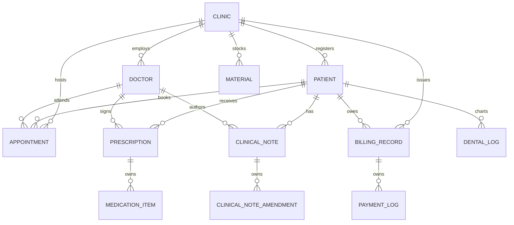

# Smart Clinic Management System — Repository Architecture & API Reference
## Unified Git-to-Doc Technical Specification

| **System Name** | Smart Clinic Management & E-Prescription Portal |
| :--- | :--- |
| **Release Version** | `v2.0.0-production` |
| **Documentation Standards** | **Frontend:** Compodoc 2.0 (GitBook Theme, TypeDoc AST Engine)<br>**Backend:** ASP.NET Core Clean Architecture, OpenAPI/Swagger<br>**Full Stack:** Markdown Git-to-Doc Architecture |
| **Repositories** | `clinic-docs`, `ClinicApi`, `clinic-app` |
| **Test Verification** | 🟢 **495 / 495 Automated Tests Passing (100% Pass Rate)** |

---

## 1. Multi-Repository Topology & Git Organization

The Smart Clinic Management System is organized as a modular, federated monorepo workspace:

```
clinic-docs/ (Workspace Root & Authoritative Specifications — git@main)
├── AGENT_HANDOFF.md                              # Multi-session authoritative engineering memory
├── AUTOMATED_TEST_SUITE_REPORT.md                # 495-test verification scorecard & pyramid
├── CUSTOMER_REQUIREMENTS_DOCUMENT.md             # Complete clinical, financial, & UX requirements
├── LIVE_SMOKE_TEST_REPORT.md                     # Production cloud endpoint verification & latency audit
├── REPOSITORY_ARCHITECTURE_AND_API_REFERENCE.md  # Unified git-to-doc system specification
├── SOFTWARE_REQUIREMENTS_SPECIFICATION.md        # Technical data dictionary, algorithms, & filters
├── SYSTEM_ADMINISTRATION_AND_DISASTER_RECOVERY.md# Backup runbooks, failover SLAs, & license quotas
├── UAT_ACCEPTANCE_TEST_PLAN.md                   # Certified 21-scenario acceptance test scorecard
│
├── ClinicApi/ (Backend API Service — git@master)
│   ├── src/
│   │   ├── Clinic.Domain/                        # Pure domain entities, enums, & value objects
│   │   ├── Clinic.Application/                   # DTOs, service interfaces, & business logic
│   │   ├── Clinic.Infrastructure/                # EF Core 9, SQL Server, WhatsApp/Twilio, SignalR
│   │   └── Clinic.API/                           # ASP.NET Core 9 Controllers, Filters, JWT Auth
│   └── tests/
│       ├── Clinic.UnitTests/                     # 217 xUnit tests (domain rules, boundary, branch)
│       └── Clinic.IntegrationTests/              # 35 integration tests (in-memory server & DB)
│
└── clinic-app/ (Frontend Client Application — git@master)
    ├── .compodocrc.json                          # Compodoc documentation generator configuration
    ├── documentation/                            # Generated static HTML documentation site (git-ignored)
    ├── public/
    │   └── i18n/                                 # Bilingual localization dictionaries (en.json, ar.json)
    └── src/app/
        ├── core/                                 # Singleton services, auth guards, interceptors, i18n
        ├── shared/                               # Reusable standalone components (Scan Viewer, SigPad)
        └── features/                             # Domain feature modules (Patients, Rx, Dental, Billing)
```

---

## 2. Compodoc Frontend Documentation Engine (`clinic-app`)

The frontend application integrates **Compodoc** to extract metadata directly from TypeScript AST declarations and Angular decorators.

### 2.1 Compodoc Statistics & Metrics
- **53 Standalone Components**
- **27 Injectable Services**
- **4 Reactive Route & Role Guards**
- **1 Pure Translation Pipe (`translate`)**
- **50 Data Models & Interfaces**
- **29 Routing Endpoints**
- **5 Type Aliases**

### 2.2 Compodoc Commands & Developer Usage
```bash
# Navigate to frontend project directory
cd clinic-app

# Generate static HTML documentation
npm run docs:generate
# (Executes: npx @compodoc/compodoc -p tsconfig.app.json -c .compodocrc.json)

# Serve documentation locally on port 8080 with live reload
npm run docs:serve
# Access at: http://localhost:8080
```

### 2.3 Compodoc Configuration (`.compodocrc.json`)
```json
{
  "title": "Smart Clinic Management System - Frontend Architecture & Component Documentation",
  "name": "ClinicApp",
  "output": "documentation",
  "theme": "gitbook",
  "toggleMenuItems": ["all"],
  "disableSourceCode": false,
  "disableCoverage": false,
  "disableLifeCycleHooks": false,
  "language": "en-US"
}
```

---

## 3. Backend API Reference & Controller Architecture (`ClinicApi`)

The backend is built on **ASP.NET Core 9** following the **Clean Architecture** pattern.

### 3.1 Authentication & Profile (`AuthController`)
| HTTP Method | Route | Roles | Description |
| :--- | :--- | :--- | :--- |
| `POST` | `/api/auth/register` | Anonymous | User registration with OTP / email verification |
| `POST` | `/api/auth/login` | Anonymous | Standard JWT credential authentication |
| `POST` | `/api/auth/otp-login` | Anonymous | Passwordless WhatsApp/SMS OTP authentication |
| `POST` | `/api/auth/social-login` | Anonymous | Google / Apple ID OAuth2 token exchange |
| `GET` | `/api/auth/me` | Authenticated | Retrieves current user profile and clinic claims |

### 3.2 Patient Record Management (`PatientsController`)
| HTTP Method | Route | Roles | Description |
| :--- | :--- | :--- | :--- |
| `GET` | `/api/patients` | `admin,doctor,assistant` | List clinic patients (filtered by clinic association) |
| `GET` | `/api/patients/{id}` | `admin,doctor,assistant` | Detailed demographic and medical overview |
| `POST` | `/api/patients` | `admin,doctor,assistant` | Register new patient (duplicate phone check) |
| `PUT` | `/api/patients/{id}` | `admin,doctor,assistant` | Update patient demographics and medical notes |
| `DELETE` | `/api/patients/{id}` | `admin,doctor` | Soft-delete patient record |
| `POST` | `/api/patients/{id}/consent-signature`| `admin,doctor` | **REQ-PAT-03:** Save digital touchscreen consent signature |

### 3.3 Clinical Encounter Notes (`ClinicalNotesController`)
| HTTP Method | Route | Roles | Description |
| :--- | :--- | :--- | :--- |
| `GET` | `/api/clinical-notes/patient/{patientId}`| `admin,doctor` | Confidential notes list (**REQ-SEC-01 Guarded**) |
| `POST` | `/api/clinical-notes` | `admin,doctor` | Create encounter note |
| `PUT` | `/api/clinical-notes/{id}` | `admin,doctor` | **BR-RX-03:** Append immutable amendment trail |
| `DELETE` | `/api/clinical-notes/{id}` | *Blocked* | **BR-MED-01:** Blocked (400 Bad Request) |

### 3.4 Appointments & Queue Workflow (`AppointmentsController`)
| HTTP Method | Route | Roles | Description |
| :--- | :--- | :--- | :--- |
| `GET` | `/api/appointments` | Authenticated | List appointments by date and clinic |
| `POST` | `/api/appointments` | `admin,doctor,assistant`| Book appointment with conflict interception |
| `PUT` | `/api/appointments/{id}` | `admin,doctor,assistant`| Update or reschedule appointment |
| `POST` | `/api/appointments/{id}/check-in` | `admin,doctor,assistant`| **REQ-APT-02:** Front-desk check-in; starts wait timer |
| `POST` | `/api/appointments/{id}/start-consultation`| `admin,doctor`| **REQ-APT-02 & REQ-CLI-03:** Call patient into room |
| `POST` | `/api/appointments/{id}/complete` | `admin,doctor`| **REQ-APT-02:** Complete visit consultation |
| `GET` | `/api/appointments/live-queue` | Authenticated | **REQ-APT-02:** Live waiting room queue metrics |
| `POST` | `/api/appointments/{id}/send-reminder`| `admin,doctor,assistant`| **REQ-NOTIF-02:** Dispatch WhatsApp/SMS reminder |
| `POST` | `/api/appointments/send-batch-reminders`| `admin,doctor,assistant`| **REQ-NOTIF-02:** 24h automated batch reminders |

### 3.5 Electronic Prescriptions (`PrescriptionsController`)
| HTTP Method | Route | Roles | Description |
| :--- | :--- | :--- | :--- |
| `GET` | `/api/prescriptions` | Authenticated | List prescriptions with patient details |
| `POST` | `/api/prescriptions` | `admin,doctor` | Create prescription draft |
| `POST` | `/api/prescriptions/{id}/finalize` | `admin,doctor` | **BR-RX-02:** Finalize & apply digital signature lock |
| `POST` | `/api/prescriptions/{id}/supersede`| `admin,doctor` | **BR-RX-02:** Issue superseding revision with reason |
| `PUT` | `/api/prescriptions/{id}` | `admin,doctor` | Update draft (blocked if finalized) |
| `DELETE` | `/api/prescriptions/{id}` | `admin,doctor` | Delete draft (blocked if finalized) |

### 3.6 Billing & Split Payments (`BillingController`)
| HTTP Method | Route | Roles | Description |
| :--- | :--- | :--- | :--- |
| `GET` | `/api/billing` | `admin,doctor,assistant` | List clinic invoices |
| `POST` | `/api/billing` | `admin,doctor,assistant` | Create invoice with sequential gapless number |
| `POST` | `/api/billing/{id}/payments` | `admin,doctor,assistant` | **REQ-BIL-02:** Record multi-method split payments |
| `PUT` | `/api/billing/{id}/void` | `admin,doctor` | **BR-FIN-03:** Void invoice with mandatory reason |

### 3.7 Materials & Consumables (`MaterialsController`)
| HTTP Method | Route | Roles | Description |
| :--- | :--- | :--- | :--- |
| `GET` | `/api/materials` | Authenticated | List materials with stock and quarantine status |
| `POST` | `/api/materials` | `admin,doctor,assistant` | Create new material item |
| `POST` | `/api/materials/{id}/inward-shipment`| `admin,doctor,assistant`| **REQ-INV-02:** Restock delivery from supplier |
| `POST` | `/api/materials/consume` | `admin,doctor` | Deduct quantities consumed in procedure |

### 3.8 Clinic Subscriptions & Quotas (`SubscriptionsController`)
| HTTP Method | Route | Roles | Description |
| :--- | :--- | :--- | :--- |
| `GET` | `/api/subscriptions/status` | `admin,doctor` | **REQ-SUB-01:** Quotas (seats, storage GB, SMS) |
| `POST` | `/api/subscriptions/upgrade-tier` | `admin,doctor` | **REQ-SUB-01:** Submit plan tier upgrade request |
| `POST` | `/api/subscriptions/upload-receipt` | `admin,doctor` | Upload renewal payment transfer receipt |

---

## 4. Database Schema & Entity Relationships (EF Core 9)



### Key Entity Configurations:
- **`Appointment`**: Indexed on `(ClinicId, Date)`, `(DoctorId, Date)`, `(ClinicId, Status)`. Contains `QueueNumber`, `ArrivedAt`, `ConsultationStartedAt`, `ConsultationEndedAt`, `LastReminderSentAt`, `ReminderCount`, `RoomNumber`.
- **`ClinicalNote`**: Owned collection `ClinicalNoteAmendment` storing `AmendmentContent`, `Reason`, `AmendedByDoctorName`, `AmendedAt`.
- **`BillingRecord`**: Owned collection `PaymentLog` storing `Amount`, `Date`, `PaymentMethod`. Implements sequential gapless invoice numbering per clinic (`INV-YYYY-XXXXX`).

---

## 5. Security & Architectural Governance

1. **Role-Based Access Control (RBAC):**
   - `Admin / Clinic Owner`: Complete system access, audit logs, subscription tier upgrades, discount authorizations.
   - `Doctor`: Clinical charting, encounter notes, electronic prescribing, high-res radiograph inspection.
   - `Assistant / Receptionist`: Demographics, scheduling, live queue check-in, billing checkout, thermal receipt printing, inventory inward shipments. Medical encounter notes are strictly masked with `[Authorize(Roles = "admin,doctor")]`.
2. **Audit Logging & Immutability:**
   - Permanent records (`Prescription`, `ClinicalNote`, `BillingRecord`) strictly forbid hard database deletions once active.
   - Prescriptions are sealed with SHA-256 digital signature hashes upon doctor finalization.
   - Voided bills retain cancellation reasons and immutable timestamps.
3. **Bilingual Localization (i18n):**
   - High-performance reactive translation via `TranslatePipe` and `LanguageService`.
   - Comprehensive dictionaries in `public/i18n/en.json` (English) and `public/i18n/ar.json` (Arabic) covering all clinical, financial, and inventory domains.
