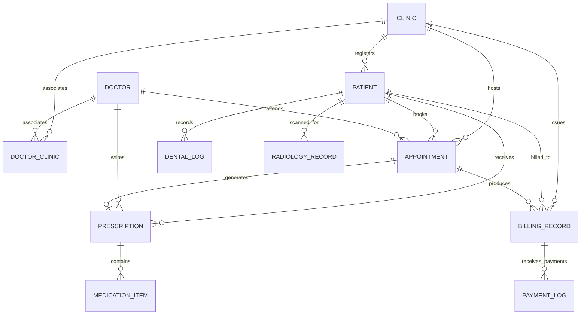

# Software Requirements Specification (SRS)
## Smart Clinic Management System (Clinic App)

| **Document Standard** | IEEE Std 830-1998 / ISO/IEC/IEEE 29148:2018 |
| :--- | :--- |
| **Document Version** | 1.0.0 (Engineering Baseline) |
| **Status** | Approved Technical Specification |
| **Date** | 2026-09-25 |
| **Classification** | Technical System Architecture & Software Requirements Specification (SRS) |
| **Primary Audience** | Software Developers, QA Engineers, DevOps Engineers, Technical Architects |
| **Companion Document** | [CUSTOMER_REQUIREMENTS_DOCUMENT.md](CUSTOMER_REQUIREMENTS_DOCUMENT.md) (v2.0.0) |

---

## 1. Introduction

### 1.1 Purpose
This Software Requirements Specification (SRS) defines the complete technical, architectural, behavioral, and contractual requirements for the **Smart Clinic Management System**. It translates the high-level business objectives outlined in the [Customer Requirements Document](CUSTOMER_REQUIREMENTS_DOCUMENT.md) into concrete, testable software engineering specifications for both the frontend single-page application (`Clinic`) and the backend RESTful API (`ClinicApi`).

### 1.2 Document Conventions & Identifier Tagging
Requirements are tagged with unique alphanumeric identifiers for bi-directional traceability:
- **`SRS-ARCH-xxx`**: Software Architecture & Component Structure
- **`SRS-DATA-xxx`**: Data Models, Entity Schemas & Relational Constraints
- **`SRS-API-xxx`**: REST API Endpoints, Request/Response Payloads & HTTP Statuses
- **`SRS-SIG-xxx`**: Real-Time SignalR WebSocket Protocols
- **`SRS-SEC-xxx`**: Security, Authentication, Authorization & Action Filters
- **`SRS-UI-xxx`**: Frontend Architecture, Interceptors & State Management
- **`SRS-NFR-xxx`**: Non-Functional Performance & Reliability Standards

### 1.3 Intended Audience
- **Backend Engineers:** For implementing .NET Clean Architecture handlers, entity mappings, and API endpoints.
- **Frontend Engineers:** For building Angular reactive components, Signal stores, and form validations.
- **QA & Automation Engineers:** For writing integration, contract, and end-to-end regression tests.
- **DevOps Engineers:** For configuring CI/CD pipelines, containerization, and cloud resource quotas.

---

## 2. System Context & Technical Architecture

### 2.1 High-Level Component Decomposition

```
┌────────────────────────────────────────────────────────────────────────┐
│                        FRONTEND PRESENTATION LAYER                     │
│                        (Angular 18+ SPA / PWA)                         │
│  ├── Core Services: AuthService, ApiService, NotificationService       │
│  ├── Feature Modules: Patients, Appointments, DentalChart, Billing     │
│  └── Interceptors: AuthInterceptor (Bearer), ErrorInterceptor          │
└───────────────────────────────────┬────────────────────────────────────┘
                                    │
                                    │ HTTPS REST JSON / WSS SignalR
                                    ▼
┌────────────────────────────────────────────────────────────────────────┐
│                        BACKEND API & DOMAIN ENGINE                     │
│                        (ASP.NET Core 8.0 Web API)                      │
│                                                                        │
│   [Clinic.API]                                                         │
│   ├── Controllers: Auth, Patients, Appointments, Dental, Billing       │
│   ├── Middleware: GlobalExceptionMiddleware, JwtBearerMiddleware       │
│   ├── Hubs: NotificationHub (/hubs/notifications)                      │
│   └── Filters: AssistantClinicRequirementFilter, SubscriptionFilter   │
│                                    │                                   │
│   [Clinic.Application]             ▼                                   │
│   ├── Services & Interfaces: IPatientService, IBillingService          │
│   ├── DTOs & ViewModels: PatientDto, PrescriptionDto, DentalLogDto     │
│   └── Business Validators: FluentValidation Rules                      │
│                                    │                                   │
│   [Clinic.Domain]                  ▼                                   │
│   ├── Domain Entities: Patient, Doctor, Appointment, DentalLog         │
│   └── Enums: UserRole, AppointmentStatus, ToothStatus, BillingStatus   │
│                                    │                                   │
│   [Clinic.Infrastructure]          ▼                                   │
│   ├── Persistence: ClinicDbContext (EF Core SQL Server)                │
│   ├── Seeders: DataSeeder (Migrations & Admin Provisioning)            │
│   └── Real-time: SignalRNotificationDispatcher                         │
└───────────────────────────────────┬────────────────────────────────────┘
                                    │
                                    │ EF Core TCP/TDS (Encrypted)
                                    ▼
┌────────────────────────────────────────────────────────────────────────┐
│                        PERSISTENCE & DATA STORAGE                      │
│                        (Microsoft Azure SQL Database)                  │
│   ├── Relational Tables (Normalized 3NF, Foreign Keys, Indexes)        │
│   ├── Global Query Filters: Soft-Delete (IsDeleted == false)           │
│   └── Blob Storage: Radiology Scans & File Attachments                 │
└────────────────────────────────────────────────────────────────────────┘
```

---

## 3. Data Model & Entity Relationship Specification

### 3.1 Entity Relationship Diagram (ERD)



---

### 3.2 Detailed Entity Schema Specifications

#### `SRS-DATA-01: Patient Entity Schema`
| Field Name | Data Type | Nullable | Description / Constraints |
| :--- | :--- | :---: | :--- |
| `Id` | `VARCHAR(36)` | NO | Primary Key (GUID string). |
| `FirstName` | `NVARCHAR(100)` | NO | Patient given name. |
| `LastName` | `NVARCHAR(100)` | NO | Patient surname. |
| `Gender` | `VARCHAR(20)` | NO | Enum string (`"Male"`, `"Female"`). |
| `DateOfBirth` | `VARCHAR(30)` | NO | ISO date string (`"YYYY-MM-DD"`). |
| `CountryCode` | `VARCHAR(10)` | NO | Default: `"+20"`. |
| `PhoneNumber` | `VARCHAR(30)` | NO | Indexed; unique collision detection per clinic. |
| `Email` | `VARCHAR(150)` | YES | Optional contact email. |
| `BloodGroup` | `VARCHAR(10)` | YES | `"A+"`, `"A-"`, `"B+"`, `"B-"`, `"AB+"`, `"AB-"`, `"O+"`, `"O-"`. |
| `Allergies` | `NVARCHAR(MAX)`| YES | Comma-separated or text of known drug allergies. |
| `ChronicDiseases` | `NVARCHAR(MAX)`| YES | Chronic health conditions. |
| `PastIllnesses` | `NVARCHAR(MAX)`| YES | Significant medical history. |
| `ClinicId` | `VARCHAR(36)` | YES | Foreign Key $\rightarrow$ `Clinics.Id`. |
| `RegistrationDate`| `VARCHAR(30)` | NO | Timestamp of intake. |
| `IsDeleted` | `BIT` | NO | Default: `0` (False). Global EF Core soft-delete filter applied. |

---

#### `SRS-DATA-02: DentalLog Entity Schema`
| Field Name | Data Type | Nullable | Description / Constraints |
| :--- | :--- | :---: | :--- |
| `Id` | `VARCHAR(36)` | NO | Primary Key (GUID string). |
| `PatientId` | `VARCHAR(36)` | NO | Foreign Key $\rightarrow$ `Patients.Id`. |
| `ToothNumber` | `VARCHAR(10)` | NO | Permanent (`"1"`–`"32"` or `"11"`–`"48"`) or Deciduous (`"A"`–`"T"` / `"51"`–`"85"`). |
| `DoctorId` | `VARCHAR(36)` | NO | Attending dentist ID. |
| `DoctorName` | `NVARCHAR(150)` | NO | Snapshot of dentist name. |
| `Date` | `VARCHAR(30)` | NO | Date recorded. |
| `Status` | `NVARCHAR(MAX)`| NO | **JSON Array** of serialized `ToothStatus` enum strings. |
| `PainLevel` | `INT` | NO | Numerical visual analog scale ($0$ to $10$). |
| `PainDetails` | `NVARCHAR(500)`| YES | Qualitative pain description. |
| `Treatment` | `NVARCHAR(500)`| YES | Procedure description (e.g., Composite Filling, Root Canal). |
| `Medication` | `NVARCHAR(500)`| YES | Chair-side administered drugs. |
| `IsPlanned` | `BIT` | NO | `1` = Proposed / Treatment Plan; `0` = Completed. |
| `ConsumedMaterials`| `NVARCHAR(MAX)`| NO | **JSON Array** of consumed material DTOs `[{"name":"Composite A2","quantity":1}]`. |
| `ClinicId` | `VARCHAR(36)` | YES | Foreign Key $\rightarrow$ `Clinics.Id`. |

---

#### `SRS-DATA-03: Prescription & MedicationItem Entity Schema`
- **`Prescriptions` Table:**
  - `Id` (`VARCHAR(36)`, PK)
  - `PatientId` (`VARCHAR(36)`, FK)
  - `AppointmentId` (`VARCHAR(36)`, FK, Unique)
  - `DoctorId` (`VARCHAR(36)`, FK)
  - `Date` (`VARCHAR(30)`)
  - `Notes` (`NVARCHAR(MAX)`, Optional)
- **`MedicationItems` (EF Core Owned Entity Collection):**
  - Configured as owned JSON collection or child relational table:
  - `Name` (`NVARCHAR(150)`, Drug trade or generic name)
  - `Dosage` (`NVARCHAR(50)`, e.g., `"500mg"`, `"10ml"`)
  - `Frequency` (`NVARCHAR(100)`, e.g., `"Every 8 hours"`)
  - `Duration` (`NVARCHAR(50)`, e.g., `"7 days"`)

---

#### `SRS-DATA-04: BillingRecord & PaymentLog Entity Schema`
- **`BillingRecords` Table:**
  - `Id` (`VARCHAR(36)`, PK)
  - `PatientId` (`VARCHAR(36)`, FK)
  - `AppointmentId` (`VARCHAR(36)`, FK, Nullable)
  - `Amount` (`DECIMAL(18,2)`, Total gross billed amount)
  - `PaidAmount` (`DECIMAL(18,2)`, Cumulative amount collected)
  - `Status` (`VARCHAR(30)`, Enum: `"paid"`, `"pending"`, `"overdue"`, `"partially_paid"`)
  - `DateIssued` (`VARCHAR(30)`)
  - `PaymentMethod` (`VARCHAR(50)`, e.g., `"Cash"`, `"Card"`, `"Split"`)
  - `Description` (`NVARCHAR(500)`)
  - `ClinicId` (`VARCHAR(36)`, FK)
- **`PaymentLogs` (Owned Entity Collection):**
  - `PaymentId` (`VARCHAR(36)`)
  - `Amount` (`DECIMAL(18,2)`)
  - `PaymentDate` (`VARCHAR(30)`)
  - `Method` (`VARCHAR(50)`)
  - `TransactionReference` (`VARCHAR(100)`)

---

#### `SRS-DATA-05: Domain Enums Specification`

```csharp
public enum UserRole 
{ 
    Admin = 0, 
    Doctor = 1, 
    Assistant = 2, 
    Patient = 3 
}

public enum AppointmentStatus 
{ 
    Scheduled = 0, 
    Completed = 1, 
    Cancelled = 2 
}

public enum ToothStatus 
{ 
    Healthy = 0, 
    Caries = 1, 
    Filled = 2, 
    UnderTreatment = 3, 
    Missing = 4, 
    Crown = 5, 
    RootCanal = 6, 
    Impacted = 7, 
    Fractured = 8, 
    Implant = 9 
}

public enum BillingStatus 
{ 
    Paid = 0, 
    Pending = 1, 
    Overdue = 2, 
    PartiallyPaid = 3 
}
```

---

## 4. API Endpoint & Data Contract Specifications

All API routes are served under the prefix `/api/`. Request and response bodies are strictly formatted as `application/json; charset=utf-8` using camelCase property naming.

---

### 4.1 Authentication & User Session Endpoints

#### `SRS-API-AUTH-01: User Login`
- **Method:** `POST`
- **Route:** `/api/auth/login`
- **Authentication:** Anonymous (`[AllowAnonymous]`)
- **Request Payload:**
  ```json
  {
    "email": "doctor@clinic.com",
    "password": "StrongPassword123!"
  }
  ```
- **Response `200 OK`:**
  ```json
  {
    "token": "eyJhbGciOiJIUzI1NiIsInR5cCI6IkpXVCJ9...",
    "user": {
      "id": "usr-881249b2-32a1-4322-98ba-23fbc01122a1",
      "email": "doctor@clinic.com",
      "firstName": "Ahmed",
      "lastName": "Hassan",
      "role": "Doctor",
      "clinicId": "cln-99881122"
    }
  }
  ```
- **Error Responses:**
  - `400 Bad Request`: Validation failure (missing email/password).
  - `401 Unauthorized`: Invalid credentials.

---

### 4.2 Patient Management Endpoints

#### `SRS-API-PAT-01: Get Paginated Patients`
- **Method:** `GET`
- **Route:** `/api/patients?search={query}&page={page}&pageSize={size}`
- **Authentication:** `[Authorize(Roles = "Admin,Doctor,Assistant")]`
- **Response `200 OK`:**
  ```json
  {
    "items": [
      {
        "id": "pat-10023",
        "firstName": "Sara",
        "lastName": "Ibrahim",
        "gender": "Female",
        "dateOfBirth": "1995-04-12",
        "contactNumber": "+20 100 987 6543",
        "allergies": "Penicillin",
        "chronicDiseases": "None",
        "clinicId": "cln-99881122"
      }
    ],
    "totalCount": 142,
    "page": 1,
    "pageSize": 20
  }
  ```

#### `SRS-API-PAT-02: Create Patient`
- **Method:** `POST`
- **Route:** `/api/patients`
- **Request Payload:**
  ```json
  {
    "firstName": "Mahmoud",
    "lastName": "Samy",
    "gender": "Male",
    "dateOfBirth": "1992-08-15",
    "countryCode": "+20",
    "phoneNumber": "1555102395",
    "email": "msami11095@gmail.com",
    "allergies": "Aspirin",
    "chronicDiseases": "Asthma",
    "clinicId": "cln-99881122"
  }
  ```
- **Response `201 Created`:** Returns created `PatientDto` with assigned `Location` header.

---

### 4.3 Appointment & Queue Endpoints

#### `SRS-API-APT-01: Create Appointment`
- **Method:** `POST`
- **Route:** `/api/appointments`
- **Request Payload:**
  ```json
  {
    "patientId": "pat-10023",
    "doctorId": "doc-55412",
    "date": "2026-09-26T14:30:00Z",
    "type": "Dental Procedure",
    "notes": "Patient reports severe pain in upper molar",
    "clinicId": "cln-99881122"
  }
  ```
- **Response `200 OK` / `201 Created`:** Returns created `AppointmentDto`.

#### `SRS-API-APT-02: Update Appointment Status (Check-In / Complete)`
- **Method:** `PATCH` / `PUT`
- **Route:** `/api/appointments/{id}/status`
- **Request Payload:**
  ```json
  {
    "status": "Completed"
  }
  ```
- **Side Effect:** Dispatches real-time SignalR notification to connected clinic group (`QueueUpdated`).

---

### 4.4 Prescription Endpoints

#### `SRS-API-RX-01: Create Prescription`
- **Method:** `POST`
- **Route:** `/api/prescriptions`
- **Authentication:** `[Authorize(Roles = "Doctor,Admin")]`
- **Request Payload:**
  ```json
  {
    "appointmentId": "apt-77112",
    "patientId": "pat-10023",
    "doctorId": "doc-55412",
    "date": "2026-09-25",
    "notes": "Take medications with food. Avoid cold beverages.",
    "medications": [
      {
        "name": "Augmentin 1g",
        "dosage": "1 Tablet",
        "frequency": "Every 12 hours",
        "duration": "7 days"
      },
      {
        "name": "Cataflam 50mg",
        "dosage": "1 Tablet",
        "frequency": "When needed for pain",
        "duration": "3 days"
      }
    ]
  }
  ```
- **Response `200 OK`:** Returns saved `PrescriptionDto`.

---

### 4.5 Dental Charting Endpoints

#### `SRS-API-DEN-01: Get Patient Dental History`
- **Method:** `GET`
- **Route:** `/api/dental/patient/{patientId}`
- **Response `200 OK`:** Array of `DentalLogDto` records representing all documented teeth, surface caries, and procedures.

#### `SRS-API-DEN-02: Save Tooth Log & Procedure`
- **Method:** `POST`
- **Route:** `/api/dental/log`
- **Request Payload:**
  ```json
  {
    "patientId": "pat-10023",
    "toothNumber": "16",
    "status": ["Caries", "Filled"],
    "painLevel": 6,
    "painDetails": "Thermal sensitivity to cold stimuli",
    "treatment": "Composite Restoration (Occlusal-Mesial)",
    "isPlanned": false,
    "consumedMaterials": [
      {
        "name": "Filtek Z250 Composite Shade A2",
        "quantity": 1
      },
      {
        "name": "Mepivacaine 2% Local Anesthetic",
        "quantity": 1
      }
    ]
  }
  ```

---

### 4.6 Standard Error Handling (RFC 7807 ProblemDetails)
All error responses from `ClinicApi` conform to **RFC 7807 Problem Details for HTTP APIs**:

```json
{
  "type": "https://tools.ietf.org/html/rfc7231#section-6.5.1",
  "title": "One or more validation errors occurred.",
  "status": 400,
  "detail": "Patient with phone number '+201555102395' already exists in clinic 'cln-99881122'.",
  "instance": "/api/patients",
  "errors": {
    "phoneNumber": ["Duplicate phone number detected."]
  }
}
```

---

## 5. Real-Time SignalR Event Specification

### 5.1 Connection Configuration
- **Hub Route:** `/hubs/notifications`
- **Transport Protocols:** WebSockets (Primary), Server-Sent Events (Fallback), Long Polling (Final Fallback).
- **Authentication:** Bearer token transmitted via query string `?access_token={jwt}` for WebSocket upgrade requests.

### 5.2 Server-to-Client Event Contracts

| Event Name | Target Group | Payload Schema | Trigger Condition |
| :--- | :--- | :--- | :--- |
| **`ReceiveNotification`** | `Clinic_{ClinicId}` | `{"id":"...","title":"Patient Arrived","message":"Ahmed Hassan is waiting","type":"info"}` | Front desk marks patient as "Checked In". |
| **`QueueUpdated`** | `Doctor_{DoctorId}` | `{"doctorId":"...","waitingCount":4,"timestamp":"..."}` | Any queue status transition. |
| **`LowStockAlert`** | `Clinic_{ClinicId}` | `{"materialId":"...","materialName":"Mepivacaine","currentStock":3,"minThreshold":10}` | Material stock drops below reorder point. |

---

## 6. Security, Authorization & Filter Pipeline

### 6.1 JWT Bearer Token Specification
- **Algorithm:** HMAC-SHA256 (`HS256`).
- **Standard Claims:** `sub` (User ID), `email`, `jti` (Token GUID), `exp` (Expiry: 24 Hours).
- **Custom Claims:**
  - `role`: Maps to `UserRole` (`Admin`, `Doctor`, `Assistant`, `Patient`).
  - `clinicId`: Unique ID of the user's primary clinic branch.

### 6.2 ASP.NET Core Action Filters

#### `SRS-SEC-FILT-01: AssistantClinicRequirementFilter`
- **Logic:** Executed before any controller action for users with `UserRole == Assistant`.
- **Enforcement:** Inspects the request context to verify that the assistant is explicitly linked to the target `ClinicId` via the `UserClinics` relational table. If unassociated, the filter immediately short-circuits the pipeline with **`403 Forbidden`**.

#### `SRS-SEC-FILT-02: SubscriptionActiveFilter`
- **Logic:** Applied to data mutation endpoints (`POST`, `PUT`, `DELETE`).
- **Enforcement:** Verifies that the clinic associated with the user possesses an active subscription (`SubscriptionSetting.IsActive == true` and `ExpiryDate > UtcNow`). If expired, mutations are blocked with **`402 Payment Required`**.

---

## 7. Frontend Architecture & State Specification

### 7.1 Architecture & Modern Web Standards
- **Framework:** Angular 18+ utilizing Standalone Components (No legacy `NgModule`).
- **Typography:** Web-safe optimized Google Fonts (`Cairo` for Arabic RTL localization, `Inter` for English LTR).
- **Styling Architecture:** Modern Tailwind CSS / SCSS with CSS Variable Design Tokens.

### 7.2 Angular HTTP Interceptors

#### `SRS-UI-INT-01: AuthInterceptor`
- Automatically intercepts every outgoing HTTP request to `environment.apiUrl`.
- Clones request and injects `Authorization: Bearer <token>` header if user session is active.

#### `SRS-UI-INT-02: ErrorInterceptor`
- Centralized HTTP response error handling:
  - **`401 Unauthorized`:** Clears local storage session and redirects user to `/login`.
  - **`403 Forbidden`:** Displays toast notification: *"Access Denied: You do not possess necessary permissions"*.
  - **`402 Payment Required`:** Redirects to `/subscription/renew`.
  - **`500 Internal Server Error`:** Displays generic user-friendly banner; logs detail to console.

---

## 8. Software Quality Attributes & Benchmarks

| Metric | Target Specification | Verification Method |
| :--- | :--- | :--- |
| **API Response Time ($P_{95}$)** | $\le 300\text{ ms}$ for standard CRUD operations | K6 load testing against Azure App Service |
| **Search Response ($P_{99}$)** | $\le 400\text{ ms}$ across 50,000 patient records | SQL indexing on `PhoneNumber` & `LastName` |
| **WebSocket Latency** | $\le 100\text{ ms}$ transmission time | SignalR ping-pong roundtrip telemetry |
| **Frontend Bundle Size** | Initial bundle $\le 500\text{ KB}$ (gzipped) | Route-level lazy loading in Angular routes |
| **Touch Ergonomics** | Minimum touch target size $48 \times 48\text{ px}$ | Tablet chair-side odontogram click audit |

---

## 9. Requirements Traceability Matrix (CRD to SRS)

| Customer Requirement (CRD v2.0.0) | Technical Software Requirement (SRS) | Implemented By |
| :--- | :--- | :--- |
| **REQ-PAT-01 (Intake in <45s)** | `SRS-DATA-01`, `SRS-API-PAT-02` | `PatientsController.Create()`, Angular Reactive Form |
| **REQ-PAT-03 (Allergy Warning)** | `SRS-DATA-01`, `SRS-UI-01` | `Patient.Allergies`, Consultation Header Banner |
| **REQ-APT-02 (Live Queue)** | `SRS-API-APT-02`, `SRS-SIG-01` | `AppointmentsController`, `NotificationHub` SignalR |
| **REQ-RX-02 (Medication Auto-fill)** | `SRS-DATA-03`, `SRS-API-RX-01` | `PrescriptionsController`, Medication DTO |
| **REQ-DEN-01/02 (Dental Odontogram)**| `SRS-DATA-02`, `SRS-API-DEN-02` | `DentalController`, SVG Interactive Odontogram Component |
| **REQ-BIL-02 (Split Payments)** | `SRS-DATA-04`, `SRS-API-BIL-01` | `BillingController`, `PaymentLog` Owned Entity Collection |
| **REQ-SEC-02 (Confidentiality)** | `SRS-SEC-01`, `SRS-SEC-FILT-01` | ASP.NET Core `[Authorize]`, Action Filters |
