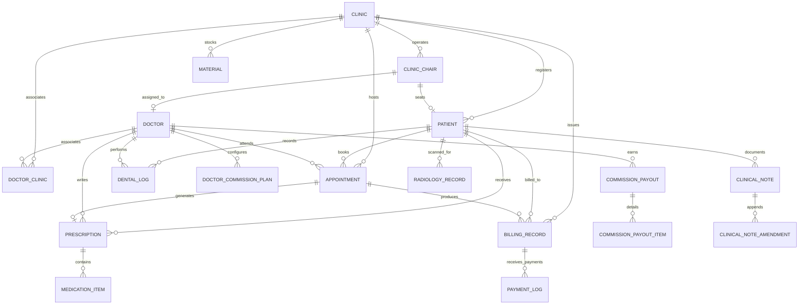

# Software Requirements Specification (SRS)
## Smart Clinic Management System (Clinic App)

| **Document Standard** | IEEE Std 830-1998 / ISO/IEC/IEEE 29148:2018 |
| :--- | :--- |
| **Document Version** | 2.0.0 (Enterprise Enhancement Edition) |
| **Status** | Approved Technical System Architecture & Engineering Specification |
| **Date** | 2026-10-06 |
| **Classification** | Technical System Architecture & Software Requirements Specification (SRS) |
| **Primary Audience** | Software Engineers, Solution Architects, QA Automation Engineers, DevOps |
| **Companion Document** | [CUSTOMER_REQUIREMENTS_DOCUMENT.md](CUSTOMER_REQUIREMENTS_DOCUMENT.md) (v3.0.0) |

---

## 1. Introduction

### 1.1 Purpose
This Software Requirements Specification (SRS) defines the comprehensive technical architecture, data structures, RESTful contracts, WebSocket event protocols, and engineering standards for the **Enterprise Smart Clinic Management System**. It establishes the formal technical contract between the business requirements defined in the [Customer Requirements Document](CUSTOMER_REQUIREMENTS_DOCUMENT.md) (v3.0.0) and the production implementation across the Angular 19+ Single Page Application (`clinic-app`) and the ASP.NET Core 9.0 Clean Architecture backend (`ClinicApi`).

### 1.2 Document Conventions & Traceability Taxonomy
Requirements and architectural units are tagged with standardized alphanumeric codes:
- **`SRS-ARCH-xxx`**: System Architecture, Layering & Component Decomposition
- **`SRS-DATA-xxx`**: Entity Schemas, Relational Integrity & JSON Documents
- **`SRS-API-xxx`**: RESTful API Endpoints, Request/Response Payloads & HTTP Statuses
- **`SRS-SIG-xxx`**: Real-Time SignalR WebSocket Protocols & Event Contracts
- **`SRS-SEC-xxx`**: Security, Authentication, Action Filters & RBAC
- **`SRS-UI-xxx`**: Frontend Reactive Architecture, Signal Primitives & Performance
- **`SRS-NFR-xxx`**: Non-Functional Performance Budgets, Latency & Reliability Benchmarks

---

## 2. System Context & Technical Architecture

### 2.1 High-Level Component Decomposition

```
┌────────────────────────────────────────────────────────────────────────────────────────┐
│                        FRONTEND PRESENTATION TIER (clinic-app)                         │
│                    (Angular 19+ SPA / PWA • Zoneless-Ready)                            │
│                                                                                        │
│  ├── Architecture: Standalone Components, Signal Primitives (input, output, model)     │
│  ├── Core Services: AuthService, ApiService, ChairService, VoiceScribeService,         │
│  │                  CommandPaletteService, WhatsAppService, OfflineService             │
│  ├── Feature Domains: Patients, Appointments, Chairs, DentalChart, Billing,            │
│  │                    Equipment, Inventory, Doctors, Radiology                         │
│  ├── Performance: Route-Level Lazy Loading, @defer Block Chunking, Dynamic Leaflet     │
│  └── Offline/PWA: Service Worker Cache, IndexedDB Local Outbox, OfflineBanner          │
└───────────────────────────────────┬────────────────────────────────────────────────────┘
                                    │
                                    │ HTTPS REST JSON / WSS SignalR WebSockets
                                    ▼
┌────────────────────────────────────────────────────────────────────────────────────────┐
│                        BACKEND API & DOMAIN ENGINE (ClinicApi)                         │
│                     (ASP.NET Core 9.0 Clean Architecture)                              │
│                                                                                        │
│   [Clinic.API]                                                                         │
│   ├── Controllers: Auth, Patients, Appointments, Chairs, Dental, Billing,              │
│   │                Commission, Search, Materials, Equipment, ClinicalNotes, Subscriptions│
│   ├── Middleware: GlobalExceptionMiddleware, JwtBearerMiddleware, ProblemDetails      │
│   ├── Hubs: NotificationHub (/hubs/notifications) with SignalRNotificationDispatcher   │
│   └── Filters: AssistantClinicRequirementFilter, SubscriptionFilter                   │
│                                    │                                                   │
│   [Clinic.Application]             ▼                                                   │
│   ├── Interfaces: IPatientService, ICommissionService, IDentalLogRepository, etc.     │
│   ├── DTOs: ChairDto, CommissionDto, SearchResultDto, DentalLogDto, PrescriptionDto   │
│   └── Business Services: CommissionService, MaterialAlertService, PhoneHelper         │
│                                    │                                                   │
│   [Clinic.Domain]                  ▼                                                   │
│   ├── Domain Entities: Patient, Doctor, Appointment, ClinicChair, DentalLog,          │
│   │                    DoctorCommissionPlan, CommissionPayout, Material, Equipment    │
│   └── Enums: UserRole, AppointmentStatus, ToothStatus, BillingStatus, ChairStatus      │
│                                    │                                                   │
│   [Clinic.Infrastructure]          ▼                                                   │
│   ├── Persistence: ClinicDbContext (Entity Framework Core 9.0 for SQL Server)          │
│   ├── Query Filters: Soft-Delete Global Filter (IsDeleted == false)                    │
│   └── Real-time: IHubContext<NotificationHub> Direct SignalR Injection                 │
└───────────────────────────────────┬────────────────────────────────────────────────────┘
                                    │
                                    │ EF Core TCP/TDS (Encrypted TLS 1.3)
                                    ▼
┌────────────────────────────────────────────────────────────────────────────────────────┐
│                        PERSISTENCE & DATA STORAGE TIER                                 │
│                        (Microsoft Azure SQL Database)                                  │
│   ├── Normalized Relational Tables (3NF, Foreign Keys, Clustered/Non-Clustered Indexes)│
│   ├── Document Columns: Serialized Status JSON Arrays, Recipe ConsumedMaterials        │
│   └── Blob Storage: Encrypted High-Resolution Radiographs & Diagnostic Attachments      │
└────────────────────────────────────────────────────────────────────────────────────────┘
```

---

## 3. Data Model & Entity Relationship Specification

### 3.1 Entity Relationship Diagram (ERD)


```mermaid
erDiagram
    CLINIC ||--o{ DOCTOR_CLINIC : associates
    DOCTOR ||--o{ DOCTOR_CLINIC : associates
    CLINIC ||--o{ PATIENT : registers
    CLINIC ||--o{ APPOINTMENT : hosts
    CLINIC ||--o{ BILLING_RECORD : issues
    CLINIC ||--o{ CLINIC_CHAIR : operates
    CLINIC ||--o{ MATERIAL : stocks

    PATIENT ||--o{ APPOINTMENT : books
    DOCTOR ||--o{ APPOINTMENT : attends
    CLINIC_CHAIR ||--o| PATIENT : seats
    CLINIC_CHAIR ||--o| DOCTOR : assigned_to

    PATIENT ||--o{ DENTAL_LOG : records
    DOCTOR ||--o{ DENTAL_LOG : performs
    PATIENT ||--o{ PRESCRIPTION : receives
    DOCTOR ||--o{ PRESCRIPTION : writes
    APPOINTMENT ||--o| PRESCRIPTION : generates
    
    PATIENT ||--o{ BILLING_RECORD : billed_to
    APPOINTMENT ||--o{ BILLING_RECORD : produces
    BILLING_RECORD ||--o{ PAYMENT_LOG : receives_payments

    DOCTOR ||--o{ DOCTOR_COMMISSION_PLAN : configures
    DOCTOR ||--o{ COMMISSION_PAYOUT : earns
    COMMISSION_PAYOUT ||--o{ COMMISSION_PAYOUT_ITEM : details

    PRESCRIPTION ||--o{ MEDICATION_ITEM : contains
    PATIENT ||--o{ RADIOLOGY_RECORD : scanned_for
    PATIENT ||--o{ CLINICAL_NOTE : documents
    CLINICAL_NOTE ||--o{ CLINICAL_NOTE_AMENDMENT : appends
```

---

### 3.2 Detailed Entity Schema Specifications

#### `SRS-DATA-01: Patient Entity Schema`
| Field Name | Data Type | Nullable | Description / Constraints |
| :--- | :--- | :---: | :--- |
| `Id` | `VARCHAR(36)` | NO | Primary Key (GUID string). |
| `FirstName` | `NVARCHAR(100)` | NO | Given name. |
| `LastName` | `NVARCHAR(100)` | NO | Surname. |
| `Gender` | `VARCHAR(20)` | NO | `"Male"`, `"Female"`. |
| `DateOfBirth` | `VARCHAR(30)` | NO | ISO date string (`"YYYY-MM-DD"`). |
| `CountryCode` | `VARCHAR(10)` | NO | Default: `"+20"`. |
| `PhoneNumber` | `VARCHAR(30)` | NO | Indexed; collision detection per clinic branch. |
| `Email` | `VARCHAR(150)` | YES | Contact email. |
| `BloodGroup` | `VARCHAR(10)` | YES | ABO blood type. |
| `Allergies` | `NVARCHAR(MAX)`| YES | Comma-separated or text of known drug allergies. Cross-referenced by `BR-RX-01`. |
| `ChronicDiseases` | `NVARCHAR(MAX)`| YES | Documented chronic medical conditions. |
| `ConsentSignature`| `NVARCHAR(MAX)`| YES | Base64 PNG representation of digital consent signature (`REQ-PAT-04`). |
| `ConsentSignedAt` | `DATETIME2` | YES | Timestamp of digital consent signature capture. |
| `ClinicId` | `VARCHAR(36)` | YES | Foreign Key $\rightarrow$ `Clinics.Id`. |
| `RegistrationDate`| `VARCHAR(30)` | NO | Intake ISO timestamp. |
| `IsDeleted` | `BIT` | NO | Default: `0` (False). Global EF Core soft-delete filter applied. |

---

#### `SRS-DATA-02: ClinicChair Entity Schema (Operatory Board)`
| Field Name | Data Type | Nullable | Description / Constraints |
| :--- | :--- | :---: | :--- |
| `Id` | `VARCHAR(36)` | NO | Primary Key (GUID string). |
| `ClinicId` | `VARCHAR(36)` | NO | Foreign Key $\rightarrow$ `Clinics.Id`. Scopes chair to clinic branch. |
| `RoomNumber` | `NVARCHAR(50)` | NO | Room/Suite identifier (e.g., `"101"`, `"Operatory 1"`). |
| `ChairName` | `NVARCHAR(100)` | NO | Display name (e.g., `"Operatory 1 - Restorative Suite"`). |
| `Status` | `VARCHAR(30)` | NO | FSM State: `"available"`, `"occupied"`, `"cleaning"`, `"maintenance"`. |
| `CurrentPatientId`| `VARCHAR(36)` | YES | Foreign Key $\rightarrow$ `Patients.Id` (Populated during occupancy). |
| `CurrentPatientName`| `NVARCHAR(150)`| YES | Denormalized display snapshot for zero-join board rendering. |
| `CurrentDoctorId` | `VARCHAR(36)` | YES | Foreign Key $\rightarrow$ `Doctors.Id`. |
| `CurrentDoctorName`| `NVARCHAR(150)`| YES | Denormalized attending doctor name. |
| `ProcedureName` | `NVARCHAR(200)`| YES | Clinical procedure currently being performed chair-side. |
| `OccupancyStartedAt`| `DATETIME2`| YES | UTC timestamp when status switched to `occupied`. Drives elapsed timer. |
| `CleaningStartedAt`| `DATETIME2` | YES | UTC timestamp when status switched to `cleaning`. Drives sterilization timer. |
| `Notes` | `NVARCHAR(500)`| YES | Operational notes (e.g., special equipment setup). |
| `UpdatedAt` | `DATETIME2` | NO | UTC timestamp of last status mutation. |

---

#### `SRS-DATA-03: DoctorCommissionPlan Entity Schema`
| Field Name | Data Type | Nullable | Description / Constraints |
| :--- | :--- | :---: | :--- |
| `Id` | `VARCHAR(36)` | NO | Primary Key (GUID string). |
| `DoctorId` | `VARCHAR(36)` | NO | Foreign Key $\rightarrow$ `Doctors.Id`. Unique per clinic. |
| `ClinicId` | `VARCHAR(36)` | YES | Foreign Key $\rightarrow$ `Clinics.Id`. |
| `DefaultCommissionRate`| `DECIMAL(5,2)`| NO | Base commission percentage (e.g., `30.00` for 30%). |
| `LabFeeDeductionType` | `VARCHAR(30)` | NO | Lab deduction strategy: `"BeforeCommission"`, `"AfterCommission"`, `"None"`. |
| `SpecialtyRatesJson` | `NVARCHAR(MAX)`| NO | Serialized JSON map of category overrides (e.g., `{"Endodontics":40.0,"Implantology":35.0}`). |
| `IsActive` | `BIT` | NO | Default: `1` (True). Active plan flag. |
| `CreatedAt` | `DATETIME2` | NO | UTC creation timestamp. |
| `UpdatedAt` | `DATETIME2` | YES | UTC modification timestamp. |

---

#### `SRS-DATA-04: CommissionPayout & CommissionPayoutItem Entity Schemas`
- **`CommissionPayout` Table:**
  - `Id` (`VARCHAR(36)`, PK)
  - `DoctorId` (`VARCHAR(36)`, FK)
  - `ClinicId` (`VARCHAR(36)`, FK)
  - `PeriodStart` (`DATETIME2`, Start date of settlement cycle)
  - `PeriodEnd` (`DATETIME2`, End date of settlement cycle)
  - `TotalGrossRevenue` (`DECIMAL(18,2)`, Sum of procedure fees)
  - `TotalLabFeesDeducted` (`DECIMAL(18,2)`, Sum of external lab deductions)
  - `TotalNetCommission` (`DECIMAL(18,2)`, Net payout amount earned by doctor)
  - `ClinicRetainedRevenue` (`DECIMAL(18,2)`, Net profit retained by clinic)
  - `Status` (`VARCHAR(30)`, Lifecycle: `"Draft"`, `"Approved"`, `"Paid"`, `"Voided"`)
  - `PaymentReference` (`VARCHAR(100)`, Bank transfer or cheque voucher ID)
  - `PaidAt` (`DATETIME2`, Settlement timestamp)
  - `Notes` (`NVARCHAR(500)`, Administrative audit notes)
  - `CreatedAt` (`DATETIME2`)
- **`CommissionPayoutItem` Table (Owned Collection):**
  - `Id` (`VARCHAR(36)`, PK)
  - `PayoutId` (`VARCHAR(36)`, FK)
  - `BillingRecordId` (`VARCHAR(36)`, FK)
  - `ProcedureName` (`NVARCHAR(200)`)
  - `GrossFee` (`DECIMAL(18,2)`)
  - `LabFee` (`DECIMAL(18,2)`)
  - `CommissionRate` (`DECIMAL(5,2)`)
  - `NetCommission` (`DECIMAL(18,2)`)

---

#### `SRS-DATA-05: DentalLog Entity Schema (Treatment Plans & Recipes)`
| Field Name | Data Type | Nullable | Description / Constraints |
| :--- | :--- | :---: | :--- |
| `Id` | `VARCHAR(36)` | NO | Primary Key (GUID string). |
| `PatientId` | `VARCHAR(36)` | NO | Foreign Key $\rightarrow$ `Patients.Id`. |
| `ToothNumber` | `VARCHAR(10)` | NO | Tooth number (Permanent `1`–`32`/`11`–`48` or Deciduous `A`–`T`/`51`–`85`). |
| `DoctorId` | `VARCHAR(36)` | NO | Attending dentist ID. |
| `DoctorName` | `NVARCHAR(150)` | NO | Snapshot of dentist name. |
| `Date` | `VARCHAR(30)` | NO | Date recorded. |
| `Status` | `NVARCHAR(MAX)`| NO | **JSON Array** of `ToothStatus` enum strings (e.g., `["Caries","Filled"]`). |
| `PainLevel` | `INT` | NO | VAS scale ($0$ to $10$). |
| `PainDetails` | `NVARCHAR(500)`| YES | Qualitative pain notes. |
| `Treatment` | `NVARCHAR(500)`| YES | Procedural description (e.g., `"Composite Restoration"`). |
| `Stage` | `VARCHAR(30)` | NO | Lifecycle: `"proposed"`, `"accepted"`, `"in_progress"`, `"completed"`, `"invoiced"`. |
| `Cost` | `DECIMAL(18,2)`| NO | Agreed procedural tariff fee. |
| `InvoiceId` | `VARCHAR(36)` | YES | Linked `BillingRecord.Id` when pushed to billing. |
| `IsPlanned` | `BIT` | NO | `1` = Proposed / Treatment Plan; `0` = Completed. |
| `ConsumedMaterials`| `NVARCHAR(MAX)`| NO | **JSON Array** of recipe DTOs: `[{"materialId":"...","name":"Composite A2","quantity":1}]`. Deducted upon completion (`BR-INV-03`). |
| `ClinicId` | `VARCHAR(36)` | YES | Foreign Key $\rightarrow$ `Clinics.Id`. |

---

## 4. API Endpoint & Data Contract Specifications

All API routes are served under prefix `/api/`. Request and response bodies are strictly formatted as `application/json; charset=utf-8` using camelCase property naming.

---

### 4.1 Operatory & Chair Management Endpoints

#### `SRS-API-OPS-01: Get Operatory Chairs`
- **Method:** `GET`
- **Route:** `/api/chairs?clinicId={clinicId}`
- **Authentication:** `[Authorize(Roles = "admin,doctor,assistant,receptionist")]`
- **Response `200 OK`:** Returns array of `ClinicChair` objects. Auto-seeds 4 standard operatories if none exist for a new clinic.

#### `SRS-API-OPS-02: Update Chair Status`
- **Method:** `PUT`
- **Route:** `/api/chairs/{id}/status`
- **Request Payload:**
  ```json
  {
    "status": "cleaning",
    "notes": "Full operatory disinfection in progress"
  }
  ```
- **Side Effect:** Dispatches SignalR `ReceiveChairStatusUpdate` event to group `clinic_{clinicId}`.

#### `SRS-API-OPS-03: Assign Patient to Chair`
- **Method:** `POST`
- **Route:** `/api/chairs/{id}/assign`
- **Request Payload:**
  ```json
  {
    "patientId": "pat-10084",
    "patientName": "Mahmoud Samy",
    "doctorId": "doc-55412",
    "doctorName": "Dr. Tarek Dentist",
    "procedureName": "Root Canal - Tooth #16",
    "notes": "Prepare endodontic motor and apex locator"
  }
  ```
- **Response `200 OK`:** Updates chair status to `occupied`, initiates `occupancyStartedAt`, broadcasts real-time update.

#### `SRS-API-OPS-04: Release Chair & Complete Cleaning`
- **Method:** `POST`
- **Route:** `/api/chairs/{id}/release` $\rightarrow$ Transitions status to `cleaning`, sets `cleaningStartedAt`.
- **Route:** `/api/chairs/{id}/complete-cleaning` $\rightarrow$ Transitions status to `available`, clears patient data.

---

### 4.2 Doctor Commission & Profit-Sharing Endpoints

#### `SRS-API-COMM-01: Get Commission Analytics`
- **Method:** `GET`
- **Route:** `/api/commission/analytics?clinicId={cid}&doctorId={did}&startDate={d1}&endDate={d2}`
- **Response `200 OK`:**
  ```json
  {
    "totalGrossRevenue": 45000.00,
    "totalLabFeesDeducted": 6500.00,
    "totalNetCommission": 13500.00,
    "clinicRetainedRevenue": 25000.00,
    "doctorBreakdowns": [
      {
        "doctorId": "doc-55412",
        "doctorName": "Dr. Tarek Dentist",
        "grossRevenue": 28000.00,
        "labFeesDeducted": 4200.00,
        "netCommission": 9520.00,
        "completedProceduresCount": 34
      }
    ]
  }
  ```

#### `SRS-API-COMM-02: Upsert Commission Plan`
- **Method:** `POST`
- **Route:** `/api/commission/plans`
- **Authentication:** `[Authorize(Roles = "admin")]`
- **Request Payload:**
  ```json
  {
    "doctorId": "doc-55412",
    "clinicId": "cln-99881122",
    "defaultCommissionRate": 30.0,
    "labFeeDeductionType": "BeforeCommission",
    "specialtyRatesJson": "{\"Endodontics\": 40.0, \"Implantology\": 35.0}"
  }
  ```

#### `SRS-API-COMM-03: Settle Commission Payout`
- **Method:** `PUT`
- **Route:** `/api/commission/payouts/{id}/settle`
- **Request Payload:**
  ```json
  {
    "paymentReference": "CIB-WIRE-2026-99812",
    "notes": "Settled via automated corporate bank transfer"
  }
  ```
- **Response `200 OK`:** Updates payout to `Paid`, records `paidAt` timestamp, audit-locks line items.

---

### 4.3 Global Spotlight Search Endpoint

#### `SRS-API-SRCH-01: Spotlight Quick Search`
- **Method:** `GET`
- **Route:** `/api/search?q={term}&limit={limit}`
- **Authentication:** `[Authorize]`
- **Response `200 OK`:**
  ```json
  {
    "patients": [
      {
        "id": "pat-10084",
        "name": "Mahmoud Samy",
        "phone": "+201555102395",
        "gender": "Male",
        "clinicId": "cln-99881122"
      }
    ],
    "doctors": [
      {
        "id": "doc-55412",
        "name": "Dr. Tarek Dentist",
        "specialization": "Endodontics",
        "email": "tarek@clinic.com"
      }
    ],
    "chairs": [
      {
        "id": "chr-101",
        "roomNumber": "101",
        "chairName": "Operatory 1 - Restorative Suite",
        "status": "available"
      }
    ],
    "materials": [
      {
        "id": "mat-302",
        "name": "Filtek Z250 Composite Shade A2",
        "category": "Restorative",
        "quantity": 18,
        "unit": "compule"
      }
    ]
  }
  ```

---

### 4.4 Dental Treatment Plan & Recipe Endpoints

#### `SRS-API-DEN-03: Push Completed Procedure to Billing`
- **Method:** `POST`
- **Route:** `/api/dental/{id}/push-to-billing`
- **Validation:** Procedure must have `Stage == "completed"`.
- **Side Effect:** Generates a new `BillingRecord` item, transitions procedure stage to `"invoiced"`, and links `InvoiceId`.

---

### 4.5 WhatsApp Communication & Batch Reminders

#### `SRS-API-NOTIF-02: Send Appointment Reminder`
- **Method:** `POST`
- **Route:** `/api/appointments/{id}/send-reminder`
- **Response `200 OK`:**
  ```json
  {
    "success": true,
    "whatsappUrl": "https://wa.me/201555102395?text=Dear%20Mahmoud...",
    "sentAt": "2026-10-06T12:00:00Z",
    "reminderCount": 1
  }
  ```

#### `SRS-API-NOTIF-03: Batch Dispatch 24h Reminders`
- **Method:** `POST`
- **Route:** `/api/appointments/send-batch-reminders`
- **Response `200 OK`:**
  ```json
  {
    "totalEligible": 15,
    "dispatchedCount": 15,
    "timestamp": "2026-10-06T12:05:00Z"
  }
  ```

### 4.6 Public Clinic QR Code & Online Booking Endpoints

#### `SRS-API-QR-01: Get Public Clinic Booking Metadata`
- **Method:** `GET`
- **Route:** `/api/public/clinics/{slug}/booking-data`
- **Authorization:** Anonymous (`AllowAnonymous`)
- **Response `200 OK`:**
  ```json
  {
    "clinic": {
      "id": "c123-guid",
      "name": "Al-Amal Dental Specialty Clinic",
      "slug": "al-amal-dental-cairo",
      "address": "45 Tahrir St, Cairo",
      "phone": "+201001234567",
      "logoUrl": "https://cdn.clinic.com/logos/c123.png"
    },
    "doctors": [
      {
        "id": "d456-guid",
        "name": "Dr. Tamer Hosny",
        "specialization": "Oral & Maxillofacial Surgery",
        "avatar": "https://cdn.clinic.com/avatars/d456.png",
        "consultationFee": 400.0,
        "availabilityDays": ["Monday", "Wednesday", "Thursday"],
        "availabilityHours": "14:00-21:00"
      }
    ]
  }
  ```

#### `SRS-API-QR-02: Get Doctor Available Consultation Slots`
- **Method:** `GET`
- **Route:** `/api/public/clinics/{slug}/doctors/{doctorId}/available-slots?date={YYYY-MM-DD}`
- **Authorization:** Anonymous (`AllowAnonymous`)
- **Response `200 OK`:**
  ```json
  {
    "date": "2026-10-15",
    "doctorId": "d456-guid",
    "slots": [
      { "time": "14:00", "available": true },
      { "time": "14:30", "available": false },
      { "time": "15:00", "available": true }
    ]
  }
  ```

#### `SRS-API-QR-03: Reserve Public Appointment with OTP Verification`
- **Method:** `POST`
- **Route:** `/api/public/clinics/{slug}/book-appointment`
- **Authorization:** Anonymous (`AllowAnonymous`)
- **Payload Schema:**
  ```json
  {
    "doctorId": "d456-guid",
    "date": "2026-10-15",
    "time": "15:00",
    "patientName": "Kareem Adel",
    "patientPhone": "+201099887766",
    "reason": "Lower molar pain",
    "otpCode": "8492"
  }
  ```

### 4.7 External Diagnostic Partner (Lab & Radiology) Drop-off Endpoints

#### `SRS-API-LAB-01: Resolve Requisition Order Token`
- **Method:** `GET`
- **Route:** `/api/public/diagnostics/orders/{token}`
- **Authorization:** Anonymous (`AllowAnonymous`)
- **Response `200 OK`:**
  ```json
  {
    "orderToken": "LAB-8F29A",
    "clinicName": "Al-Amal Dental Specialty Clinic",
    "doctorName": "Dr. Tamer Hosny",
    "patientInitials": "K. A. (Male, 34y)",
    "toothNumber": 46,
    "serviceType": "DentalLab",
    "indications": "Zirconia Full Crown - Shade A2",
    "status": "Pending",
    "createdAt": "2026-10-12T10:30:00Z"
  }
  ```

#### `SRS-API-LAB-02: Diagnostic Partner Upload with Automated Ingestion`
- **Method:** `POST`
- **Route:** `/api/public/diagnostics/orders/{token}/upload`
- **Content-Type:** `multipart/form-data`
- **Authorization:** Anonymous (`AllowAnonymous`)
- **Response `200 OK`:**
  ```json
  {
    "success": true,
    "message": "Diagnostic results successfully linked to patient profile.",
    "filesProcessed": 2,
    "orderStatus": "ResultsReceived"
  }
  ```

### 4.8 Clinic QR Code Poster Kit Endpoint

#### `SRS-API-QRKIT-01: Generate Printable Clinic QR Poster Kit`
- **Method:** `GET`
- **Route:** `/api/clinics/{id}/qr-code-kit`
- **Authorization:** `Roles = "admin,doctor,assistant"`
- **Response `200 OK`:** Returns SVG/PNG QR Code image data and printable A4 poster PDF metadata.

### 4.9 Inter-Branch Inventory Stock Transfer Requisition Endpoints

#### `SRS-API-TRANS-01: Submit Inter-Branch Stock Requisition`
- **Method:** `POST`
- **Route:** `/api/inventory/transfers/request`
- **Authorization:** `Roles = "admin,doctor,assistant"`
- **Payload Schema:**
  ```json
  {
    "sourceClinicId": "c-central-guid",
    "destinationClinicId": "c-westside-guid",
    "materialId": "mat-graft-guid",
    "quantityRequested": 10,
    "priority": "Urgent",
    "notes": "Emergency reconstructive surgery tomorrow morning"
  }
  ```
- **Response `201 Created`:** Returns `StockTransferRequisitionResponseDto` with generated token `TRF-YYYYMM-XXXX` in status `Requested`.

#### `SRS-API-TRANS-02: Query Transfer Requisitions`
- **Method:** `GET`
- **Route:** `/api/inventory/transfers?clinicId={clinicId}&status={status}&direction={all|inbound|outbound}`
- **Authorization:** `Roles = "admin,doctor,assistant"`
- **Response `200 OK`:** Returns array of requisitions with source, destination, batch numbers, and audit details.

#### `SRS-API-TRANS-03: Dispatch Shipment with Source Stock Deduction (BR-LOG-01)`
- **Method:** `PUT`
- **Route:** `/api/inventory/transfers/{id}/dispatch`
- **Authorization:** `Roles = "admin,doctor,assistant"`
- **Payload Schema:**
  ```json
  {
    "quantityDispatched": 10,
    "batchNumber": "LOT-202610-09",
    "expiryDate": "2028-06-30T00:00:00Z",
    "notes": "Courier pickup confirmed"
  }
  ```
- **Response `200 OK`:** Transitions requisition to `InTransit` and atomically decrements source clinic material quantity.

#### `SRS-API-TRANS-04: Receive Shipment & Credit Destination Stock (BR-LOG-02)`
- **Method:** `PUT`
- **Route:** `/api/inventory/transfers/{id}/receive`
- **Authorization:** `Roles = "admin,doctor,assistant"`
- **Payload Schema:**
  ```json
  {
    "quantityReceived": 10,
    "quantityDamaged": 1,
    "damageReason": "Vial cracked during transport",
    "notes": "9 usable units stored in cabinet B"
  }
  ```
- **Response `200 OK`:** Transitions requisition to `Received` and credits usable quantity to destination clinic inventory.

### 4.10 Dental & Medical Insurance Claims & Pre-Authorization Endpoints

#### `SRS-API-INS-01: Query Insurance Providers Catalog`
- **Method:** `GET`
- **Route:** `/api/insurance/providers`
- **Authorization:** `Roles = "admin,doctor,assistant"`
- **Response `200 OK`:** Returns array of active insurance companies, payer codes, and pre-authorization thresholds.

#### `SRS-API-INS-02: Submit Insurance Claim & Pre-Authorization (BR-INS-01..02)`
- **Method:** `POST`
- **Route:** `/api/insurance/claims`
- **Authorization:** `Roles = "admin,doctor,assistant"`
- **Payload Schema:**
  ```json
  {
    "clinicId": "c-downtown-guid",
    "patientId": "pat-100-guid",
    "doctorId": "doc-50-guid",
    "insuranceProviderId": "prov-bupa-guid",
    "policyNumber": "POL-998822",
    "memberId": "MEM-10492",
    "toothNumber": 16,
    "diagnosisCode": "K02.1",
    "procedureDescription": "Full Ceramic Zirconia Crown",
    "totalGrossAmount": 4000.00,
    "copayPercentage": 20.00,
    "preAuthNotes": "Severe coronal destruction"
  }
  ```
- **Response `201 Created`:** Computes patient copay (800 EGP) and claimed amount (3200 EGP). Sets status to `PreAuthorized` if gross >= threshold.

#### `SRS-API-INS-03: Adjudicate Insurance Claim (BR-INS-03)`
- **Method:** `PUT`
- **Route:** `/api/insurance/claims/{id}/adjudicate`
- **Authorization:** `Roles = "admin,doctor,assistant"`
- **Payload Schema:**
  ```json
  {
    "status": "Approved",
    "approvedAmount": 3200.00,
    "adjudicationNotes": "Full coverage approved per policy schedule"
  }
  ```
- **Response `200 OK`:** Updates claim status and records approved reimbursement amount.

#### `SRS-API-INS-04: Settle Remitted Insurance Claim (BR-INS-03)`
- **Method:** `PUT`
- **Route:** `/api/insurance/claims/{id}/settle`
- **Authorization:** `Roles = "admin,doctor,assistant"`
- **Response `200 OK`:** Sets status to `Settled` upon TPA remittance payment.

### 4.11 Clinical Informed Consent & Medico-Legal Dossier Endpoints

#### `SRS-API-CONSENT-01: Query Statutory Consent Templates`
- **Method:** `GET`
- **Route:** `/api/consents/templates`
- **Authorization:** `Roles = "admin,doctor,assistant"`
- **Response `200 OK`:** Returns standardized procedure consent templates with statutory risk disclosures.

#### `SRS-API-CONSENT-02: Create & Sign Informed Consent Document (BR-CONSENT-01..03)`
- **Method:** `POST` / `PUT`
- **Route:** `/api/consents`, `/api/consents/{id}/sign-patient`, `/api/consents/{id}/countersign`
- **Authorization:** `Roles = "admin,doctor,assistant"`
- **Response `200 OK`:** Computes immutable SHA-256 digital checksum and locks document to `ArchivedLocked`.

### 4.12 AI Clinical Decision Support (CDS) & Drug-Drug Interaction Endpoints

#### `SRS-API-CDS-01: Real-Time Prescription Safety & Interaction Evaluator (BR-CDS-01..02)`
- **Method:** `POST`
- **Route:** `/api/cds/evaluate`
- **Authorization:** `Roles = "admin,doctor,assistant"`
- **Payload Schema:**
  ```json
  {
    "prescribedMolecules": ["Ibuprofen", "Amoxicillin"],
    "patientChronicMedications": ["Warfarin"],
    "patientChronicConditions": ["Peptic Ulcer"],
    "patientWeightKg": 25.0,
    "patientAgeYears": 8
  }
  ```
- **Response `200 OK`:** Returns `CdsEvaluationResponseDto` flagging Critical DDIs, disease contraindications, and pediatric mg/kg dosage calculations.

#### `SRS-API-CDS-02: Calculate Pediatric Weight-Based Dosage (BR-CDS-03)`
- **Method:** `GET`
- **Route:** `/api/cds/pediatric-dose?drugName={drug}&weightKg={weight}&ageYears={age}`
- **Authorization:** `Roles = "admin,doctor,assistant"`
- **Response `200 OK`:** Returns calculated dose capped at adult maximum ceiling.

---

## 5. Real-Time SignalR Event Specification

### 5.1 Connection Configuration
- **Hub Route:** `/hubs/notifications`
- **Transport Protocols:** WebSockets (Primary), Server-Sent Events (Fallback), Long Polling (Final Fallback).
- **Authentication:** Bearer token transmitted via query parameter `?access_token={jwt}` for WebSocket handshake.

### 5.2 Server-to-Client Real-Time Event Contracts

| Event Name | Target Group | Payload Schema | Trigger Condition |
| :--- | :--- | :--- | :--- |
| **`ReceiveChairStatusUpdate`** | `clinic_{clinicId}` / All | `ClinicChair` JSON DTO (Id, Room, ChairName, Status, Patient, Doctor, Timers) | Any operatory chair assignment, release, or cleaning completion (`BR-OPS-01`). |
| **`ReceiveNotification`** | `Clinic_{ClinicId}` | `{"id":"...","title":"...","message":"...","type":"info"}` | Patient check-in, appointment cancellation, or priority alert. |
| **`QueueUpdated`** | `Doctor_{DoctorId}` | `{"doctorId":"...","waitingCount":4,"timestamp":"..."}` | Any queue status transition. |
| **`LowStockAlert`** | `Clinic_{ClinicId}` | `{"materialId":"...","materialName":"Mepivacaine","currentStock":4,"minThreshold":5}` | Procedure auto-deduction reduces stock to or below minimum threshold (`BR-INV-02`). |
| **`ReceiveDiagnosticResultsUploaded`** | `Doctor_{DoctorId}` | `{"orderToken":"LAB-8F29A","patientName":"Kareem Adel","partnerName":"Apex Lab","serviceType":"DentalLab"}` | External diagnostic partner uploads completed results via public dropzone (`BR-LAB-03`). |
| **`ReceiveStockTransferAlert`** | `Clinic_{SourceClinicId}` | `{"requisitionNumber":"TRF-202610-001","sourceClinicId":"...","materialName":"Bio-Oss","quantity":10}` | A satellite clinic submits a new inter-branch transfer request (`REQ-LOG-01`). |
| **`ReceiveStockTransferInTransit`** | `Clinic_{DestinationClinicId}` | `{"requisitionNumber":"TRF-202610-001","batchNumber":"LOT-09","quantityDispatched":10}` | Source clinic dispatches courier shipment; inventory is in-transit (`BR-LOG-01`). |
| **`ReceiveStockTransferCompleted`** | Audit Ledger | `{"requisitionNumber":"TRF-202610-001","receivedQuantity":9,"damagedQuantity":1}` | Receiving clinic inspects shipment and confirms receipt (`BR-LOG-02`). |

---

## 6. Security, Authorization & Filter Pipeline

### 6.1 Action Filters Architecture
- **`AssistantClinicRequirementFilter`:** Validates assistant belongs to target clinic before executing mutations. Short-circuits with `403 Forbidden` if unassigned.
- **`SubscriptionFilter`:** Enforces clinic subscription active status on mutation endpoints. Returns `402 Payment Required` if expired.
- **`ReceptionistClinicalPrivacyFilter`:** Restricts clinical encounter notes and diagnoses from receptionist roles (`403 Forbidden`).

---

## 7. Frontend Architecture & Modern Engineering Specification

### 7.1 Angular 19+ Signal Primitives Standard
The frontend application architecture conforms to Angular 19+ modern reactive primitives:
1. **Inputs:** Migrated from legacy `@Input()` to signal inputs:
   ```typescript
   readonly patientId = input.required<string>();
   readonly isReadOnly = input<boolean>(false);
   ```
2. **Outputs:** Migrated from legacy `@Output() EventEmitter` to:
   ```typescript
   readonly statusChange = output<ChairStatus>();
   ```
3. **Two-Way Models:** Using `model()` for two-way state binding:
   ```typescript
   readonly isOpen = model<boolean>(false);
   ```
4. **Computed State:** Using `computed()` for declarative, memoized state derivation:
   ```typescript
   readonly activeChairsCount = computed(() => this.chairs().filter(c => c.status === 'occupied').length);
   ```

### 7.2 Performance, Lazy Loading & Bundle Budgets
- **Route-Level Code Splitting:** Every major feature module is lazily loaded via `loadComponent` / `loadChildren` in `app.routes.ts`.
- **Deferred Rendering (`@defer`):** Heavy UI elements (e.g., interactive 3D/SVG charts, scan zoom viewers, and analytics graphs) are wrapped in `@defer (on viewport)` and `@defer (on idle)` blocks.
- **Dynamic Vendor Chunking:** Heavy external libraries (e.g., Leaflet interactive maps) are dynamically imported (`await import('leaflet')`) only when the location modal is opened.
- **Initial Bundle Budget Constraint:** Main entry bundle transfer size must not exceed **200 KB** (gzipped).

### 7.3 Progressive Web App (PWA) Offline Strategy
- **Service Worker Caching:**
  - `CacheFirst` for static fonts (`Cairo`, `Inter`), CSS, and application JavaScript chunks.
  - `NetworkFirst` with IndexedDB local storage cache for patient profiles and active queue data.
- **Optimistic Offline Outbox:** Offline form submissions are queued locally with GUIDs and synced automatically when network connectivity returns.

---

## 8. Software Quality Attributes & Performance Benchmarks

| Metric | Target Specification | Verification Method |
| :--- | :--- | :--- |
| **API Response Time ($P_{95}$)** | $\le 300\text{ ms}$ for standard CRUD operations | K6 load testing against Azure App Service |
| **Search Response ($P_{99}$)** | $\le 400\text{ ms}$ across 50,000 patient records | SQL indexing on `PhoneNumber` & `LastName` |
| **Command Palette Search** | $\le 150\text{ ms}$ search execution | Debounced API query with in-memory caching |
| **WebSocket Latency** | $\le 100\text{ ms}$ transmission time | SignalR ping-pong roundtrip telemetry |
| **Frontend Initial Transfer** | Initial bundle $\le 200\text{ KB}$ (gzipped) | Angular build statistics & Lighthouse audit |
| **Backend Test Execution** | 340 tests executed in $\le 30\text{ seconds}$ | xUnit 2.9 + Moq test runner execution |

---

## 9. Requirements Traceability Matrix (CRD v3.0.0 to SRS v2.0.0)

| Customer Requirement (CRD v3.0.0) | Technical Software Requirement (SRS v2.0.0) | Implementation Source File / Class |
| :--- | :--- | :--- |
| **REQ-CLI-03 (Multi-Branch/Room)** | `SRS-DATA-02`, `SRS-API-OPS-01` | `ChairsController.cs`, `ClinicChair.cs` |
| **REQ-PAT-03 (Allergy Warning)** | `SRS-DATA-01`, `BR-RX-01` | `Patient.cs`, `allergy-conflict.service.ts` |
| **REQ-PAT-04 (Consent Signature)**| `SRS-DATA-01`, `REQ-PLAN-03` | `signature-pad-modal.component.ts` |
| **REQ-RX-02 (E-Rx Allergy Check)** | `SRS-API-RX-01`, `BR-RX-01` | `PrescriptionsController.cs`, `prescription-form` |
| **REQ-AI-01/02 (Voice Scribe SOAP)**| `BR-AI-01`, `SRS-UI-01` | `voice-scribe-modal.component.ts`, `voice-scribe.service.ts` |
| **REQ-DEN-01/02 (Odontogram)** | `SRS-DATA-05`, `BR-DEN-01` | `DentalController.cs`, `skeuomorphic-dental-chart` |
| **REQ-PLAN-01/02 (Treatment Plan)**| `SRS-DATA-05`, `BR-PLAN-01` | `treatment-plan-modal.component.ts`, `DentalController.cs` |
| **REQ-RAD-02/03/04 (Caliper/Compare)**| `SRS-UI-02`, `BR-RAD-01` | `scan-viewer-modal.component.ts` |
| **REQ-INV-03 (Recipe Auto-Deduct)**| `SRS-DATA-05`, `BR-INV-03` | `DentalController.cs`, `MaterialsController.cs` |
| **REQ-OPS-01/02/03 (Chair Board)** | `SRS-DATA-02`, `SRS-API-OPS-01..04`, `SRS-SIG-01` | `ChairsController.cs`, `chair.service.ts`, `chairs-board` |
| **REQ-COMM-01/02/03 (Commissions)**| `SRS-DATA-03/04`, `SRS-API-COMM-01..03` | `CommissionController.cs`, `CommissionService.cs`, `doctor-commissions` |
| **REQ-NOTIF-01/02 (WhatsApp Hub)**| `BR-NOTIF-01`, `SRS-API-NOTIF-02/03` | `AppointmentsController.cs`, `whatsapp.service.ts` |
| **REQ-NAV-01/02 (Command Palette)**| `SRS-API-SRCH-01`, `BR-UX-01` | `SearchController.cs`, `command-palette.component.ts` |
| **REQ-I18N-01 (100% Arabic RTL)** | `SRS-UI-03` | `TranslatePipe`, `Cairo` Font, `dir="rtl"` layout |
| **REQ-PWA-01 (Offline Resilience)**| `SRS-UI-04`, `BR-PWA-01` | `offline.service.ts`, `offline-banner.component.ts` |
